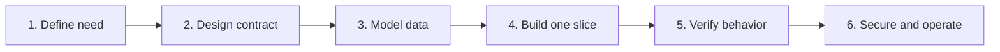
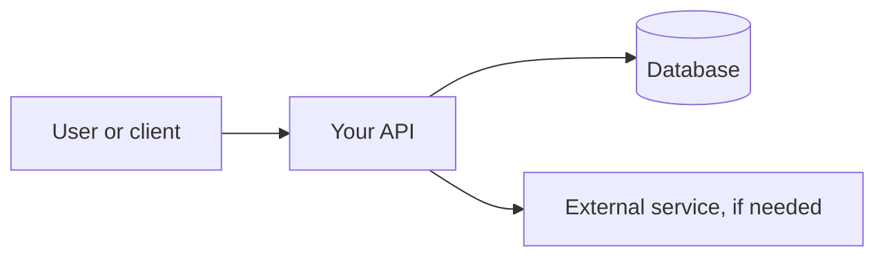
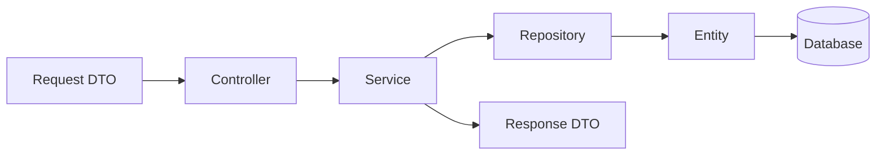
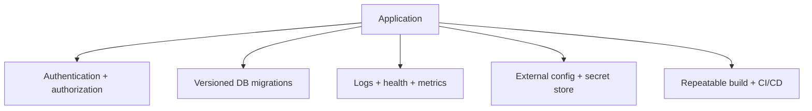
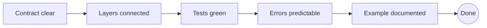

# Reusable Spring Boot project checklist

[← Handbook](README.md) · [Project setup](docs/02-project-setup.md) · [Real-project toolbox](docs/10-real-project-toolbox.md)

Copy this page into a new project and check only what its requirements need.

## 1. Define the project

- [ ] Write the users and the problem in two sentences.
- [ ] List the first three user stories.
- [ ] Mark each integration: database, external API, email, files, queue, or scheduled work.
- [ ] Separate “version one” from “later.”

## 2. Draw before coding

- [ ] Draw the system boundary and external dependencies.
- [ ] Define method, path, request, response, and error for the first endpoint.
- [ ] Sketch tables, keys, required fields, and relationships.

## 3. Create the foundation

- [ ] Generate a stable Java 17+ Maven project in Spring Initializr.
- [ ] Add only requirement-driven starters.
- [ ] Put the main class in the root package.
- [ ] Add safe local configuration and ignore secrets/generated data.
- [ ] Run `mvn clean verify` before building features.

## 4. Build each feature vertically

- [ ] Entity and repository represent persistence.
- [ ] Request/response DTOs protect the API boundary.
- [ ] Controller translates HTTP only.
- [ ] Service owns use cases, rules, and transaction boundaries.
- [ ] Mapper converts shapes without making business decisions.
- [ ] Validation and predictable errors cover bad input and missing data.

## 5. Verify the slice

- [ ] Unit-test business branches.
- [ ] MVC-test routes, JSON, validation, and status codes.
- [ ] Data-test custom mappings and queries.
- [ ] Integration-test the most important flow with real infrastructure where practical.
- [ ] Test one happy path and the important failure paths manually.

## 6. Prepare for shared or production use

- [ ] Replace automatic schema updates with Flyway or Liquibase migrations.
- [ ] Apply least-privilege authorization, not only authentication.
- [ ] Keep secrets outside Git and avoid logging sensitive data.
- [ ] Set timeouts for external calls and use retries only when safe.
- [ ] Expose only required Actuator endpoints.
- [ ] Add structured logs, health checks, metrics, backups, and restore practice.
- [ ] Pin a repeatable build and run tests in CI.

## Definition of done for one endpoint

- [ ] Success response and status are correct.
- [ ] Invalid, missing, and unauthorized cases are correct.
- [ ] Database changes are transactional and migrated.
- [ ] Tests explain the intended behavior.
- [ ] An example request is runnable.
