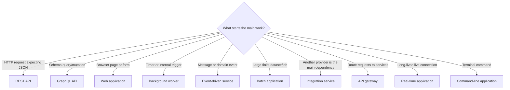

# What do you want to build with Spring Boot?

[](https://github.com/SidheshwarSarangal/spring-boot-project-blueprint/actions/workflows/verify.yml)
[](https://github.com/SidheshwarSarangal/spring-boot-project-blueprint/actions/workflows/codeql.yml)
[](https://github.com/SidheshwarSarangal/spring-boot-project-blueprint/issues/new?template=beginner-feedback.yml)

This repository helps you build common kinds of Spring Boot applications. You choose what the application must do, build one small feature, add only the extra features it needs, test it, and prepare it to run outside your computer.

## Choose how you want to begin

| Your situation | Start here | Then |
|---|---|---|
| You have not installed Java development tools | Complete the [toolchain setup guide](docs/setup-guide.md) | Follow the [first project tutorial](docs/first-project-tutorial.md) |
| Java and Spring Boot are both new to you | Complete the [Java and Spring Boot foundation](docs/java-spring-foundation.md) | Follow the [first project tutorial](docs/first-project-tutorial.md), then choose a type below |
| You want to create a project from Spring Initializr | Choose an application type below | Follow its numbered process from Step 1 |
| You learn best from working code or need a quick starting point | Choose a [runnable starter](starters/README.md) | Follow the [starter adaptation guide](docs/starter-adaptation-guide.md) |
| You already have a Spring Boot project | Choose the closest application type below | Use its steps as a gap checklist; do not regenerate the project |

Whichever route you choose, keep the [beginner execution guide](docs/beginner-execution-guide.md) open when you do not know how to create a file, use the terminal, add an import/dependency, edit YAML, run a test, or fix the first error. Use the [Java syntax primer](docs/java-syntax-primer.md) whenever a Java symbol is unfamiliar.

Do not read the entire repository before starting. Choose one application type and one small result you can see or test.

## Select one primary application type

| I need to build… | Follow | Working starter |
|---|---|---|
| A JSON backend for a frontend, mobile app, or another service | [REST API](paths/rest-api.md) | [Taskboard API](taskboard-api/README.md) |
| An API where clients ask for exactly the fields they need | [GraphQL API](paths/graphql-api.md) | [GraphQL starter](starters/graphql-api/README.md) |
| HTML pages and forms rendered by Spring | [Web application](paths/web-application.md) | [Web starter](starters/web-application/README.md) |
| Work that runs at a time or outside an HTTP request | [Background worker](paths/background-worker.md) | [Worker starter](starters/background-worker/README.md) |
| A service that receives or sends messages through Kafka or RabbitMQ | [Event-driven service](paths/event-driven-service.md) | [Event starter](starters/event-driven-service/README.md) |
| A service whose main job is calling another API or provider | [Integration service](paths/integration-service.md) | [Integration starter](starters/integration-service/README.md) |
| One public entry point that forwards requests to other services | [API gateway](paths/api-gateway.md) | [Gateway starter](starters/api-gateway/README.md) |
| A large import, export, or processing job that can restart after failure | [Batch application](paths/batch-application.md) | [Batch starter](starters/batch-application/README.md) |
| Live server-to-client updates, chat, tracking, or notifications | [Real-time application](paths/realtime-application.md) | [Real-time starter](starters/realtime-application/README.md) |
| A terminal command or one-off automation utility | [Command-line application](paths/command-line-application.md) | [CLI starter](starters/command-line-application/README.md) |

> Shopping, banking, hospital, booking, and learning systems can use the same application types. Choose by how the work starts and what result it produces—not by the business name.

Words such as “monolith,” “microservice,” and “serverless” describe how an application is divided or deployed. They do not describe its main job. Choose the application type first; decide how to split it later, when there is a clear reason.

## Not sure which one?



## Add extra capabilities only when needed

| The application also needs… | Capability module |
|---|---|
| SQL or MongoDB persistence | [Data storage](capabilities/data-storage.md) |
| Login, roles, permissions, or private records | [Security](capabilities/security.md) |
| Payments, email, maps, AI, or another HTTP API | [External API](capabilities/external-api.md) |
| Kafka, RabbitMQ, or durable asynchronous work | [Messaging](capabilities/messaging.md) |
| Uploads, downloads, images, or documents | [File storage](capabilities/file-storage.md) |
| Faster repeated reads after a measured bottleneck | [Caching](capabilities/caching.md) |

These capabilities are optional building blocks. Do not add all of them. Finish the main path, add one required capability, test it, and continue.

## Build it one step at a time

Open your selected path and start at Step 1. Read only that step. The `📍` callout tells you exactly where to work. Follow the instructions in order and confirm the expected result before moving on.

When a step links to database, security, messaging, or another capability, open only that guide. Complete it, return to the main path, and continue. Replace example names with the names in your `PROJECT.md`.

## Find the right supporting guide

| Stage | Use these resources |
|---|---|
| Set up | [Toolchain setup](docs/setup-guide.md) · [Java and Spring Boot foundation](docs/java-spring-foundation.md) · [Java syntax primer](docs/java-syntax-primer.md) |
| Practise | [First project tutorial](docs/first-project-tutorial.md) · [Beginner execution guide](docs/beginner-execution-guide.md) |
| Plan | [Project workbook](docs/project-workbook.md) · choose an application path above |
| Learn from code | [Taskboard REST API](taskboard-api/README.md) · [Runnable starters](starters/README.md) · [Source walkthroughs](docs/starter-walkthroughs.md) |
| Build safely | [Testing](docs/testing-guide.md) · [Configuration](docs/configuration-guide.md) · [Troubleshooting](docs/troubleshooting.md) |
| Release | [Delivery](docs/delivery-guide.md) · [Production checklist](docs/production-checklist.md) |
| Review the guide | [Official references](docs/official-references.md) · [Quality evidence](docs/quality-evidence.md) · [Usability testing](docs/usability-testing.md) |

## What makes this repository verifiable?

| Claim | Evidence |
|---|---|
| The examples are runnable | CI executes `clean verify` independently for all ten application types |
| The handbook remains navigable | A repository validator checks local links, code fences, required files, and step completion gates |
| Documentation follows consistent Markdown | Markdown lint runs on every pull request and main-branch push |
| Referenced web resources remain reachable | An external-link job checks every Markdown document |
| New dependency risk is reviewed | Dependabot proposes updates and dependency review rejects newly introduced known vulnerabilities |
| Java source receives static security analysis | CodeQL compiles and analyzes every runnable application |
| Beginner-friendliness is tested honestly | The repository provides a usability protocol and structured feedback form; it does not substitute build results for human evidence |

## The rule for using this repository

```text
Choose one path → build one useful feature → add one required capability
→ verify → repeat only for remaining requirements → production checklist
```

The reference example uses Spring Boot 4.1.0 and Java 17. For a new project, confirm supported versions in the [official Spring Boot system requirements](https://docs.spring.io/spring-boot/system-requirements.html).
