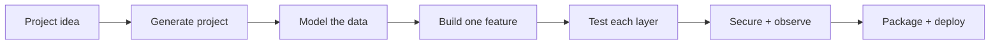
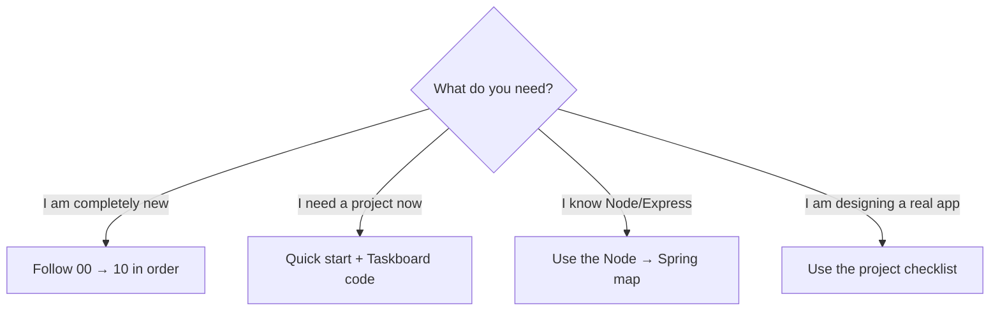
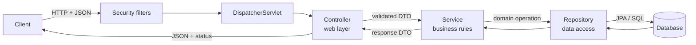
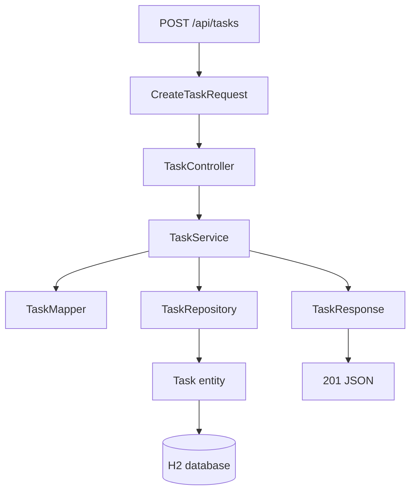
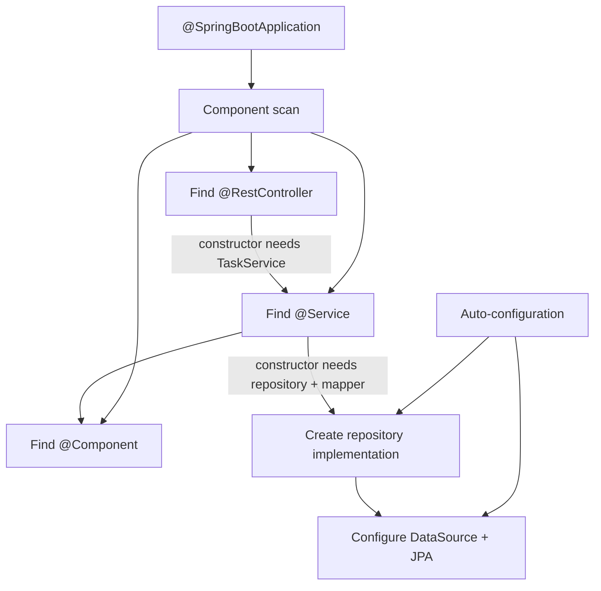
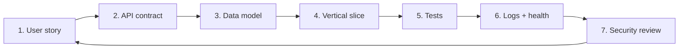
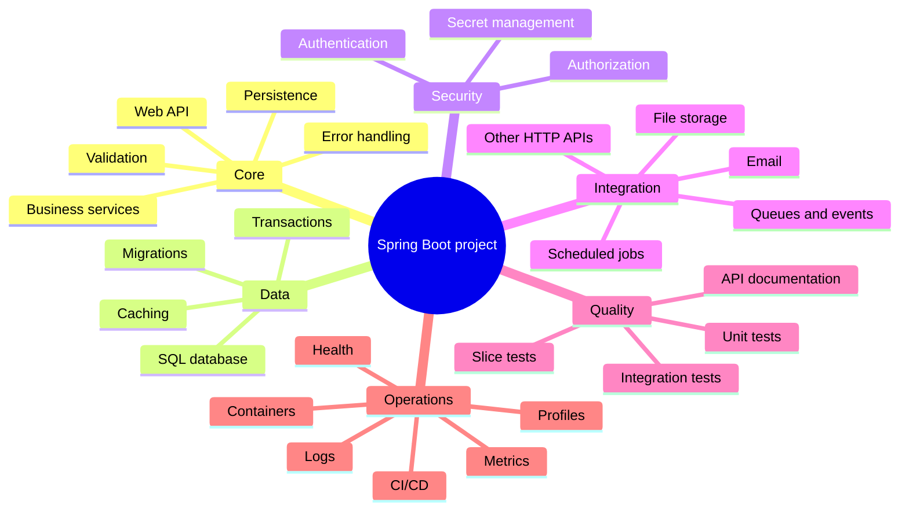

# Spring Boot Project Blueprint

> A visual, beginner-first handbook for turning a project idea into a structured Java/Spring Boot application—with a runnable reference API beside the documentation.

**Baseline:** Java 17 · Spring Boot 4.1 · Maven · Spring MVC · Spring Data JPA · H2



## Start here



| Goal | Open |
|---|---|
| Understand the complete path | [Learning roadmap](docs/00-learning-roadmap.md) |
| Translate Node/Express concepts | [Mental model](docs/01-mental-model.md) |
| Create a project correctly | [Project setup](docs/02-project-setup.md) |
| See how every layer connects | [Architecture and connections](docs/03-architecture-and-connections.md) |
| Build controllers, services, repositories, and DTOs | [Build a feature](docs/04-build-a-feature.md) |
| Understand entities, JPA, SQL, and migrations | [Database and JPA](docs/05-database-and-jpa.md) |
| Validate input and return useful errors | [Validation and errors](docs/06-validation-and-errors.md) |
| Use config, environments, and secrets | [Configuration and profiles](docs/07-configuration-and-profiles.md) |
| Test without guessing | [Testing](docs/08-testing.md) |
| Add auth and production features safely | [Security and production](docs/09-security-and-production.md) |
| Decide what a general project needs | [Real-project toolbox](docs/10-real-project-toolbox.md) |
| Plan or review your own project | [Reusable project checklist](PROJECT-CHECKLIST.md) |
| Fix common problems | [Troubleshooting](docs/11-troubleshooting.md) |
| Check official sources | [Official references](docs/official-references.md) |

## The one diagram to remember



### Layer responsibilities

| Layer | Simple meaning | Should contain | Should avoid |
|---|---|---|---|
| Controller | HTTP translator | Routes, status codes, DTO validation | SQL and business rules |
| Service | Decision maker | Use cases, rules, transactions | HTTP details |
| Repository | Database gateway | Queries and persistence | Request/response logic |
| Entity | Database-shaped object | Persistent state and relationships | API contract decisions |
| DTO | Boundary-shaped data | Request/response fields | Persistence behavior |
| Mapper | Shape converter | Entity ↔ DTO conversion | Business decisions |

## Runnable reference project

The included [Taskboard API](taskboard-api/README.md) demonstrates one complete CRUD feature.



```bash
cd taskboard-api
mvn spring-boot:run
```

Need the tools first? Follow the [setup prerequisites](docs/02-project-setup.md#install-and-check-the-tools).

```bash
curl -X POST http://localhost:8080/api/tasks \
  -H 'Content-Type: application/json' \
  -d '{"title":"Learn Spring layers","description":"Trace one request","dueDate":"2030-01-01"}'
```

Then try:

```text
GET  http://localhost:8080/api/tasks
GET  http://localhost:8080/api/tasks/1
GET  http://localhost:8080/actuator/health
```

## How Spring connects classes



You create classes and declare their dependencies. Spring creates and connects the managed objects—called **beans**—at startup.

## Project-building loop



Build one complete vertical slice before creating dozens of empty controllers, services, and repositories.

## Common project map



You rarely need everything on day one. [The toolbox](docs/10-real-project-toolbox.md) explains when each piece earns its place.

## Quick vocabulary

| Term | Meaning |
|---|---|
| Spring Framework | Dependency injection, web, data, transactions, security, and other foundations |
| Spring Boot | Opinionated setup and auto-configuration for Spring applications |
| Bean | An object created and managed by Spring |
| Dependency injection | Supplying an object with the collaborators it needs |
| Starter | A curated dependency bundle such as Web MVC or Data JPA |
| Annotation | Metadata such as `@Service`, `@Entity`, or `@GetMapping` |
| JPA | Java specification for object-relational persistence |
| Hibernate | The JPA implementation used by default in common Boot JPA projects |
| Maven | Build, dependency, test, and packaging tool |
| Embedded server | Tomcat runs inside the application JAR by default |

## Version note

This handbook was researched against the official Spring documentation on **2026-07-20**. The reference app uses Spring Boot `4.1.0`, whose documented minimum is Java 17. When starting a future project, confirm the latest stable version at [Spring Initializr](https://start.spring.io/) and the [Spring Boot system requirements](https://docs.spring.io/spring-boot/system-requirements.html).

> [!TIP]
> Read diagrams first, run the Taskboard API second, and return to the detailed pages when you need to change something. Spring becomes much easier once you can trace one request through the layers.
# spring-boot-project-blueprint
