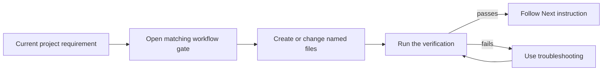
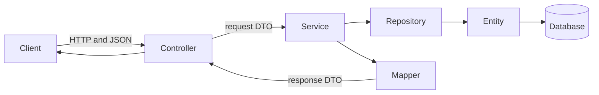

# Spring Boot Project Builder

> A working reference for creating a general Java/Spring Boot project. It tells you what to do, where to do it, how to verify it, and what to do next.

> [!IMPORTANT]
> **Timed interview and no Java experience:** start with the [Three-hour assignment runbook](THREE-HOUR-ASSIGNMENT.md), rehearse it once, and keep the [Java survival sheet](JAVA-SURVIVAL.md) open during adaptation.

## Use this repository



Start with the [project-building workflow](docs/00-project-workflow.md). Do not read every page first.

1. Find the gate matching the work you are doing.
2. Read its **Before you start** table.
3. Perform the **Do** actions in order.
4. Use the linked Taskboard file only when you need a working example.
5. Run **Verify**.
6. Continue only through the stated **Next** instruction.

## Choose the current task

| You need to… | Open |
|---|---|
| Complete a three-hour interview assignment | [Three-hour assignment runbook](THREE-HOUR-ASSIGNMENT.md) |
| Read or adapt unfamiliar Java syntax | [Java survival sheet](JAVA-SURVIVAL.md) |
| Start a project | [Workflow: Gate 0](docs/00-project-workflow.md#gate-0--define-the-first-useful-feature) |
| Turn a request into a first release | [Project decisions](docs/01-project-decisions.md) |
| Generate and run Spring Boot | [Project setup](docs/02-project-setup.md) |
| Decide which files connect | [Architecture and connections](docs/03-architecture-and-connections.md) |
| Add a controller, service, repository, entity, or DTO | [Build a feature](docs/04-build-a-feature.md) |
| Add tables, relationships, queries, or migrations | [Database and JPA](docs/05-database-and-jpa.md) |
| Validate input or return API errors | [Validation and errors](docs/06-validation-and-errors.md) |
| Add environment configuration or secrets | [Configuration and profiles](docs/07-configuration-and-profiles.md) |
| Add or choose tests | [Testing](docs/08-testing.md) |
| Add login, permissions, health, or deployment controls | [Security and production](docs/09-security-and-production.md) |
| Add an external API, queue, schedule, cache, or files | [Optional capabilities](docs/10-real-project-toolbox.md) |
| Fix a failure | [Troubleshooting](docs/11-troubleshooting.md) |
| Review before sharing or deploying | [Project checklist](PROJECT-CHECKLIST.md) |

## Project shape to create

```text
src/main/java/com/company/project/
├── ProjectApplication.java
├── common/error/
│   └── ApiExceptionHandler.java
└── feature/
    ├── Feature.java
    ├── FeatureRepository.java
    ├── FeatureService.java
    ├── FeatureController.java
    ├── FeatureMapper.java
    └── dto/
        ├── CreateFeatureRequest.java
        ├── UpdateFeatureRequest.java
        └── FeatureResponse.java
```



> **Terms:** A **controller** handles HTTP. A **service** performs a business action. A **repository** reads and writes stored data. An **entity** maps Java state to a database table. A **DTO** (data transfer object) defines data entering or leaving the API. A **mapper** converts between entity and DTO shapes.

## Working example

The [Taskboard API](taskboard-api/README.md) supplies working files for the structure above. It is a pattern to compare against, not a project template to copy unchanged.

```bash
cd taskboard-api
mvn clean verify
mvn spring-boot:run
```

Prepared calls are in [`taskboard-api/requests.http`](taskboard-api/requests.http).

## Rules for using the reference

- Build one complete feature before starting another.
- Add a dependency only when a requirement needs it.
- Keep HTTP work in controllers and business rules in services.
- Keep database entities separate from API request and response DTOs.
- Put transaction boundaries around complete service operations.
- Verify each change with tests and a runnable request.
- Use versioned migrations before a database becomes shared.
- Keep credentials and other secrets outside Git.

## Version baseline

The working example uses Java 17, Maven, and Spring Boot `4.1.0`. Confirm the current stable release and supported Java version at [Spring Initializr](https://start.spring.io/) and the [Spring Boot system requirements](https://docs.spring.io/spring-boot/system-requirements.html) when starting a new project.

The framework sources used for this reference are listed in [Official references](docs/official-references.md).
