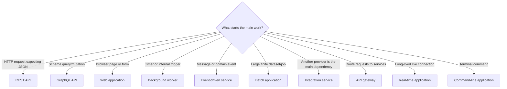

# What do you want to build with Spring Boot?

Choose the result your application must produce. Open only that path; it contains the complete order from project setup to delivery.

## Select one primary application type

| I need to build… | Choose this path |
|---|---|
| A JSON backend for a frontend, mobile app, or another service | [REST API](paths/rest-api.md) |
| A schema-driven API where clients choose fields | [GraphQL API](paths/graphql-api.md) |
| HTML pages and forms rendered by Spring | [Web application](paths/web-application.md) |
| Work that runs at a time or outside an HTTP request | [Background worker](paths/background-worker.md) |
| A service that consumes or publishes events | [Event-driven service](paths/event-driven-service.md) |
| A service mainly connecting to another API/provider | [Integration service](paths/integration-service.md) |
| A single entry point that routes and protects downstream services | [API gateway](paths/api-gateway.md) |
| Large, restartable data import/export or processing | [Batch application](paths/batch-application.md) |
| Live server-to-client updates, chat, tracking, or notifications | [Real-time application](paths/realtime-application.md) |
| A terminal command or one-off automation utility | [Command-line application](paths/command-line-application.md) |

> Most business domains—shopping, banking, hospital, booking, learning—use one or more of these technical shapes. Select by how the application runs and delivers results, not by its business name.

“Monolith,” “modular monolith,” “microservice,” and “serverless” describe system boundaries or deployment. They do not replace the choices above. Start with the selected application path; split deployment units only when team, scaling, ownership, or reliability requirements justify it.

## Not sure which one?



## Add capabilities only when the selected path asks for them

| The application also needs… | Capability module |
|---|---|
| SQL or MongoDB persistence | [Data storage](capabilities/data-storage.md) |
| Login, roles, permissions, or private records | [Security](capabilities/security.md) |
| Payments, email, maps, AI, or another HTTP API | [External API](capabilities/external-api.md) |
| Kafka, RabbitMQ, or durable asynchronous work | [Messaging](capabilities/messaging.md) |
| Uploads, downloads, images, or documents | [File storage](capabilities/file-storage.md) |
| Faster repeated reads after a measured bottleneck | [Caching](capabilities/caching.md) |

Do not read or add every capability. Complete the primary path, attach one required capability at its stated step, verify it, and continue.

## Shared resources

- [Project workbook](docs/project-workbook.md) — copy into your project to track requirements, features, tests, and delivery.
- [Taskboard reference API](taskboard-api/README.md) — runnable example for the REST + SQL path.
- [Troubleshooting](docs/troubleshooting.md) — use when a build, startup, HTTP, database, or test step fails.
- [Production checklist](docs/production-checklist.md) — final gate for every application type.
- [Official references](docs/official-references.md) — primary Spring documentation used by this repository.

## The rule for using this repository

```text
Choose one path → build one useful feature → add one required capability
→ verify → repeat only for remaining requirements → production checklist
```

The reference example uses Spring Boot 4.1.0 and Java 17. For a new project, confirm supported versions in the [official Spring Boot system requirements](https://docs.spring.io/spring-boot/system-requirements.html).
