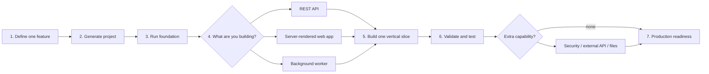
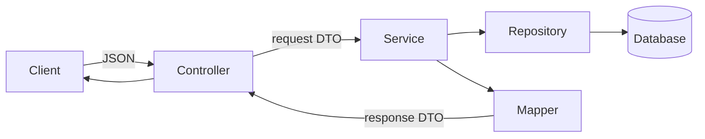

# Build a Spring Boot Application

This repository is a practical path from an idea to a tested, deployable Spring Boot application. Establish a small foundation, choose the kind of application you need, and build one complete feature at a time.

## The path



Use these guides:

1. Follow this page through the running foundation.
2. [Choose your application type](docs/application-paths.md).
3. Use [Build the core application](docs/core-guide.md) for the database-backed REST pattern.
4. [Prepare for production](docs/production-checklist.md) before sharing or deploying.

If something fails, use [Troubleshooting](docs/troubleshooting.md). The runnable [Taskboard API](taskboard-api/README.md) shows the complete core pattern.

## 1. Define one useful feature

Do not design the entire system first. Write one action that produces a useful result:

```text
User:
Action:
Request input:
Success response:
Data to save:
Expected errors:
Who may perform it:
```

Example: “A team member creates a task with a title and due date; the API returns the saved task with an ID and `TODO` status.”

## 2. Generate the project

At [Spring Initializr](https://start.spring.io/), choose Maven, Java, Jar, the current stable Spring Boot release, and a supported Java version. For a database-backed JSON API, start with:

- Spring Web
- Validation
- Spring Data JPA
- the driver for your database
- Actuator

Add other dependencies only when you reach an application branch that needs them.

```bash
java -version
mvn -version
mvn clean verify
mvn spring-boot:run
```

The untouched generated project must build and start before feature code is added.

## 3. Choose the application path

Once the generated application starts, open [Choose your application type](docs/application-paths.md). First select one primary shape:

- JSON REST API;
- server-rendered web application; or
- background/scheduled worker.

Then add only required capabilities: SQL persistence, security, an external API, or file processing.

## 4. Build one vertical slice

Keep code grouped by feature:

```text
src/main/java/com/company/project/
├── ProjectApplication.java
├── common/error/ApiExceptionHandler.java
└── task/
    ├── Task.java
    ├── TaskRepository.java
    ├── TaskService.java
    ├── TaskController.java
    ├── TaskMapper.java
    └── dto/
        ├── CreateTaskRequest.java
        ├── UpdateTaskRequest.java
        └── TaskResponse.java
```



Build in this order:

1. Write the HTTP contract: method, path, request, response, status, and errors.
2. Create the entity and repository.
3. Create request and response DTOs.
4. Map entity data to the response DTO.
5. Put business rules and the transaction in the service.
6. Put HTTP binding and status codes in the controller.
7. Run a real request and confirm both response and stored data.

The exact code pattern is in [Build the core application](docs/core-guide.md).

If the application has no database, omit the entity and repository; the service can coordinate an external adapter or background operation instead.

## 5. Make failure predictable

- Validate request DTOs with Jakarta Validation and `@Valid`.
- Throw named exceptions for expected failures such as “not found” or “conflict.”
- Map exceptions in one `@RestControllerAdvice`.
- Return consistent `ProblemDetail` responses.
- Never expose stack traces, secrets, or database details to clients.

Use the normal HTTP meanings: `201` created, `200` success, `204` successful deletion, `400` invalid request, `401` unauthenticated, `403` forbidden, `404` missing, and `409` conflict.

## 6. Test before expanding

Run:

```bash
mvn clean verify
```

For each feature, test:

- service rules with a unit test;
- routes, JSON, validation, and errors with an MVC test;
- entity mappings and custom queries with a JPA test;
- the critical full flow with an integration test when needed.

At minimum cover success, invalid input, missing data, and the feature’s most important business rule.

## 7. Choose an extra capability

| Requirement | Next branch |
|---|---|
| CRUD, search, filters, pagination | [REST API](docs/application-paths.md#path-a--rest-api) |
| Login, roles, private data | [Secure application](docs/application-paths.md#path-b--secure-application) |
| Call payments, email, maps, or another API | [Integration service](docs/application-paths.md#path-c--external-api-integration) |
| Slow, retryable, queued, or scheduled work | [Background worker](docs/application-paths.md#path-d--background-or-scheduled-work) |
| Upload or download documents and images | [File application](docs/application-paths.md#path-e--file-processing) |
| Server-rendered HTML instead of a JSON API | [Web application](docs/application-paths.md#path-f--server-rendered-web-application) |

Choose every branch required by the real use case, but add them one at a time. After each branch, rerun the clean build and its manual request.

## 8. Finish the application

Before another person or environment depends on it, complete the [production checklist](docs/production-checklist.md). The application is ready only when a clean environment can configure, build, migrate, start, test, and monitor it without source-code edits.

## Definition of done

- The required user action works end to end.
- Input, output, permissions, and errors match the written contract.
- Database changes are repeatable migrations.
- Collections are paginated and external calls have timeouts.
- Tests pass with `mvn clean verify`.
- Secrets are outside Git.
- Health checks and useful logs exist.
- The README contains exact run, test, configuration, and request commands.

The example currently uses Spring Boot 4.1.0 and Java 17. When creating a new project, confirm the supported versions in the [official Spring Boot system requirements](https://docs.spring.io/spring-boot/system-requirements.html).
