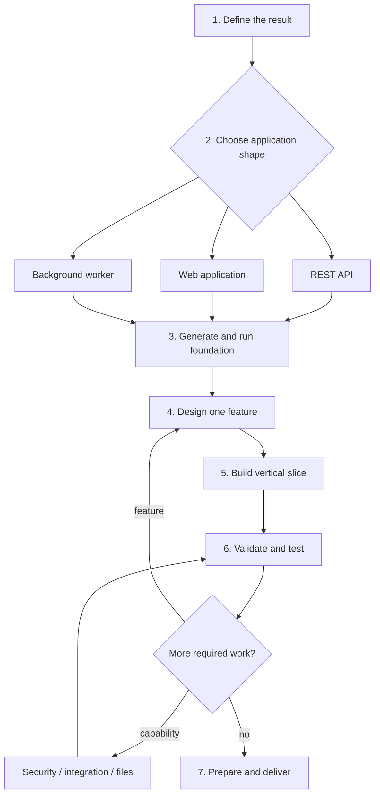
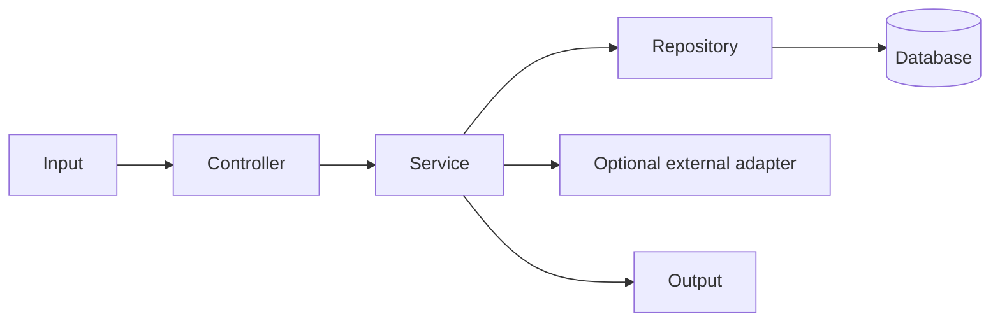

# Spring Boot: Start Here

> Build a complete Spring Boot application from an idea to a tested, deployable result.

This repository is arranged as a workflow, not a textbook. A new user should start on this page, complete one gate at a time, and continue only when its pass condition is true.

## Start in 30 seconds

1. Copy the [project workbook](docs/project-workbook.md) and fill in Gate 1.
2. Choose the application shape and dependencies in [Gate 2](#gate-2--choose-the-application-shape).
3. Generate and run the empty project in [Gate 3](#gate-3--create-a-working-foundation).
4. Build one complete feature using the selected path.
5. Verify every gate, then complete the production checklist.

When you need working code, compare your feature with the runnable [Taskboard API](taskboard-api/README.md). When a command fails, go directly to [Troubleshooting](docs/troubleshooting.md).

## Complete route



| Gate | Output | Continue only when |
|---|---|---|
| 1. Define | One small, testable user result | Success can be stated in one sentence |
| 2. Choose | Application shape and dependency list | Every dependency has a requirement |
| 3. Foundation | Generated application | Clean build passes and application starts |
| 4. Design | Contract, data, errors, access rules | Input and observable output are written |
| 5. Build | One vertical slice | A real request/job works end to end |
| 6. Verify | Automated and manual checks | Clean build and important failure paths pass |
| 7. Deliver | Configurable deployable artifact | A clean environment can run and monitor it |

## Gate 1 · Define the result

Open the [project workbook](docs/project-workbook.md) and complete its first section.

Write one result, not the entire imagined system:

```text
User: Team member
Action: Create a task
Input: title and due date
Output: saved task with an ID and TODO status
Data: task record
Access: authenticated team member
Failure: invalid title returns a clear validation error
```

Pass condition: “Given this input, when this user performs this action, then this result is returned or saved” is specific enough to test.

## Gate 2 · Choose the application shape

Choose one primary shape first:

| What the application must deliver | Primary path | Minimum starting dependency |
|---|---|---|
| JSON for a frontend, mobile app, or service | [REST API](docs/application-paths.md#path-a--rest-api) | Spring Web |
| HTML pages and forms rendered by Spring | [Web application](docs/application-paths.md#path-f--server-rendered-web-application) | Spring Web, Thymeleaf |
| Work from a schedule, queue, or event | [Background worker](docs/application-paths.md#path-d--background-or-scheduled-work) | Depends on trigger |

Add only capabilities the feature requires:

| Requirement | Add |
|---|---|
| Validate incoming fields | Validation |
| Store relational data | Spring Data JPA and one database driver |
| Health endpoint and metrics | Actuator |
| Login, roles, private records | [Spring Security path](docs/application-paths.md#path-b--secure-application) |
| Call another service | [External integration path](docs/application-paths.md#path-c--external-api-integration) |
| Upload or process files | [File path](docs/application-paths.md#path-e--file-processing) |

Pass condition: the workbook names one primary path and every selected dependency is connected to a written requirement.

## Gate 3 · Create a working foundation

### Prerequisite

Install a JDK supported by the selected Spring Boot version. Check it:

```bash
java -version
```

### Generate

At [Spring Initializr](https://start.spring.io/), select:

```text
Project: Maven
Language: Java
Spring Boot: current stable release
Group: your reverse domain, for example com.company
Artifact: your project name, for example orders-api
Packaging: Jar
Java: a version supported by the selected Spring Boot release
Dependencies: only those selected in Gate 2
```

Extract the project and run its Maven wrapper:

```bash
cd orders-api
./mvnw clean verify
./mvnw spring-boot:run
```

On Windows, use `mvnw.cmd` instead of `./mvnw`. If the project has no wrapper, install Maven and use `mvn`.

If Actuator was selected:

```bash
curl http://localhost:8080/actuator/health
```

Pass condition: the untouched project reports `BUILD SUCCESS`, starts without a stack trace, and health reports `UP` when Actuator is present.

## Gate 4 · Design one feature

Complete one feature section in the [project workbook](docs/project-workbook.md):

1. User story and acceptance criteria.
2. Trigger: HTTP method/path, form action, event, or schedule.
3. Request/input fields and validation.
4. Success output and status.
5. Expected failures.
6. Stored fields and ownership.
7. Permission and external-system rules.

For an HTTP feature, write the contract before Java:

```text
POST /api/tasks
Request:  { "title": "Learn Spring", "dueDate": "2030-01-01" }
Success:  201 Created + TaskResponse + Location header
Invalid:  400 Bad Request
Access:   authenticated member
```

Pass condition: another person could write a test from the contract without asking what the feature should do.

## Gate 5 · Build one vertical slice

A vertical slice is one action completed through every required layer. For a database-backed REST feature, use [Build the core application](docs/core-guide.md).

```text
src/main/java/com/company/project/
├── ProjectApplication.java
├── common/error/ApiExceptionHandler.java
└── task/
    ├── Task.java
    ├── TaskRepository.java
    ├── TaskService.java
    ├── TaskController.java
    ├── TaskMapper.java
    └── dto/
```



Build in dependency order:

1. Entity and repository, when data persists.
2. Request and response DTOs.
3. Mapper.
4. Service with business rules and transaction.
5. Controller, event listener, or scheduled entry point.
6. Global handling for expected errors.
7. One real end-to-end call or job execution.

If there is no database, omit the entity and repository. If there is no HTTP interface, replace the controller with the selected trigger. Keep the service as the owner of the use case.

Pass condition: one real input reaches the service and produces the intended response, stored change, file, external call, or completed job.

## Gate 6 · Validate and test

For every feature, verify:

| Concern | Required check |
|---|---|
| Success | Intended result and status/state |
| Input | Missing, malformed, boundary, and invalid values |
| Data | Mapping, constraints, queries, and transaction |
| Missing state | Unknown ID or absent dependency |
| Permissions | Unauthenticated, forbidden, allowed, and ownership cases |
| External dependency | Timeout, rejection, invalid response, and outage |
| Background work | Duplicate delivery, retry, permanent failure, restart |

Use the smallest suitable tests:

- unit test for service rules;
- MVC test for routes, JSON, validation, and errors;
- JPA test for mappings and custom queries;
- integration test for critical component connections.

```bash
./mvnw clean verify
```

Pass condition: the clean build passes, the happy path works manually, and important expected failures have automated tests.

## Gate 7 · Continue or deliver

After each passing feature, choose exactly one next action:

| Need | Return to |
|---|---|
| Add another user action | Gate 4 |
| Add/change a field | contract → migration → entity → DTO → mapper → tests |
| Add an endpoint | contract → DTO → service → controller → tests |
| Add authentication or roles | [Security path](docs/application-paths.md#path-b--secure-application) |
| Add an external provider | [Integration path](docs/application-paths.md#path-c--external-api-integration) |
| Add queue/scheduled work | [Background path](docs/application-paths.md#path-d--background-or-scheduled-work) |
| Add uploads/downloads | [File path](docs/application-paths.md#path-e--file-processing) |
| Fix a failure | [Troubleshooting](docs/troubleshooting.md) |
| Requirements are complete | [Production checklist](docs/production-checklist.md) |

Do not start several branches together. Add one, verify it, update the workbook, and choose again.

## Final definition of done

- Every requested result has an acceptance test or repeatable verification.
- Input, output, permissions, and errors match the workbook.
- Database changes use repeatable migrations.
- Growing collections are paginated.
- External calls have timeouts and safe failure handling.
- Tests pass with a clean Maven build.
- Secrets and environment values stay outside Git.
- Health checks, useful logs, and required metrics exist.
- The project README contains exact setup, run, test, migration, and example-use commands.
- A clean environment can configure, build, migrate, start, and verify the application.

## Small glossary

| Term | Meaning |
|---|---|
| Controller | Translates HTTP input/output |
| Service | Performs one business use case |
| Repository | Reads and writes persistent data |
| Entity | Java state mapped to a database table |
| DTO | Input/output shape crossing an application boundary |
| Bean | Object created and connected by Spring |
| Dependency injection | Receiving required collaborators through a constructor |
| Transaction | Database work that commits or rolls back as one operation |

The example uses Spring Boot 4.1.0 and Java 17. For a new project, confirm supported versions in the [official Spring Boot system requirements](https://docs.spring.io/spring-boot/system-requirements.html).
