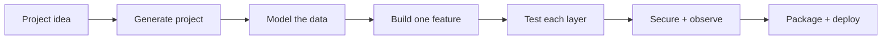
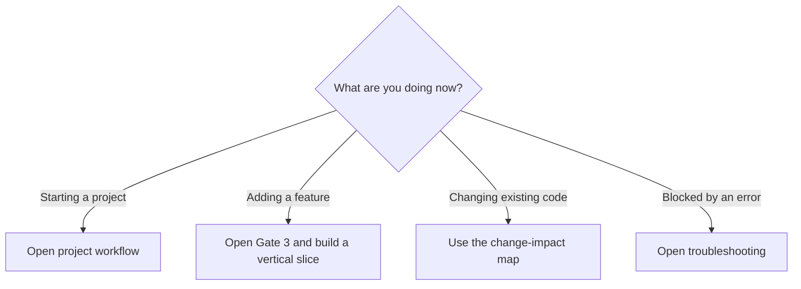
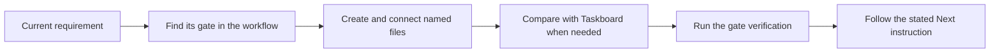
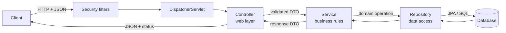
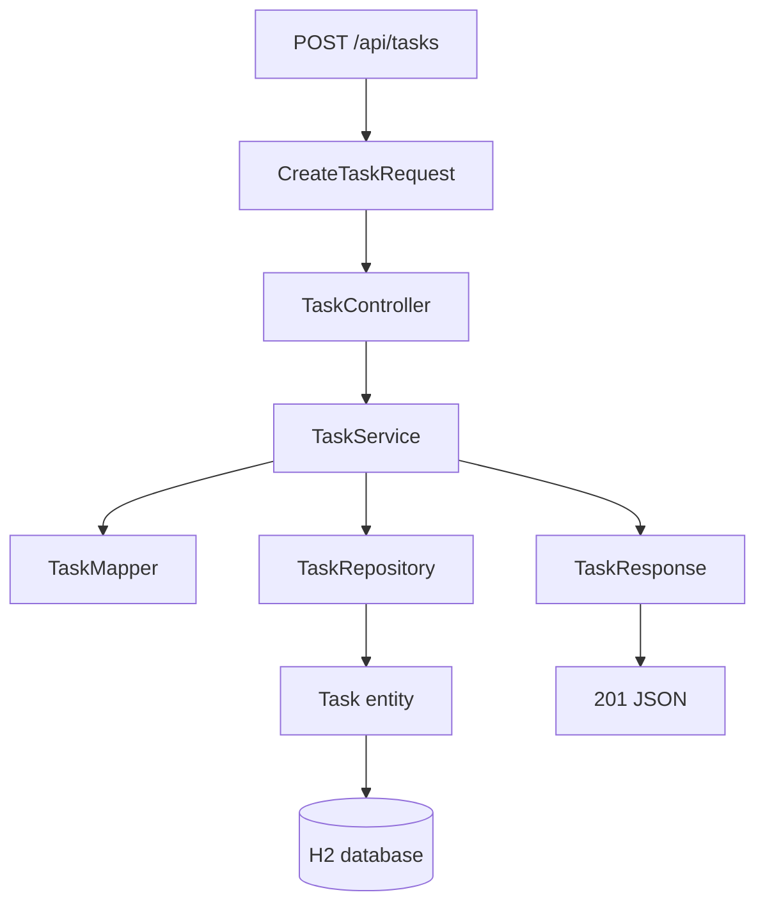
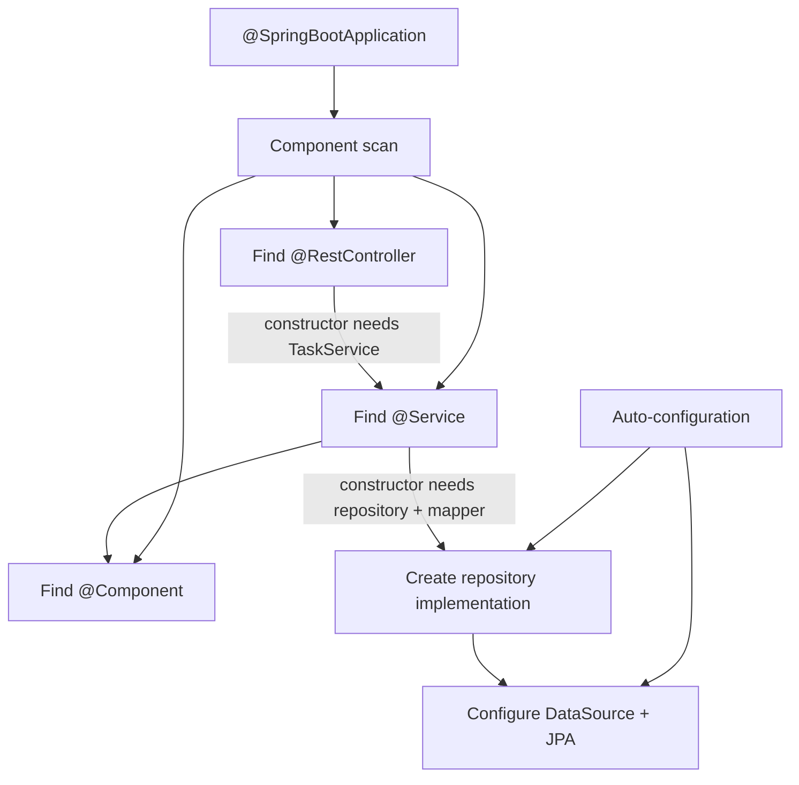
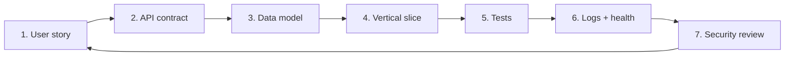
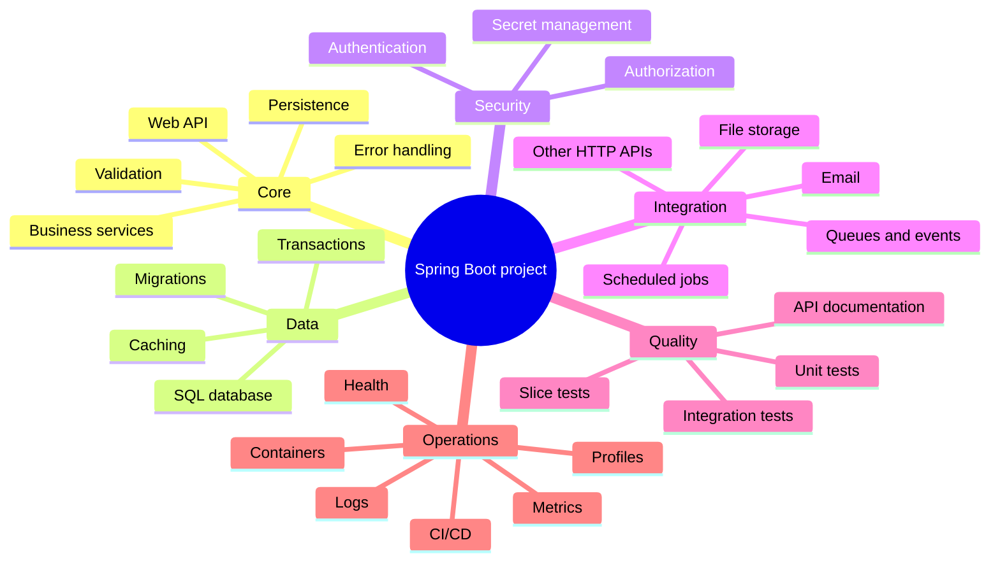

# Spring Boot Project Builder

> A visual execution reference for building Java/Spring Boot projects. Start with the current project requirement, perform the named steps, verify the result, and follow the explicit next action.

**Baseline:** Java 17 · Spring Boot 4.1 · Maven · Spring MVC · Spring Data JPA · H2



## Start here when building a project



The [project-building workflow](docs/00-project-workflow.md) is the primary document. Keep it open while working. It tells you what to create, where to create it, how the files connect, how to verify the phase, and what to do next.

| Current task | Use |
|---|---|
| Start a new project and always know the next step | [Project-building workflow](docs/00-project-workflow.md) |
| Translate a familiar Node/Express structure | [Node → Spring lookup](docs/01-mental-model.md) |
| Generate, configure, and run the foundation | [Project setup reference](docs/02-project-setup.md) |
| Decide which class connects to which | [Architecture and connections](docs/03-architecture-and-connections.md) |
| Implement controllers, services, repositories, entities, and DTOs | [Feature implementation reference](docs/04-build-a-feature.md) |
| Add entities, relationships, queries, migrations, or transactions | [Database and JPA reference](docs/05-database-and-jpa.md) |
| Add input rules and consistent API failures | [Validation and error reference](docs/06-validation-and-errors.md) |
| Add environment variables, profiles, and typed settings | [Configuration reference](docs/07-configuration-and-profiles.md) |
| Choose and create the required tests | [Testing reference](docs/08-testing.md) |
| Prepare authentication, authorization, and operations | [Security and production reference](docs/09-security-and-production.md) |
| Decide whether the project needs queues, cache, jobs, files, or clients | [Capability selection toolbox](docs/10-real-project-toolbox.md) |
| Review completeness before sharing or deploying | [Project checklist](PROJECT-CHECKLIST.md) |
| Resolve a build, startup, HTTP, or database failure | [Troubleshooting map](docs/11-troubleshooting.md) |
| Confirm framework behavior | [Official references](docs/official-references.md) |

## How to use this repository



1. Do not read the repository from beginning to end.
2. Start at the workflow gate matching the work in front of you.
3. Open a supporting page only when that gate links to it.
4. Copy structure and patterns from Taskboard, then rename and adapt them to the actual domain.
5. Do not copy optional infrastructure until a project requirement needs it.

## The one diagram to remember



### Layer responsibilities

| Layer | Simple meaning | Should contain | Should avoid |
|---|---|---|---|
| Controller | HTTP translator | Routes, status codes, DTO validation | SQL and business rules |
| Service | Decision maker | Use cases, rules, transactions | HTTP details |
| Repository | Database gateway | Queries and persistence | Request/response logic |
| Entity | Database-shaped object | Persistent state and relationships | API contract decisions |
| DTO | Boundary-shaped data | Request/response fields | Persistence behavior |
| Mapper | Shape converter | Entity ↔ DTO conversion | Business decisions |

## Copyable working reference

The included [Taskboard API](taskboard-api/README.md) is a working pattern library for one complete CRUD feature. Use its files as concrete references while implementing the corresponding step in your own project.



```bash
cd taskboard-api
mvn spring-boot:run
```

Need the tools first? Follow the [setup prerequisites](docs/02-project-setup.md#install-and-check-the-tools).

```bash
curl -X POST http://localhost:8080/api/tasks \
  -H 'Content-Type: application/json' \
  -d '{"title":"Learn Spring layers","description":"Trace one request","dueDate":"2030-01-01"}'
```

Then try:

```text
GET  http://localhost:8080/api/tasks
GET  http://localhost:8080/api/tasks/1
GET  http://localhost:8080/actuator/health
```

## How Spring connects classes



You create classes and declare their dependencies. Spring creates and connects the managed objects—called **beans**—at startup.

## The repeatable feature loop



After the foundation runs, repeat this loop for every requested feature. Build one complete vertical slice before creating empty layers for future ideas.

## Common project map



Select only what the current requirements need. [The toolbox](docs/10-real-project-toolbox.md) maps each need to the appropriate project capability.

## Lookup glossary

| Term | Meaning |
|---|---|
| Spring Framework | Dependency injection, web, data, transactions, security, and other foundations |
| Spring Boot | Opinionated setup and auto-configuration for Spring applications |
| Bean | An object created and managed by Spring |
| Dependency injection | Supplying an object with the collaborators it needs |
| Starter | A curated dependency bundle such as Web MVC or Data JPA |
| Annotation | Metadata such as `@Service`, `@Entity`, or `@GetMapping` |
| JPA | Java specification for object-relational persistence |
| Hibernate | The JPA implementation used by default in common Boot JPA projects |
| Maven | Build, dependency, test, and packaging tool |
| Embedded server | Tomcat runs inside the application JAR by default |

## Version note

This handbook was researched against the official Spring documentation on **2026-07-20**. The reference app uses Spring Boot `4.1.0`, whose documented minimum is Java 17. When starting a future project, confirm the latest stable version at [Spring Initializr](https://start.spring.io/) and the [Spring Boot system requirements](https://docs.spring.io/spring-boot/system-requirements.html).

> [!TIP]
> Keep the workflow open, finish one gate at a time, and do not move forward until its verification passes.
# spring-boot-project-blueprint
