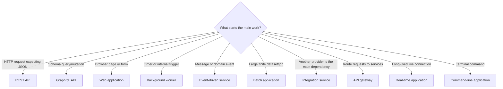

# What do you want to build with Spring Boot?

This repository is a build guide for common Spring Boot application types. It helps you choose an application shape, build one feature at a time, add only the capabilities that feature needs, test it, and prepare it for delivery.

## Choose how you want to begin

| Your situation | Start here | Then |
|---|---|---|
| Java and Spring Boot are both new to you | Complete the [Java and Spring Boot foundation](docs/java-spring-foundation.md) | Return here and choose an application type below |
| You want to create a project from Spring Initializr | Choose an application type below | Follow its numbered process from Step 1 |
| You learn best from working code or need a quick starting point | Choose a [runnable starter](starters/README.md) | Follow the [starter adaptation guide](docs/starter-adaptation-guide.md) |
| You already have a Spring Boot project | Choose the closest application type below | Use its steps as a gap checklist; do not regenerate the project |

Whichever route you choose, keep the [beginner execution guide](docs/beginner-execution-guide.md) open when you do not know how to create a file, use the terminal, add an import/dependency, edit YAML, run a test, or fix the first error. Use the [Java syntax primer](docs/java-syntax-primer.md) whenever a Java symbol is unfamiliar.

Do not try to read the entire repository before starting. Choose one primary application type and one small, observable feature.

## Select one primary application type

| I need to build… | Follow | Working starter |
|---|---|---|
| A JSON backend for a frontend, mobile app, or another service | [REST API](paths/rest-api.md) | [Taskboard API](taskboard-api/README.md) |
| A schema-driven API where clients choose fields | [GraphQL API](paths/graphql-api.md) | [GraphQL starter](starters/graphql-api/README.md) |
| HTML pages and forms rendered by Spring | [Web application](paths/web-application.md) | [Web starter](starters/web-application/README.md) |
| Work that runs at a time or outside an HTTP request | [Background worker](paths/background-worker.md) | [Worker starter](starters/background-worker/README.md) |
| A service that consumes or publishes events | [Event-driven service](paths/event-driven-service.md) | [Event starter](starters/event-driven-service/README.md) |
| A service mainly connecting to another API/provider | [Integration service](paths/integration-service.md) | [Integration starter](starters/integration-service/README.md) |
| A single entry point that routes and protects downstream services | [API gateway](paths/api-gateway.md) | [Gateway starter](starters/api-gateway/README.md) |
| Large, restartable data import/export or processing | [Batch application](paths/batch-application.md) | [Batch starter](starters/batch-application/README.md) |
| Live server-to-client updates, chat, tracking, or notifications | [Real-time application](paths/realtime-application.md) | [Real-time starter](starters/realtime-application/README.md) |
| A terminal command or one-off automation utility | [Command-line application](paths/command-line-application.md) | [CLI starter](starters/command-line-application/README.md) |

> Most business domains—shopping, banking, hospital, booking, learning—use one or more of these technical shapes. Select by how the application runs and delivers results, not by its business name.

“Monolith,” “modular monolith,” “microservice,” and “serverless” describe system boundaries or deployment. They do not replace the choices above. Start with the selected application path; split deployment units only when team, scaling, ownership, or reliability requirements justify it.

## Not sure which one?



## Add capabilities only when the selected path asks for them

| The application also needs… | Capability module |
|---|---|
| SQL or MongoDB persistence | [Data storage](capabilities/data-storage.md) |
| Login, roles, permissions, or private records | [Security](capabilities/security.md) |
| Payments, email, maps, AI, or another HTTP API | [External API](capabilities/external-api.md) |
| Kafka, RabbitMQ, or durable asynchronous work | [Messaging](capabilities/messaging.md) |
| Uploads, downloads, images, or documents | [File storage](capabilities/file-storage.md) |
| Faster repeated reads after a measured bottleneck | [Caching](capabilities/caching.md) |

Do not read or add every capability. Complete the primary path, attach one required capability at its stated step, verify it, and continue.

## Build it one step at a time

Open the selected path and begin with Step 1. Read only the current step. The `📍` callout shows the exact file, folder, browser page, or terminal to use. Perform the instructions beneath it in order, use the code or command shown there, and check the stated result before continuing.

When a step links a capability such as database, security, or messaging, open only the capability you need. Complete it, return to the application path, and continue. Replace the example feature and package names with the names written in your `PROJECT.md`.

## Shared resources

- [Project workbook](docs/project-workbook.md) — copy into your project to track requirements, features, tests, and delivery.
- [Java and Spring Boot foundation](docs/java-spring-foundation.md) — prerequisites, Java syntax, generated files, Spring wiring, and the normal development loop.
- [Beginner execution guide](docs/beginner-execution-guide.md) — physical IDE/file/terminal actions used by every process step.
- [Java syntax primer](docs/java-syntax-primer.md) — packages, imports, types, methods, collections, exceptions, annotations, and safe code adaptation.
- [Testing guide](docs/testing-guide.md) — concrete unit, MVC, persistence, and integration-test patterns.
- [Configuration guide](docs/configuration-guide.md) — YAML, environment variables, profiles, validated settings, and secrets.
- [Delivery guide](docs/delivery-guide.md) — package, run, containerize, verify in CI, migrate, deploy, and roll back.
- [Taskboard reference API](taskboard-api/README.md) — runnable example for the REST + SQL path.
- [Runnable starters](starters/README.md) — minimal, tested Maven applications for every other path.
- [Troubleshooting](docs/troubleshooting.md) — use when a build, startup, HTTP, database, or test step fails.
- [Production checklist](docs/production-checklist.md) — final gate for every application type.
- [Official references](docs/official-references.md) — primary Spring documentation used by this repository.

## The rule for using this repository

```text
Choose one path → build one useful feature → add one required capability
→ verify → repeat only for remaining requirements → production checklist
```

The reference example uses Spring Boot 4.1.0 and Java 17. For a new project, confirm supported versions in the [official Spring Boot system requirements](https://docs.spring.io/spring-boot/system-requirements.html).
