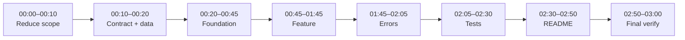
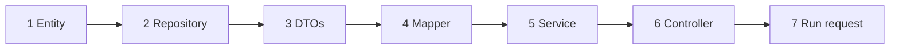
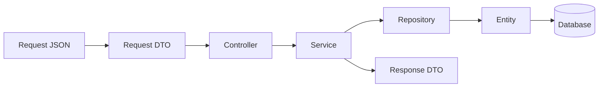
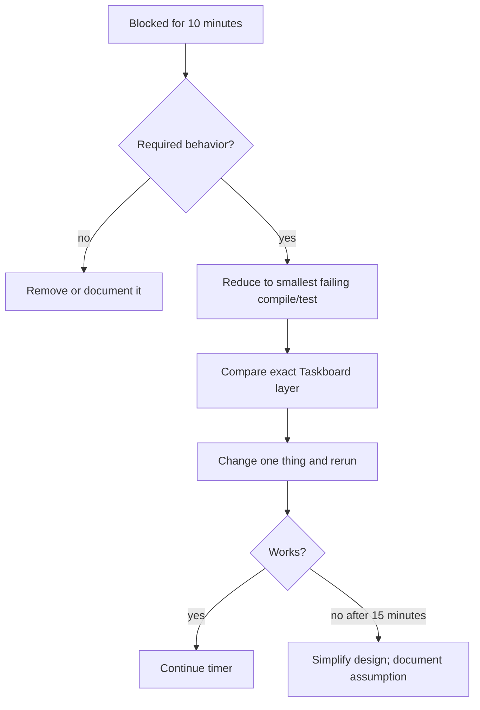

# Three-hour Spring Boot assignment runbook

[Repository home](README.md) · [Java survival sheet](JAVA-SURVIVAL.md) · [Working Taskboard code](taskboard-api/README.md)

Use this page during a timed interview assignment. It optimizes for a small, correct, testable submission—not a production platform.

> [!IMPORTANT]
> If you currently know no Java, rehearse this runbook once before an interview. During the real test, use the same structure and change only the domain. Three hours is not enough to learn Java, Spring, the assignment, and debugging for the first time.

## Before the interview — rehearse once

| What | Where | Finish when |
|---|---|---|
| Verify tools | Terminal | `java -version` and `mvn -version` work |
| Build reference | `taskboard-api/` | `mvn clean verify` passes |
| Run reference | `taskboard-api/` | Health and one POST request work |
| Trace code | Taskboard files | You can point to DTO → controller → service → repository → entity |

```bash
cd taskboard-api
mvn clean verify
mvn spring-boot:run
```

Use [`requests.http`](taskboard-api/requests.http) or `curl` to create and read a task. Do this rehearsal without an interview timer.

## Three-hour timer



The clock is a limit. Move forward when the required result works; do not spend spare time adding architecture.

---

## 00:00–00:10 — Reduce the prompt to deliverables

| What | Where | Output |
|---|---|---|
| Mark mandatory nouns and verbs | Prompt or scratch note | Must/should/skip list |

Write:

```text
MUST: endpoints, fields, rules, required tests, required database/build tool
SHOULD: clean errors, pagination, useful README
SKIP unless demanded: authentication, Docker, cache, queue, cloud, UI, microservices
Assumptions:
```

> **Term:** An **assumption** is a decision made where the prompt is unclear. Recording it is safer than silently guessing.

### Stop rule

If a feature is not explicitly required and does not make a required feature work, skip it.

**Next:** Write the contract and data sketch.

## 00:10–00:20 — Write the contract and data sketch

| What | Where | Output |
|---|---|---|
| Define each required operation | Scratch note or README draft | Method, path, request, response, errors |
| Define stored fields | Same note | Entity fields, types, required/unique rules |

```text
POST /api/items
Request: name, description
Success: 201 + item
Errors: 400 invalid input

GET /api/items/{id}
Success: 200 + item
Errors: 404 missing item
```

Start with one entity unless the prompt requires a relationship. Choose simple Java types:

| Data | Java type |
|---|---|
| Text | `String` |
| Whole number/ID | `Long` |
| Decimal | `BigDecimal` |
| True/false | `boolean` or `Boolean` |
| Date only | `LocalDate` |
| Timestamp | `Instant` |
| Fixed states | `enum` |

**Next:** Establish a passing foundation.

## 00:20–00:45 — Build and run the untouched foundation

| Situation | Do |
|---|---|
| Assignment supplies a project | Use it; inspect `pom.xml` and run tests before editing |
| Assignment asks you to create one | Use Spring Initializr with Maven, Java, Spring Web, Validation, Data JPA, H2, and Actuator |
| Assignment names a database | Use its driver; do not replace it with H2 unless local/test use is allowed |

Run immediately:

```bash
mvn clean verify
mvn spring-boot:run
```

> **Terms:** `pom.xml` is the Maven build/dependency file. A **clean build** deletes old build output before compiling and testing. A **baseline failure** is a failure present before your feature changes.

Do not start feature code until you know whether the supplied/generated foundation builds.

**If blocked:** use [Troubleshooting](docs/11-troubleshooting.md).  
**Next:** Create one feature package.

## 00:45–01:45 — Implement one complete feature

Create in this order:



| Order | Create | Copy/adapt from | Required job |
|---|---|---|---|
| 1 | `Item.java` | [`Task.java`](taskboard-api/src/main/java/com/example/taskboard/task/Task.java) | Entity fields and persistence mapping |
| 2 | `ItemRepository.java` | [`TaskRepository.java`](taskboard-api/src/main/java/com/example/taskboard/task/TaskRepository.java) | Extend `JpaRepository<Item, Long>` |
| 3 | Request/response records | [`dto/`](taskboard-api/src/main/java/com/example/taskboard/task/dto) | Define API input and output |
| 4 | `ItemMapper.java` | [`TaskMapper.java`](taskboard-api/src/main/java/com/example/taskboard/task/TaskMapper.java) | Convert entity to response |
| 5 | `ItemService.java` | [`TaskService.java`](taskboard-api/src/main/java/com/example/taskboard/task/TaskService.java) | Rules, transaction, repository calls |
| 6 | `ItemController.java` | [`TaskController.java`](taskboard-api/src/main/java/com/example/taskboard/task/TaskController.java) | Routes, validation, HTTP response |

When adapting a file:

1. Put it under your generated base package.
2. Change the `package` line first.
3. Rename the domain type everywhere in the file.
4. Replace fields and validation from the prompt.
5. Remove Taskboard operations the assignment does not require.
6. Compile after every two or three files.

```bash
mvn test -DskipTests
```

This command compiles main and test sources while skipping test execution. Use `mvn clean verify` for the final result.

### Minimum connection



### Scope order

1. Make create work.
2. Make get-by-ID work.
3. Add list if required.
4. Add update/delete only when required.
5. Add relationships or filters only after basic operations work.

**Next:** Add only required validation and expected errors.

## 01:45–02:05 — Add validation and errors

| What | Where | Verify |
|---|---|---|
| Required/length/range rules | Request DTO annotations | Invalid request returns `400` |
| Missing record exception | Feature package | Unknown ID returns `404` |
| Error mapping | `common/error/ApiExceptionHandler.java` | Stable safe error body |

Adapt [`ApiExceptionHandler.java`](taskboard-api/src/main/java/com/example/taskboard/common/error/ApiExceptionHandler.java). Do not build a large exception hierarchy.

Required manual calls:

- valid create;
- invalid create;
- existing ID;
- missing ID.

**Next:** Add tests for behavior most likely to be reviewed.

## 02:05–02:30 — Add a small high-value test set

| Priority | Test | Working example |
|---|---|---|
| 1 | Controller accepts valid JSON and returns intended status | [`TaskControllerTest`](taskboard-api/src/test/java/com/example/taskboard/task/TaskControllerTest.java) |
| 2 | Controller rejects invalid JSON/fields | [`TaskControllerTest`](taskboard-api/src/test/java/com/example/taskboard/task/TaskControllerTest.java) |
| 3 | Service handles a missing ID or important rule | [`TaskServiceTest`](taskboard-api/src/test/java/com/example/taskboard/task/TaskServiceTest.java) |
| 4 | Custom repository query works, if one exists | [`TaskRepositoryTest`](taskboard-api/src/test/java/com/example/taskboard/task/TaskRepositoryTest.java) |

Do not chase a coverage percentage unless the prompt requires it. Test required behavior and failure paths.

```bash
mvn clean verify
```

**Next:** Make the submission runnable by the reviewer.

## 02:30–02:50 — Write the reviewer README

| What | Include |
|---|---|
| Prerequisites | Java version and Maven |
| Run | Exact startup command |
| Test | Exact clean verification command |
| API | Method, path, request example, expected result |
| Decisions | Assumptions and trade-offs |
| Remaining work | Only honest known limitations |

Also provide `requests.http` or `curl` examples. A reviewer should not have to inspect code to discover how to start or call the application.

**Next:** Stop adding features and perform final verification.

## 02:50–03:00 — Final submission check

Run from the project root:

```bash
mvn clean verify
git status --short
```

Check:

- [ ] Required endpoints exist.
- [ ] Clean build passes.
- [ ] No secrets, IDE files, database files, or build output are committed.
- [ ] README commands are correct.
- [ ] One happy-path request works.
- [ ] Invalid input and missing data return intended errors.
- [ ] Package names match directories.
- [ ] No placeholder/TODO remains in required behavior.

If the clean build fails, fix it before formatting or optional improvements.

## When time is going wrong



Never spend the final ten minutes creating a new capability. Preserve a passing, runnable submission.
