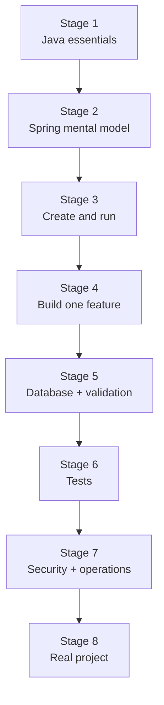
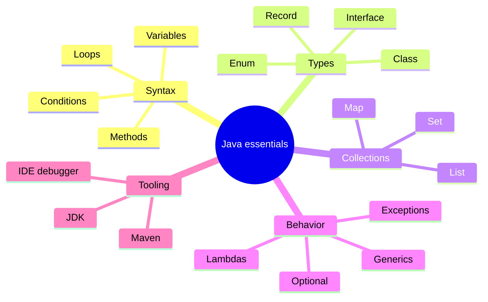
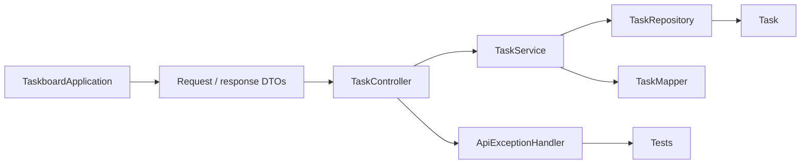
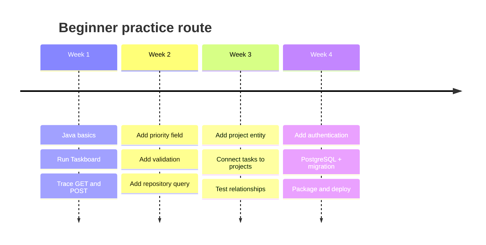
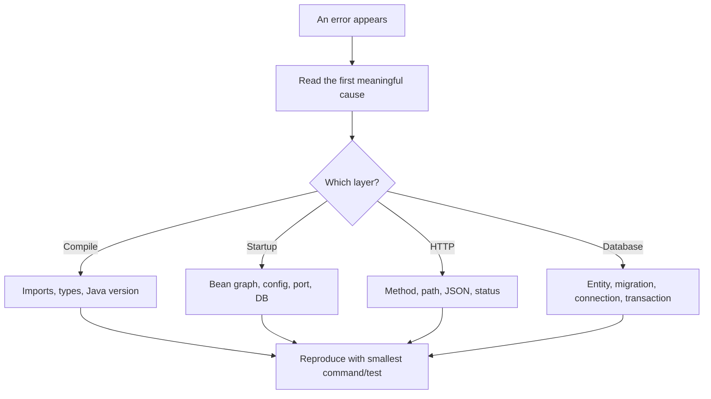

# 00 · Learning roadmap

[← README](../README.md) · [Next: Mental model →](01-mental-model.md)

## The path from zero to a working project

| Stage | Learn | Prove it |
|---|---|---|
| 1 | Classes, records, interfaces, collections, exceptions | Read the Task DTOs and service |
| 2 | Beans, injection, annotations, auto-configuration | Trace the startup diagram |
| 3 | Initializr, Maven, packages, application entry point | Run the app and health endpoint |
| 4 | Controller → service → repository | Create and fetch a task |
| 5 | Entity, JPA, validation, errors, transactions | Send valid and invalid requests |
| 6 | Unit, slice, and integration tests | Run `mvn test` |
| 7 | Profiles, secrets, security, Actuator | Explain what changes for production |
| 8 | Requirements, integrations, deployment | Plan your own project with the checklist |

## Minimum Java before Spring

You do **not** need advanced Java before starting. Learn each item when the reference app makes it concrete.

## Read code in this order

This order follows a request from the outside inward.

## Four-week practice route

## Progress checklist

- [ ] I can explain controller, service, repository, entity, and DTO.
- [ ] I can trace a request to the database and back.
- [ ] I can add a field across request, entity, response, and tests.
- [ ] I can add a new endpoint without placing rules in the controller.
- [ ] I can explain why a transaction belongs around a use case.
- [ ] I can run unit, MVC, JPA, and integration tests.
- [ ] I know what belongs in configuration instead of source code.
- [ ] I can identify security and production work that a tutorial omits.

## When you get stuck

Use [Troubleshooting](11-troubleshooting.md) as a symptom map—not as a list to memorize.
