# 00 · Project-building workflow

[← README](../README.md) · [Project checklist](../PROJECT-CHECKLIST.md) · [Example application](../taskboard-api/README.md)

Use this page while building a project. Do not read every document first. Complete one gate, verify its output, and follow the **Next** instruction.

## The working loop

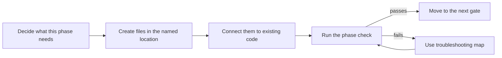

## Complete route

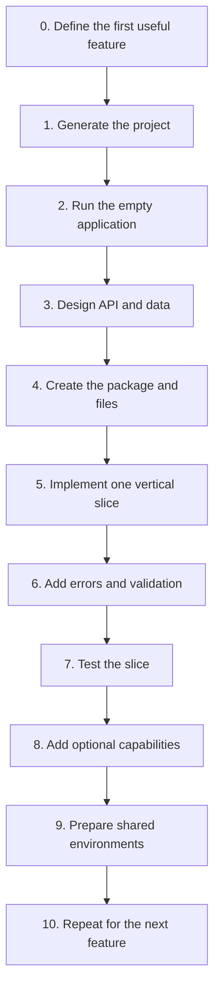

---

## Gate 0 — Define the first useful feature

### Before you start

| Item | Value |
|---|---|
| What | Select one user action to implement first. |
| Where | Project notes, issue, or copied planning block below—not Java code. |
| Input | User, problem, required data, access rule, and external systems. |
| Output | One small feature with a clear success result. |

> **Terms:** A **feature** is a user-visible capability. A **use case** is one action the application performs for a user or another system. A **business rule** is a condition the application must enforce regardless of UI or database choice.

### Do

```text
Project:
User:
Problem:
First action the user must complete:
Input required:
Output returned:
Data that must persist:
Who may perform the action:
```

Example:

```text
Project: Taskboard
User: Team member
First action: Create a task
Input: title, description, due date
Output: created task with ID and TODO status
Persist: task record
Access: authenticated team member
```

Required output:

- One user action, not the entire future system.
- Its input, output, saved data, and access rule.
- A list of external systems it must contact.

### Verify

Can you describe success in one sentence? If not, reduce the feature.

Use [Project decisions](01-project-decisions.md) when roles, scope, integrations, or acceptance criteria are not yet clear.

**Next:** Generate the project in Gate 1.

---

## Gate 1 — Generate the project

### Before you start

| Item | Value |
|---|---|
| What | Generate a minimal Spring Boot foundation. |
| Where | [Spring Initializr](https://start.spring.io/), then the extracted project root. |
| Input | Project name, base package, supported Java version, and required capabilities. |
| Output | A Maven project whose clean build passes. |

> **Terms:** **Spring Boot** configures a Spring application from its dependencies and settings. **Spring Initializr** generates the initial files. **JDK** is the Java compiler and runtime. **Maven** builds and tests the project using `pom.xml`. A **dependency** is external code the project uses; a Spring **starter** bundles dependencies for one capability. A **REST API** exposes resource operations through HTTP methods and paths.

### Do

Open [Spring Initializr](https://start.spring.io/) and select:

| Field | Use |
|---|---|
| Project | Maven |
| Language | Java |
| Spring Boot | Current stable version |
| Group | Your reverse domain, such as `com.company` |
| Artifact | Project name, such as `orders-api` |
| Packaging | Jar |
| Java | A version supported by the selected Spring Boot release |

Choose dependencies from requirements:

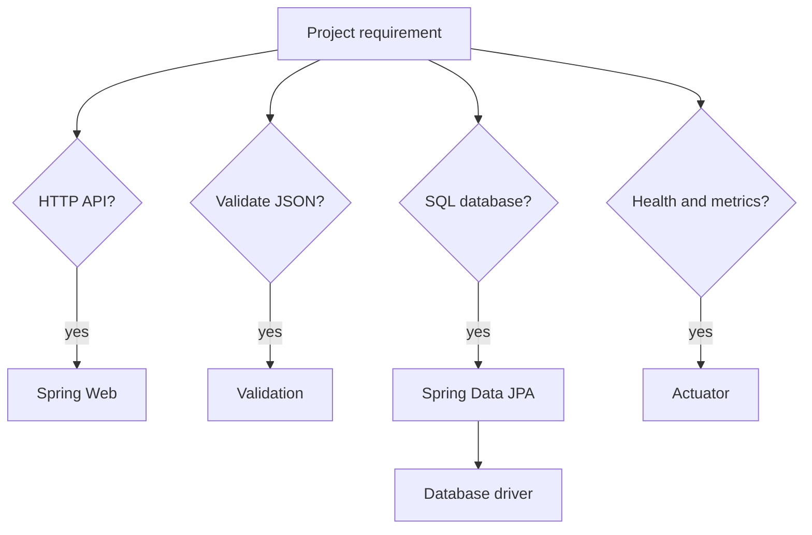

For a typical database-backed REST API, start with Spring Web, Validation, Spring Data JPA, the selected database driver, and Actuator.

Unzip the generated project and open its `pom.xml` as a Maven project.

### Verify

```bash
java -version
mvn -version
mvn clean verify
```

The last command must end with `BUILD SUCCESS`.

**If tools are missing:** use [Project setup](02-project-setup.md#install-and-check-the-tools).  
**Next:** Run the untouched application in Gate 2.

---

## Gate 2 — Run the empty application

### Before you start

| Item | Value |
|---|---|
| What | Prove the untouched generated application can start. |
| Where | Project root and the generated `*Application.java` file. |
| Input | Successful Gate 1 build. |
| Output | Running application and healthy startup check. |

> **Terms:** The **application class** contains `main` and starts Spring Boot. The **application context** is the container holding objects managed by Spring. Those managed objects are **beans**. An **embedded server** is the HTTP server packaged inside the application. **Actuator** supplies operational endpoints such as health.

### Do

Keep the generated application class at the top of your package tree:

```text
src/main/java/com/company/orders/
└── OrdersApplication.java
```

Run:

```bash
mvn spring-boot:run
```

If Actuator is present, request:

```bash
curl http://localhost:8080/actuator/health
```

### Verify

- The application starts without a stack trace.
- The configured port is available.
- The health endpoint returns `UP`.

Do not add feature code until the generated foundation runs.

**If startup fails:** use [Troubleshooting](11-troubleshooting.md).  
**Next:** Stop the application and design the first contract in Gate 3.

---

## Gate 3 — Design the API and data

### Before you start

| Item | Value |
|---|---|
| What | Define the API boundary and persistent data before implementing classes. |
| Where | Project notes/API specification and database migration design. |
| Input | First use case from Gate 0. |
| Output | Method, path, input, output, errors, fields, and schema strategy. |

> **Terms:** **HTTP** is the request/response protocol used by the API. An **endpoint** is one HTTP method and path. An API **contract** defines accepted input and promised output. **JSON** is the common text format for request and response data. A **DTO** (data transfer object) is the Java shape crossing an API boundary. An **entity** is the Java shape mapped to persistent database state. A **migration** is a versioned database schema change.

### 3A. Define the HTTP contract

```text
Method: POST
Path: /api/tasks
Request: title, description, dueDate
Success: 201 Created + TaskResponse
Invalid input: 400 Bad Request
Unauthorized: 401 Unauthorized
Forbidden: 403 Forbidden
Conflict: 409 Conflict, if the rule requires it
```

### 3B. Define stored data

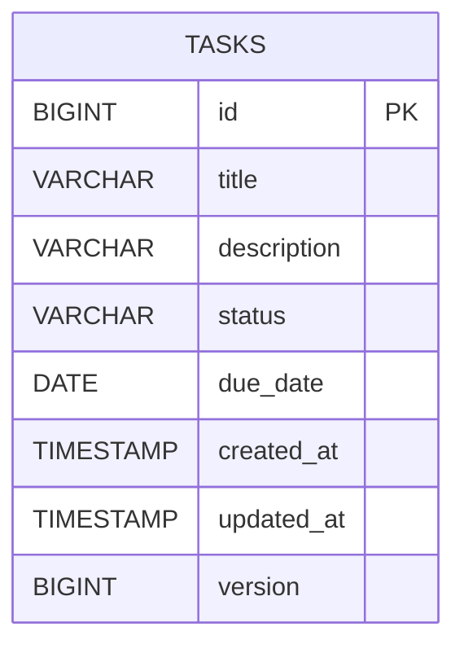

For each field decide:

- type and maximum length;
- required or optional;
- unique or repeatable;
- default value;
- relationship to another table;
- whether clients may set it or the server owns it.

### 3C. Choose schema handling

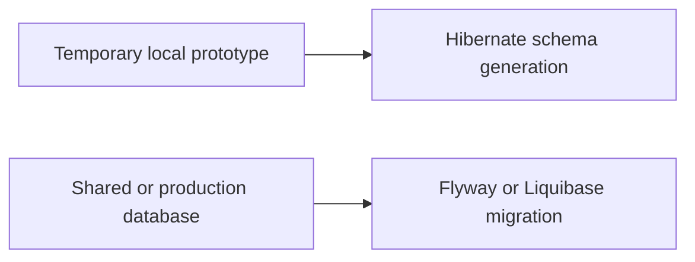

### Verify

The request, response, errors, table fields, and ownership rules are written down.

**Need relationship guidance:** open [Database and JPA](05-database-and-jpa.md).  
**Next:** Create the feature package and files in Gate 4.

---

## Gate 4 — Create the package and file skeleton

### Before you start

| Item | Value |
|---|---|
| What | Create the files required for one feature and establish dependency direction. |
| Where | `src/main/java/<base-package>/<feature>/` and `common/error/`. |
| Input | API and data design from Gate 3. |
| Output | Compiling feature skeleton with constructor dependencies. |

> **Terms:** A **package** groups related Java types. A **controller** translates HTTP. A **service** performs the use case. A **repository** accesses stored data. A **mapper** converts entity and DTO shapes. **Dependency injection** means Spring supplies constructor dependencies instead of classes constructing them directly.

### Do

Create a package named after the feature, not one global package per layer:

```text
src/main/java/com/company/orders/
├── OrdersApplication.java
├── common/error/
│   └── ApiExceptionHandler.java
└── order/
    ├── Order.java
    ├── OrderRepository.java
    ├── OrderService.java
    ├── OrderController.java
    ├── OrderMapper.java
    └── dto/
        ├── CreateOrderRequest.java
        ├── UpdateOrderRequest.java
        └── OrderResponse.java
```

Create only the files required by the first feature. Empty classes for imagined features add no value.

### Connection rule

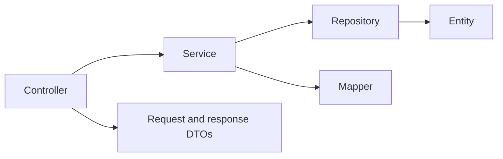

Dependencies move inward. The entity and repository must not depend on the controller.

### Verify

- Every file is below the package containing the application class.
- The package name matches its directory.
- The controller depends on the service through its constructor.
- The service depends on the repository and mapper through its constructor.

**See exact working files:** compare with the [Taskboard task package](../taskboard-api/src/main/java/com/example/taskboard/task).  
**Next:** Fill the files in the order shown in Gate 5.

---

## Gate 5 — Implement one vertical slice

### Before you start

| Item | Value |
|---|---|
| What | Fill the feature files in dependency order and run one request end to end. |
| Where | Feature package created in Gate 4. |
| Input | Compiling skeleton, API contract, and data design. |
| Output | One working API operation connected to persistence. |

> **Terms:** A **vertical slice** is one user action completed through all necessary layers. **JPA** is Java’s persistence specification; **Hibernate** commonly implements it. A **transaction** makes a group of database operations commit or roll back together. **JSON binding** converts request JSON into Java data and response Java data back into JSON.

### Do

Use this order because every new file then depends on something already defined:

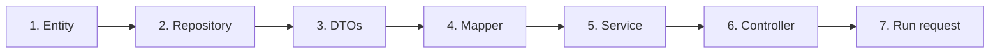

| Order | Create here | Do | Connect to | Working example |
|---|---|---|---|---|
| 1. Entity | `feature/Order.java` | Map ID, fields, enums, timestamps, and required relationships. | Repository persistent type | [`Task.java`](../taskboard-api/src/main/java/com/example/taskboard/task/Task.java) |
| 2. Repository | `feature/OrderRepository.java` | Extend `JpaRepository`; add only required bounded queries. | Service constructor | [`TaskRepository.java`](../taskboard-api/src/main/java/com/example/taskboard/task/TaskRepository.java) |
| 3. DTOs | `feature/dto/` | Define client-writable request fields and client-visible response fields. | Controller input and service output | [`CreateTaskRequest.java`](../taskboard-api/src/main/java/com/example/taskboard/task/dto/CreateTaskRequest.java) |
| 4. Mapper | `feature/OrderMapper.java` | Convert entity state to response DTO without business decisions. | Service constructor | [`TaskMapper.java`](../taskboard-api/src/main/java/com/example/taskboard/task/TaskMapper.java) |
| 5. Service | `feature/OrderService.java` | Load data, apply rules, change state, transact, and return response DTO. | Controller constructor | [`TaskService.java`](../taskboard-api/src/main/java/com/example/taskboard/task/TaskService.java) |
| 6. Controller | `feature/OrderController.java` | Bind/validate input, call one service method, and return HTTP status/body. | Spring MVC route | [`TaskController.java`](../taskboard-api/src/main/java/com/example/taskboard/task/TaskController.java) |

Use [Build a feature](04-build-a-feature.md) for the code and annotation meanings. Do not expose entities directly or place SQL/business rules in controllers.

### Verify

Start the application and run the new request. Confirm both the HTTP response and stored database row.

**Next:** Make failure behavior predictable in Gate 6.

---

## Gate 6 — Add validation and error handling

### Before you start

| Item | Value |
|---|---|
| What | Define predictable results for bad input and expected failures. |
| Where | Request DTOs, services, domain exceptions, and `common/error/`. |
| Input | Error cases written in Gate 3. |
| Output | Stable 4xx responses and safe unexpected-error handling. |

> **Terms:** **Validation** checks input constraints. A **domain exception** names an expected business failure. `ProblemDetail` is Spring’s structured HTTP error body. `@RestControllerAdvice` catches selected exceptions across controllers and converts them into responses.

### Do

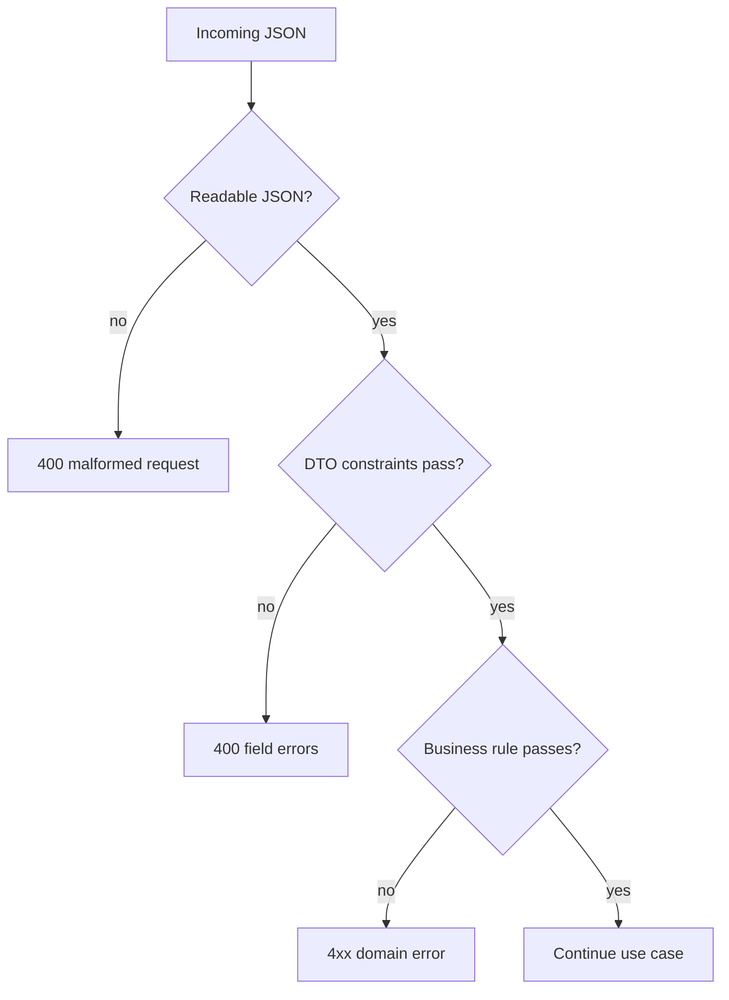

Do now:

1. Put Jakarta validation annotations on request DTOs.
2. Add `@Valid` to controller request parameters.
3. Create meaningful domain exceptions such as `OrderNotFoundException`.
4. Map expected exceptions in one `@RestControllerAdvice`.
5. Return safe, consistent `ProblemDetail` responses.

Working example: [`ApiExceptionHandler.java`](../taskboard-api/src/main/java/com/example/taskboard/common/error/ApiExceptionHandler.java).

### Verify

Send valid JSON, invalid fields, malformed JSON, a missing ID, and an invalid enum value. Each must return the intended 2xx or 4xx status; expected client errors must not become `500`.

**Need the error matrix:** open [Validation and errors](06-validation-and-errors.md).  
**Next:** Lock the behavior with tests in Gate 7.

---

## Gate 7 — Test the slice

### Before you start

| Item | Value |
|---|---|
| What | Prove the contract, rules, mappings, and critical full flow. |
| Where | Matching packages under `src/test/java`; test configuration under `src/test/resources`. |
| Input | Working feature and its success/failure matrix. |
| Output | Repeatable clean build with focused tests. |

> **Terms:** A **unit test** checks one class. A **mock** replaces a collaborator with controlled behavior. A **slice test** loads one framework layer. An **integration test** checks several real components together. **MockMvc** tests MVC requests without opening a server port.

### Do

Create matching test packages under `src/test/java`.

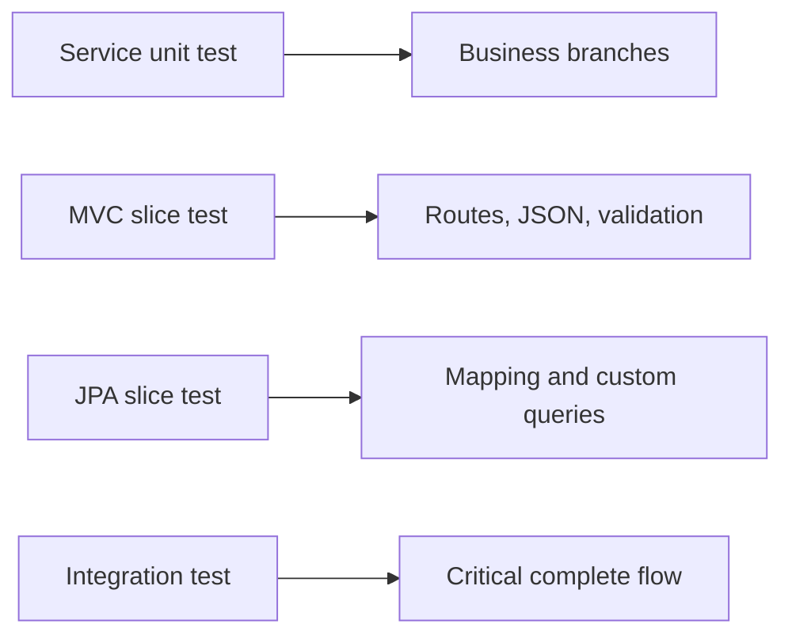

Minimum checks for a feature:

- success;
- invalid input;
- missing record;
- forbidden operation when authorization exists;
- conflict or duplicate rule;
- custom database query.

Run:

```bash
mvn clean verify
```

### Verify

The build passes from a clean checkout without the IDE.

**Choose the right test:** open [Testing](08-testing.md).  
**Next:** If the feature needs another capability, use Gate 8; otherwise continue to Gate 9.

---

## Gate 8 — Add optional capabilities only when required

### Before you start

| Item | Value |
|---|---|
| What | Add one capability demanded by a written requirement. |
| Where | Dedicated adapter/configuration package connected through the service. |
| Input | Required behavior, provider/system, limits, and failure expectations. |
| Output | Isolated, configured, and tested capability. |

> **Terms:** An **adapter** isolates an external provider behind application-owned code. A **queue** stores background work. A **cache** holds temporary copies for faster reads. A **scheduled job** starts work at configured times. A **timeout** limits how long an external call may block.

### Do

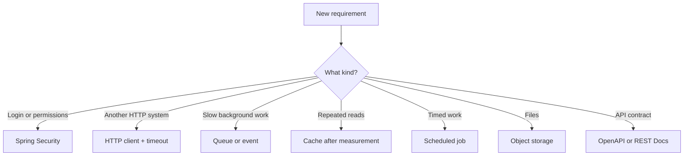

For every capability:

1. Define why it is needed.
2. Add the smallest suitable dependency.
3. Isolate it behind a service or adapter.
4. Put URLs, credentials, and timeouts in configuration.
5. Test success, failure, and timeout behavior.

### Verify

The main use case depends on an application-owned interface, provider settings are externalized, and tests cover provider failure without contacting the real provider.

**Selection guide:** use [Real-project toolbox](10-real-project-toolbox.md).  
**Next:** Prepare configuration and operations in Gate 9.

---

## Gate 9 — Prepare shared environments

### Before you start

| Item | Value |
|---|---|
| What | Make one tested JAR configurable, secure, observable, and deployable. |
| Where | Resources, security/configuration packages, CI configuration, and deployment platform. |
| Input | Completed features and target environment requirements. |
| Output | Repeatable build, migration, startup, health check, and delivery process. |

> **Terms:** A **JAR** is the packaged Java application file. A **profile** activates a named configuration group. A **secret** is sensitive configuration stored outside Git. **Authentication** establishes identity; **authorization** decides allowed actions. **Observability** uses logs, metrics, and traces to explain runtime behavior. **CI/CD** automates build, test, and delivery.

### Do

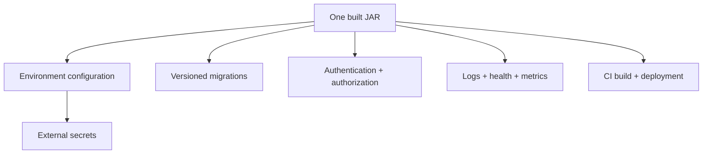

Before another person or environment depends on the project:

- replace `ddl-auto: update` with versioned migrations;
- keep secrets outside source control;
- define local, test, and production configuration;
- add authentication and authorization where data is protected;
- set external-call timeouts;
- expose only required Actuator endpoints;
- make logs useful without exposing sensitive data;
- run `mvn clean verify` in CI;
- document environment variables and startup commands;
- plan database backup and restore.

### Verify

A clean environment can receive configuration, build the project, apply migrations, start it, and report healthy without manual source edits.

**Configuration details:** [Configuration and profiles](07-configuration-and-profiles.md).  
**Production controls:** [Security and production](09-security-and-production.md).  
**Next:** Review the [project checklist](../PROJECT-CHECKLIST.md), then repeat Gate 3 onward for the next feature.

---

## Gate 10 — Repeat for the next feature

### Before you start

| Item | Value |
|---|---|
| What | Select the next smallest feature without weakening completed behavior. |
| Where | Return to the project requirements, then create or extend one feature package. |
| Input | Passing build, current user feedback, and next prioritized use case. |
| Output | Updated contract and another verified vertical slice. |

### Do

1. Choose the next required use case.
2. Return to Gate 3 and define its contract and data changes.
3. Use the change map below to identify every affected boundary.
4. Implement through Gate 9 only where the feature requires changes.
5. Keep all previously passing tests green.

### Verify

The new behavior works, existing behavior remains intact, and the clean build passes.

**Next:** Repeat Gate 10 until the agreed release scope is complete, then use the [project checklist](../PROJECT-CHECKLIST.md).

---

## What changes when you add something?

Use this map when the current task is smaller than a complete new feature.

| Change requested | Files normally changed | Then verify |
|---|---|---|
| Add a field | migration, entity, request/response DTOs, mapper, tests | create/read/update JSON and DB column |
| Add an endpoint | request DTO if needed, controller, service, tests | method, path, status, errors |
| Add a query/filter | repository, service, controller parameter, tests | pagination and empty results |
| Add a relationship | migration, entities, DTOs, mapper/query, tests | loading behavior and JSON shape |
| Add a business rule | service/domain exception, error handler, tests | allowed and rejected cases |
| Add an external API | properties, client adapter, service, tests | timeout and provider failure |
| Add authentication | security config, identity model/provider, tests | `401`, `403`, and allowed request |
| Change configuration | properties record, YAML/environment docs, startup test | application fails fast when invalid |

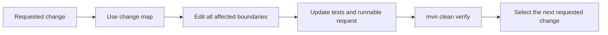
