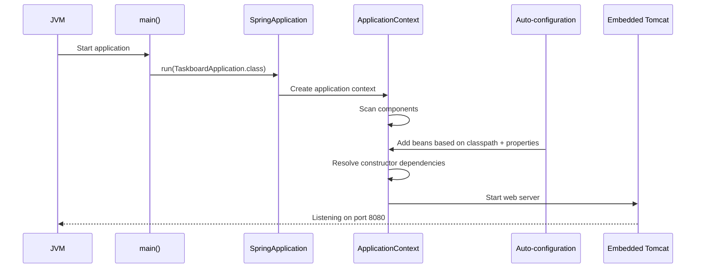
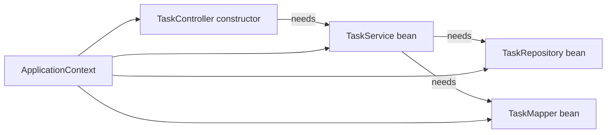
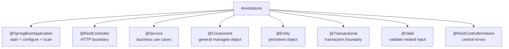
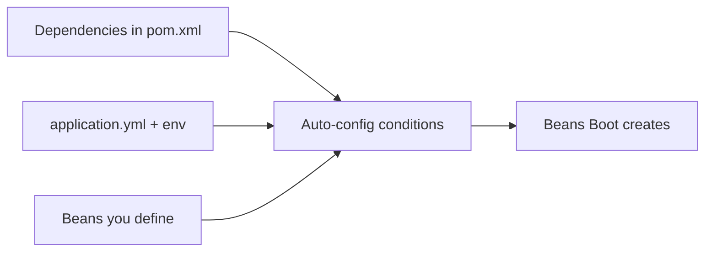
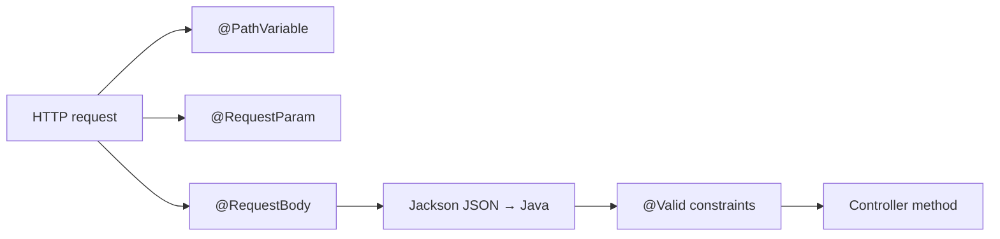
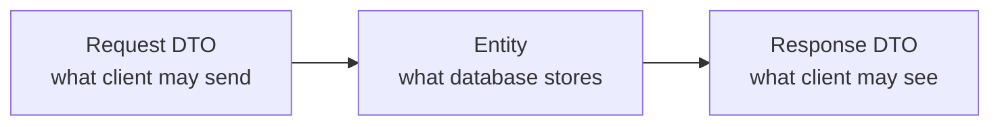

# 01 · Node-to-Spring structure lookup

[← Project workflow](00-project-workflow.md) · [Repository home](../README.md) · [Working example](../taskboard-api/README.md)

## Node/Express → Spring Boot

| Node/Express idea | Spring Boot equivalent | Important difference |
|---|---|---|
| `package.json` | `pom.xml` | Maven also defines compilation and packaging |
| `npm install` | `mvn dependency:resolve` / build | Maven downloads declared artifacts |
| `node server.js` | `mvn spring-boot:run` | Boot creates the application context and embedded server |
| `app.get(...)` | `@GetMapping` in `@RestController` | Mapping is declared on classes/methods |
| Middleware | Servlet filters / interceptors / advice | Each runs at a different boundary |
| Controller function | Controller method | Spring binds request data to typed parameters |
| Service module | `@Service` class | Usually injected through the constructor |
| ORM model | JPA `@Entity` | Entity maps Java state to a relational table |
| Data access module | Spring Data repository | Spring can implement the interface at runtime |
| Request schema | DTO + Jakarta Validation | Java types and constraints define the boundary |
| Error middleware | `@RestControllerAdvice` | Central exception-to-response mapping |
| `.env` / config | Properties, YAML, env vars, profiles | Boot has ordered external configuration sources |
| Jest/Supertest | JUnit, Mockito, MockMvc, test slices | Boot can load only the layer under test |

## What happens at startup



## Dependency injection

Without injection:

```java
TaskRepository repository = new TaskRepositorySomehow();
TaskService service = new TaskService(repository, new TaskMapper());
TaskController controller = new TaskController(service);
```

With Spring:

```java
@RestController
class TaskController {
    private final TaskService service;

    TaskController(TaskService service) {
        this.service = service;
    }
}
```



Constructor injection makes required collaborators visible and makes classes easy to unit-test.

## Annotation map



Annotations describe roles or behavior. They do not replace design decisions.

## Automatic does not mean magic



Example: Web MVC on the classpath triggers MVC configuration; JPA plus a database driver triggers a `DataSource`, entity manager, and repository support.

## Request binding



## The three shapes rule



These shapes can look similar and still serve different purposes. Keeping them separate prevents database changes from silently changing the public API.
