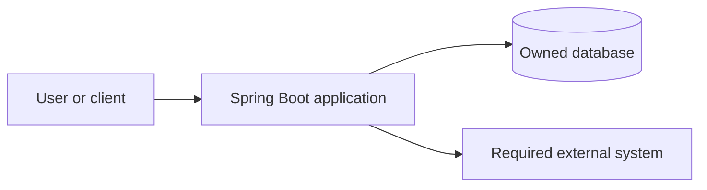
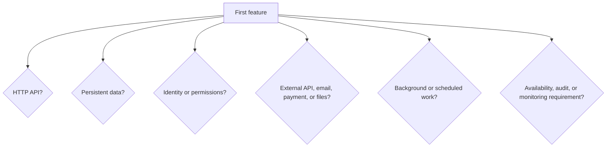

# 01 · Define the project before generating it

[← Project workflow](00-project-workflow.md) · [Repository home](../README.md) · [Next: create foundation](02-project-setup.md)

| Before you act | Details |
|---|---|
| What | Convert the project request into a small, testable first release. |
| Where | Project brief, issue tracker, or repository planning note—not Java code. |
| Input | Requested outcome, intended users, data, integrations, and constraints. |
| Finish when | One first feature has written acceptance criteria and known dependencies. |

> **Terms:** A **role** is a type of user with defined permissions. A **user story** states who needs an action and why. An **acceptance criterion** is an observable condition that proves the feature works. An **integration** is another system the application communicates with. A **non-functional requirement** is an operating constraint such as latency, availability, audit, or data retention.

## Step 1 — Draw the system boundary

| What | Where | Produces |
|---|---|---|
| Show users, this application, and external systems | Project brief | One context diagram |



Remove the database or external-system box when the project does not require it. Do not add future systems “just in case.”

## Step 2 — List roles and protected actions

| Role | May do | Must not do |
|---|---|---|
| Example: member | Create and read owned records | Read another member’s private records |
| Example: administrator | Manage all records | Bypass audit requirements |

If the application has no users or private data, state that explicitly.

## Step 3 — Select the first vertical slice

Write one story:

```text
As a <role>,
I want to <perform one action>,
so that <outcome>.
```

Then write observable acceptance criteria:

```text
Given <starting state>
When <request/action>
Then <response and saved state>
```

Choose a slice that produces useful output through all required layers. Avoid “create every entity” or “build the whole backend” as the first item.

## Step 4 — Record required capabilities



For each **yes**, record the reason and expected failure behavior. This list determines dependencies later; it is not permission to implement every capability immediately.

## Step 5 — Complete the project brief

```text
Project name:
Problem and intended outcome:
Users/roles:
First user story:
Acceptance criteria:
Request input:
Success output:
Expected errors:
Data to store:
Ownership/access rule:
Required external systems:
Operating constraints:
Explicitly out of scope:
```

## Verify the decision

- The first feature can be described and tested independently.
- Client input, server output, and persistent data are distinct.
- Permissions and ownership are written down.
- Every selected external capability has a requirement.
- Out-of-scope work is visible.

**Next:** Return to [Workflow Gate 1](00-project-workflow.md#gate-1--generate-the-project) and generate only the foundation required by this brief.
