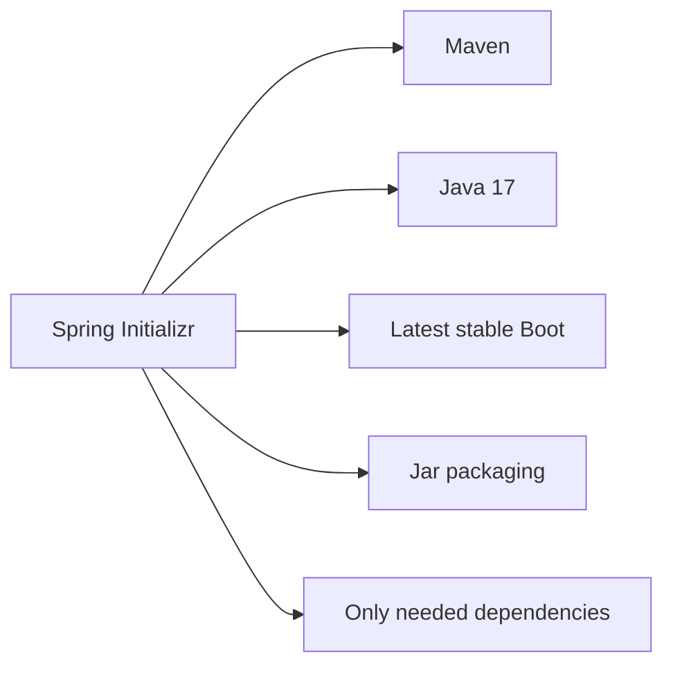
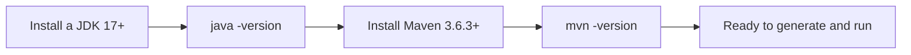
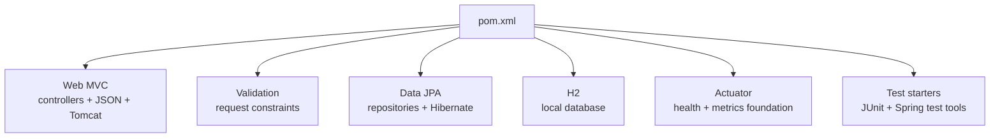
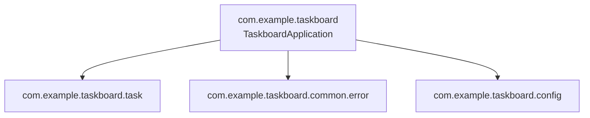
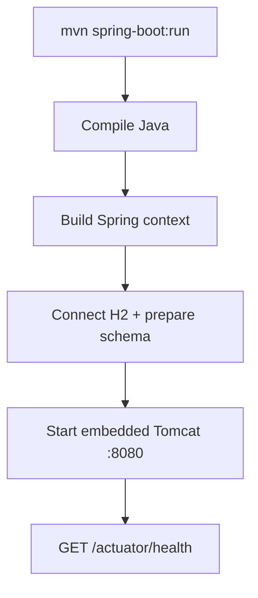
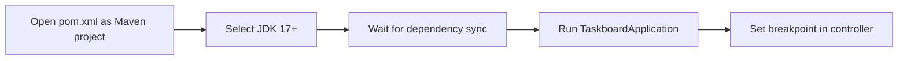
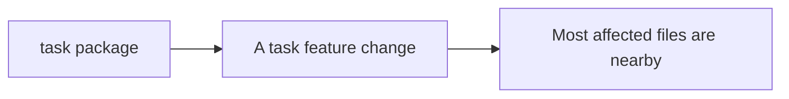

# 02 · Project setup

[← Mental model](01-mental-model.md) · [README](../README.md) · [Next: Architecture →](03-architecture-and-connections.md)

## Choose a boring baseline



Recommended first API selections:

| Initializr field | Choice |
|---|---|
| Project | Maven |
| Language | Java |
| Spring Boot | Latest stable, not snapshot |
| Group | Reverse domain, e.g. `com.example` |
| Artifact | Project name, e.g. `taskboard` |
| Packaging | Jar |
| Java | 17 minimum for the current Boot 4.1 baseline |
| Dependencies | Spring Web, Validation, Spring Data JPA, H2, Actuator |

Generate at [start.spring.io](https://start.spring.io/).

## Install and check the tools



- Install a JDK from a trusted distribution listed at [dev.java](https://dev.java/learn/getting-started/).
- Install Maven using the [official Maven instructions](https://maven.apache.org/install.html), or use the Maven wrapper (`./mvnw`) when an Initializr project includes it.
- Make sure `mvn -version` reports the same Java installation you intend to use.

```bash
java -version
mvn -version
```

If both commands print versions and Maven reports Java 17 or newer, the toolchain is ready.

## Dependency purpose



Do not add Redis, Kafka, Security, MongoDB, WebFlux, or cloud SDKs “just in case.” Add a dependency when a requirement needs it.

## Generated structure

```text
taskboard-api/
├── pom.xml
└── src/
    ├── main/
    │   ├── java/com/example/taskboard/
    │   │   └── TaskboardApplication.java
    │   └── resources/
    │       └── application.yml
    └── test/
        └── java/com/example/taskboard/
```

## Place the main class at the top



`@SpringBootApplication` scans its package and children. Putting it in a root package allows Spring to find controllers, services, components, repositories, and entities below it.

## First run

```bash
cd taskboard-api
mvn spring-boot:run
```



Build an executable JAR:

```bash
mvn clean verify
java -jar target/taskboard-api-0.0.1-SNAPSHOT.jar
```

## IDE setup



IntelliJ IDEA, Spring Tools, and VS Code with Java extensions can all run the project. The command line remains the source of truth for reproducible builds.

## Package by feature

For small and medium applications, keep one feature together:

```text
com.example.taskboard/
├── TaskboardApplication.java
├── common/error/
└── task/
    ├── Task.java
    ├── TaskController.java
    ├── TaskService.java
    ├── TaskRepository.java
    ├── TaskMapper.java
    └── dto/
```



Layer-only packages (`controller/`, `service/`, `repository/`) are easy initially but scatter each feature across the repository as the project grows.

## Setup checklist

- [ ] Stable Spring Boot version selected.
- [ ] Supported Java version installed.
- [ ] Package uses a reverse-domain name.
- [ ] Main class sits above application packages.
- [ ] Only requirement-driven starters are included.
- [ ] `mvn clean verify` succeeds.
- [ ] `/actuator/health` returns `UP`.
- [ ] Secrets and generated data are ignored by Git.
