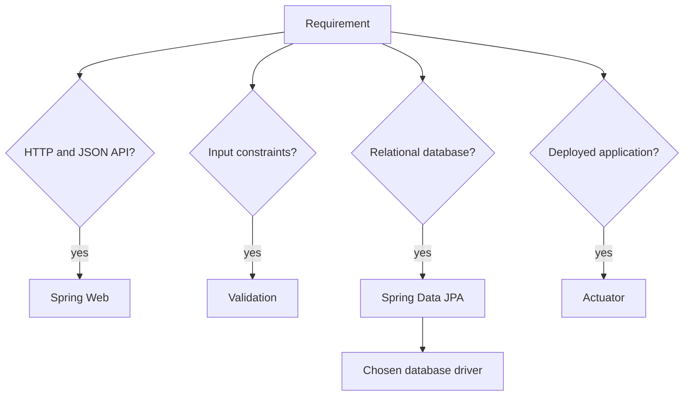

# 02 · Create the project foundation

[← Project workflow](00-project-workflow.md) · [Repository home](../README.md) · [Setup gate](00-project-workflow.md#gate-1--generate-the-project)

| Before you act | Details |
|---|---|
| What | Generate, open, build, and run the project foundation. |
| Where | Spring Initializr, then the generated project root containing `pom.xml`. |
| Input | Project name, base package, supported Java version, and required capabilities. |
| Finish when | `mvn clean verify` succeeds and the application reports healthy. |

> **Terms:** **Spring Initializr** generates a Spring project. **JDK** is the Java compiler and runtime. **Maven** downloads dependencies, compiles, tests, and packages the project. A **dependency** is external code declared in `pom.xml`; a Spring **starter** is a dependency bundle for one capability.

## Step 1 — Check the tools

| What | Where | Required result |
|---|---|---|
| Check Java and Maven | Terminal in any directory | Both commands print supported versions |

```bash
java -version
mvn -version
```

Install a JDK from [dev.java](https://dev.java/learn/getting-started/) and Maven from the [official Maven instructions](https://maven.apache.org/install.html) if needed. `mvn -version` must show the Java installation you intend to use.

**Next:** Continue only when both commands work.

## Step 2 — Generate only the required foundation

| What | Where | Required result |
|---|---|---|
| Select project metadata and dependencies | [start.spring.io](https://start.spring.io/) | Downloaded ZIP containing `pom.xml` |

| Initializr field | Choice |
|---|---|
| Project | Maven |
| Language | Java |
| Spring Boot | Latest stable, not snapshot |
| Group | Reverse domain, such as `com.company` |
| Artifact | Project name, such as `orders-api` |
| Packaging | Jar |
| Java | Version supported by the selected Boot release |

Choose dependencies from requirements:



> **Terms:** **Spring MVC** is Spring’s HTTP controller system. **JPA** maps Java entities to relational data; **Hibernate** commonly implements it. A database **driver** connects Java to a chosen database. **H2** is suitable for a disposable local database. **Actuator** adds operational endpoints such as health.

For a normal database-backed API, select Spring Web, Validation, Spring Data JPA, Actuator, and the driver for the database the project will actually use. Add H2 only when a disposable local database is useful. Do not add queues, caches, cloud SDKs, security, or a second database without a requirement.

**Next:** Download and extract the project.

## Step 3 — Open and build the untouched project

| What | Where | Required result |
|---|---|---|
| Import and build | Extracted directory containing `pom.xml` | `BUILD SUCCESS` |

Open `pom.xml` as a Maven project in the IDE, select the supported JDK, then run:

```bash
cd orders-api
mvn clean verify
```

Do not add feature code until the generated build passes.

**Next:** Put the application class above all project packages.

## Step 4 — Establish the package root

| What | Where | Required result |
|---|---|---|
| Keep the generated application class at the common package root | `src/main/java/<group>/<project>/` | All feature packages are below it |

```text
src/main/java/com/company/orders/
├── OrdersApplication.java
├── common/
└── order/
```

`@SpringBootApplication` starts configuration and scans its package and child packages. A **package** is Java’s namespace and directory grouping. Keeping the application class at the root lets Spring find controllers, services, repositories, and other beans below it.

Use packages by feature:

```text
order/
├── Order.java
├── OrderController.java
├── OrderService.java
├── OrderRepository.java
├── OrderMapper.java
└── dto/
```

**Next:** Start the application without feature code.

## Step 5 — Run and verify the foundation

| What | Where | Required result |
|---|---|---|
| Start the application and call health | Project root and terminal/API client | Application starts; health is `UP` |

```bash
mvn spring-boot:run
```

```bash
curl http://localhost:8080/actuator/health
```

Build the executable JAR after stopping the running process:

```bash
mvn clean verify
java -jar target/orders-api-0.0.1-SNAPSHOT.jar
```

> **Terms:** A **JAR** is the packaged Java application. An **embedded server** is the HTTP server inside that JAR. A **health endpoint** reports whether the application can serve requests.

## Foundation verification

- [ ] Stable Spring Boot and supported Java selected.
- [ ] Only requirement-driven dependencies added.
- [ ] Main class above all application packages.
- [ ] `mvn clean verify` succeeds without the IDE.
- [ ] Application starts and health returns `UP`.
- [ ] Generated data and secrets are ignored by Git.

**Next:** Return to [Workflow Gate 3](00-project-workflow.md#gate-3--design-the-api-and-data) and design the first feature contract.
