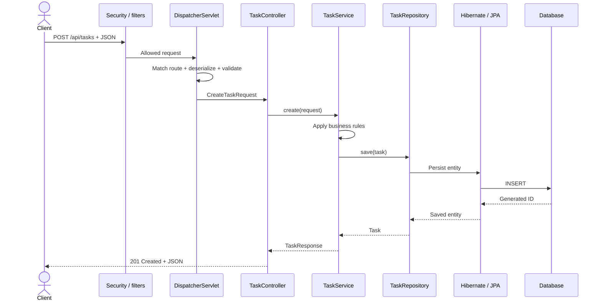
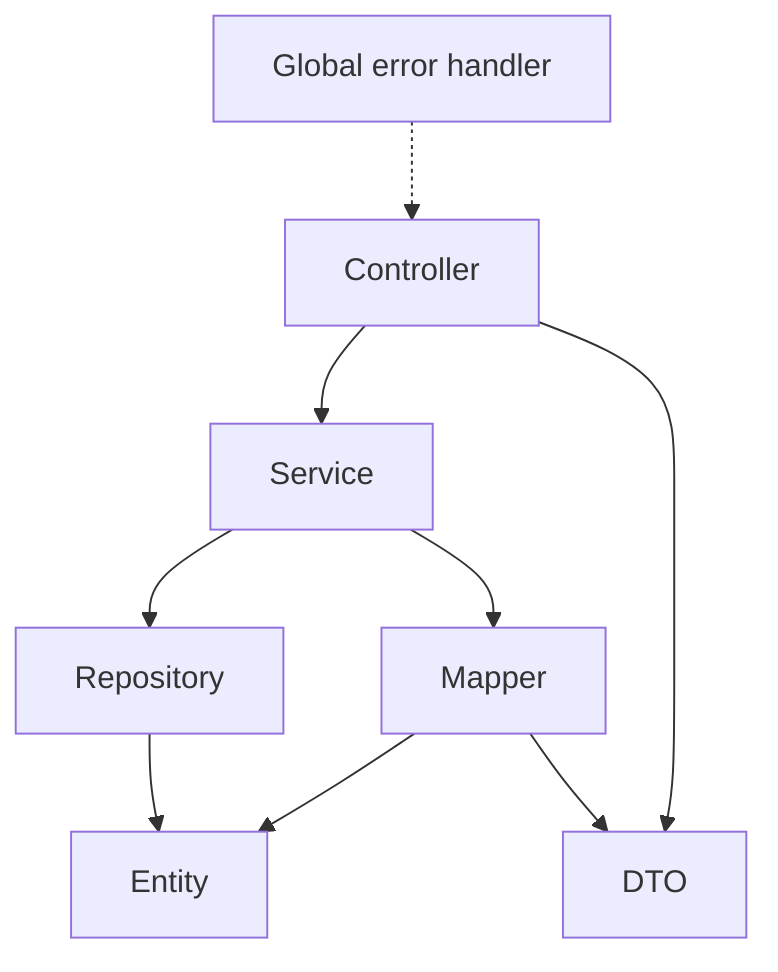
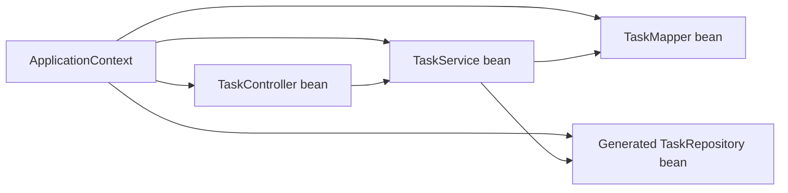
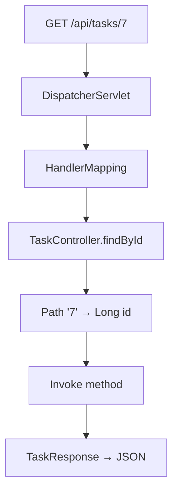
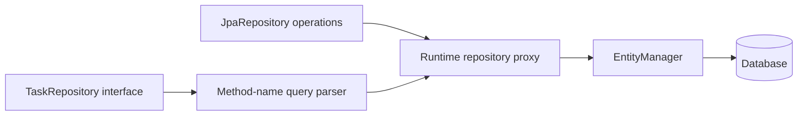
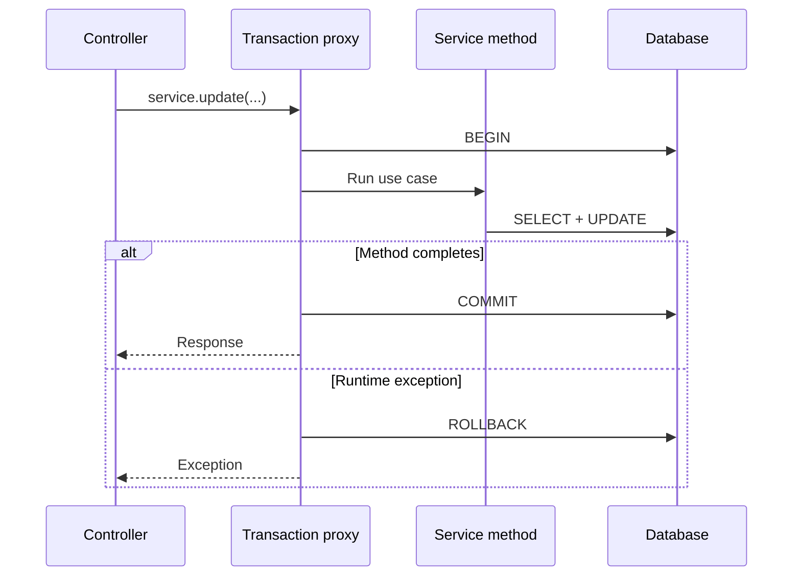

# 03 · Architecture and connections

[← Project workflow](00-project-workflow.md) · [Repository home](../README.md) · [File skeleton gate](00-project-workflow.md#gate-4--create-the-package-and-file-skeleton)

| Before you act | Details |
|---|---|
| What | Decide which class owns each responsibility and which direction dependencies point. |
| Where | Feature package under `src/main/java/<base-package>/<feature>/`. |
| Input | One written API operation and its data needs. |
| Finish when | Every required class has one role and dependencies point controller → service → repository. |

> **Terms:** A Spring **bean** is an object created and connected by Spring. **Dependency injection** means a class receives the collaborators it needs through its constructor. `ApplicationContext` is Spring’s container of beans. A **transaction** groups database work so it commits together or rolls back together.

## Trace the request before creating classes



## Set the dependency direction



Keep dependency arrows pointing inward. A repository should not call a controller; an entity should not build an HTTP response.

## Connect classes through constructors



| Type | How it becomes available |
|---|---|
| Controller | Component scanning finds `@RestController` |
| Service | Component scanning finds `@Service` |
| Mapper | Component scanning finds `@Component` |
| Repository | Spring Data creates an implementation for the interface |
| DataSource | Boot auto-configures it from driver + properties |
| Entity manager | Boot/JPA auto-configuration creates it |

## Map HTTP to the controller



You do not call the controller yourself. Spring MVC finds the matching method and prepares its arguments.

## Declare the repository interface

You write:

```java
interface TaskRepository extends JpaRepository<Task, Long> {
    Page<Task> findAllByStatus(TaskStatus status, Pageable pageable);
}
```

Spring Data provides:



No handwritten implementation is needed for standard CRUD or supported derived queries.

## Place the transaction around the use case



Place `@Transactional` around a business use case, usually on a public service method. It is proxy-driven; casually calling a transactional method from another method in the same object can bypass the proxy.

**Next:** Return to [Workflow Gate 5](00-project-workflow.md#gate-5--implement-one-vertical-slice). Add external providers only through [Gate 8](00-project-workflow.md#gate-8--add-optional-capabilities-only-when-required).
