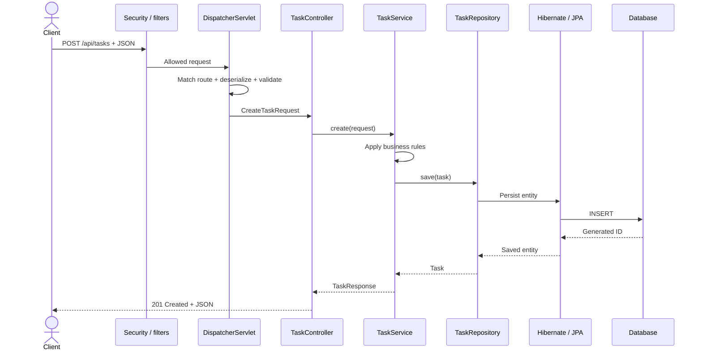
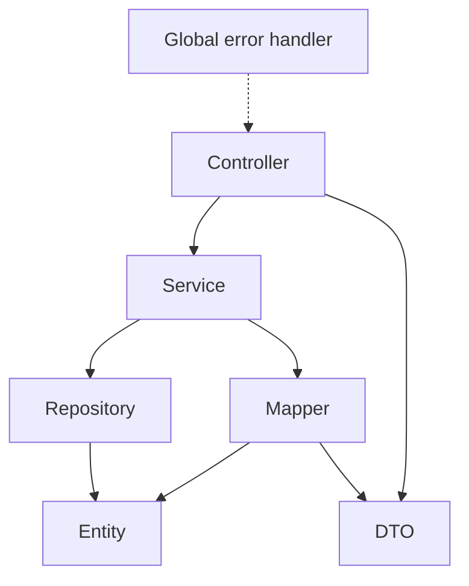
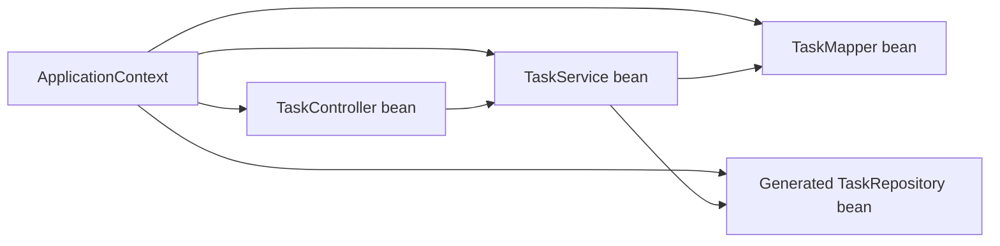
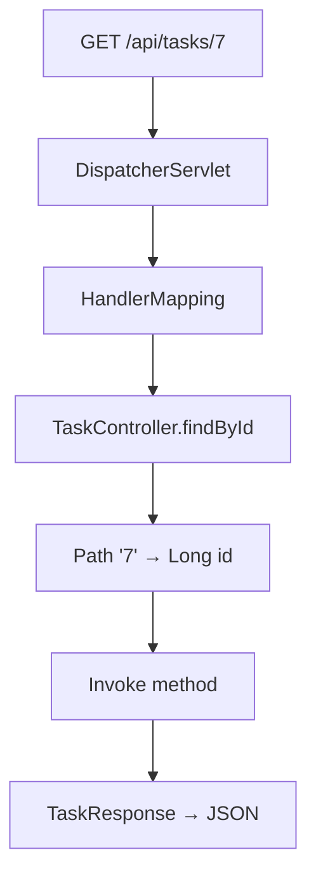
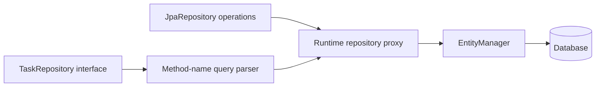
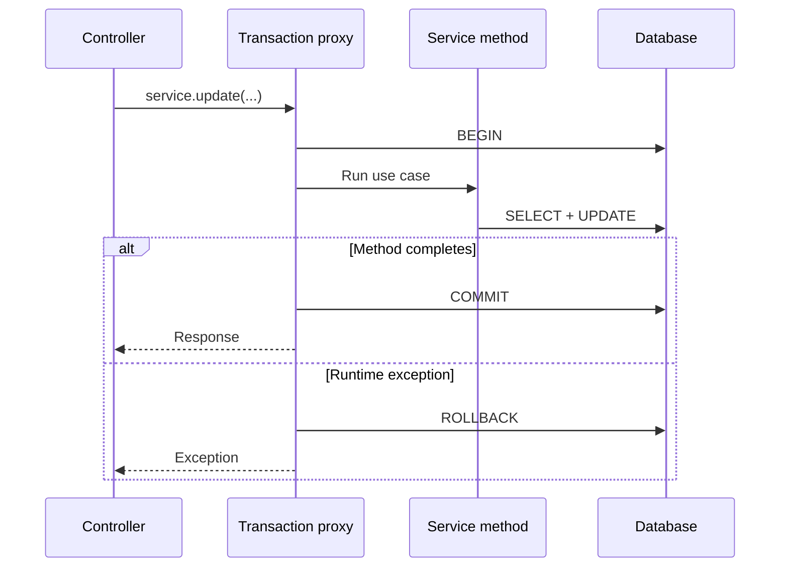
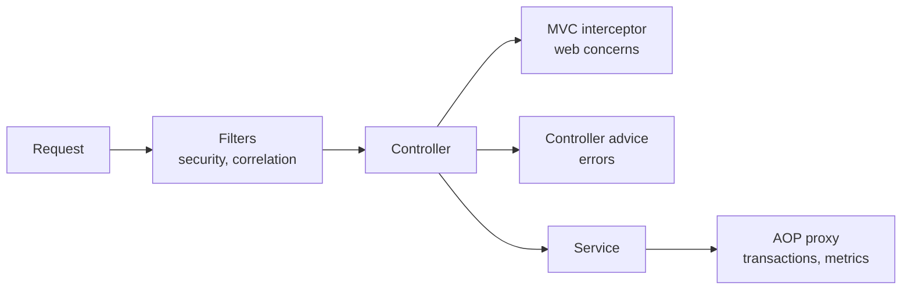
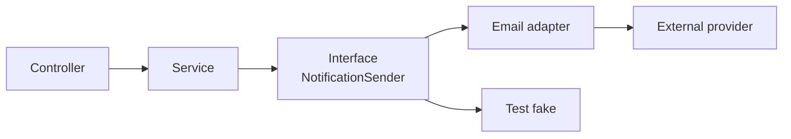

# 03 · Architecture and connections

[← Setup](02-project-setup.md) · [README](../README.md) · [Next: Build a feature →](04-build-a-feature.md)

## Complete request lifecycle



## Who may call whom?



Keep dependency arrows pointing inward. A repository should not call a controller; an entity should not build an HTTP response.

## Spring bean graph



| Type | How it becomes available |
|---|---|
| Controller | Component scanning finds `@RestController` |
| Service | Component scanning finds `@Service` |
| Mapper | Component scanning finds `@Component` |
| Repository | Spring Data creates an implementation for the interface |
| DataSource | Boot auto-configures it from driver + properties |
| Entity manager | Boot/JPA auto-configuration creates it |

## MVC routing



You do not call the controller yourself. Spring MVC finds the matching method and prepares its arguments.

## Repository implementation

You write:

```java
interface TaskRepository extends JpaRepository<Task, Long> {
    Page<Task> findAllByStatus(TaskStatus status, Pageable pageable);
}
```

Spring Data provides:



No handwritten implementation is needed for standard CRUD or supported derived queries.

## Transaction boundary



Place `@Transactional` around a business use case, usually on a public service method. It is proxy-driven; casually calling a transactional method from another method in the same object can bypass the proxy.

## Cross-cutting concerns



Use the boundary designed for the concern; do not duplicate logging, error conversion, or authorization in every controller method.

## Connecting external services



Hide provider-specific code behind an application-owned interface. The service knows the capability it needs, not the vendor SDK details.
