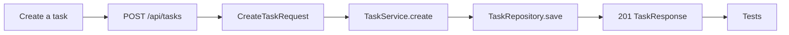
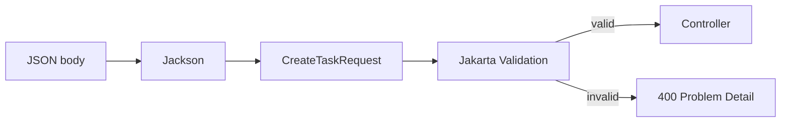
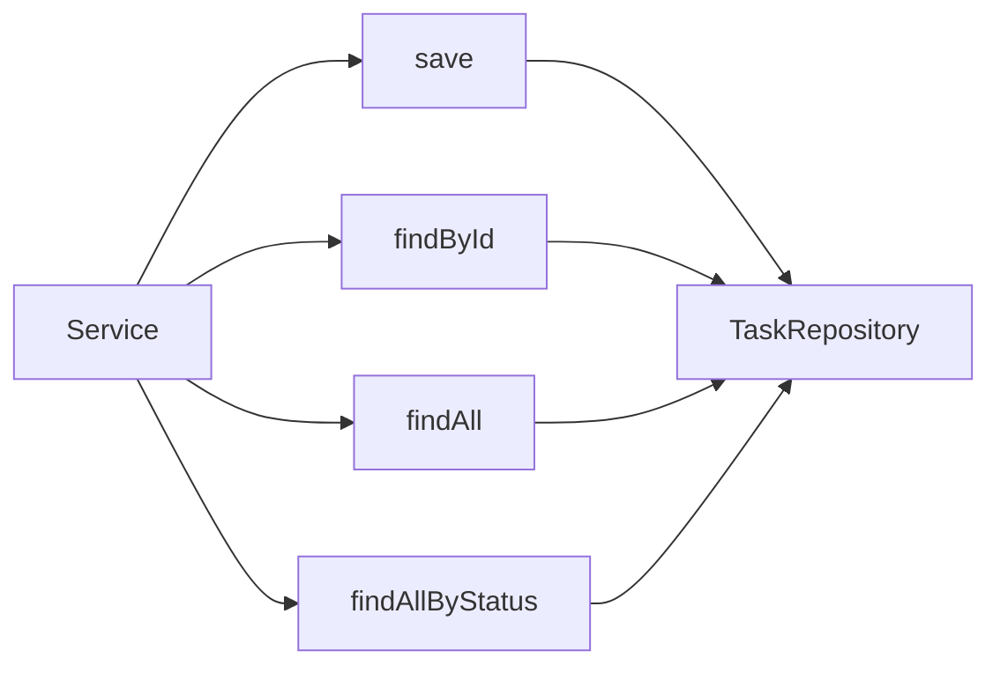
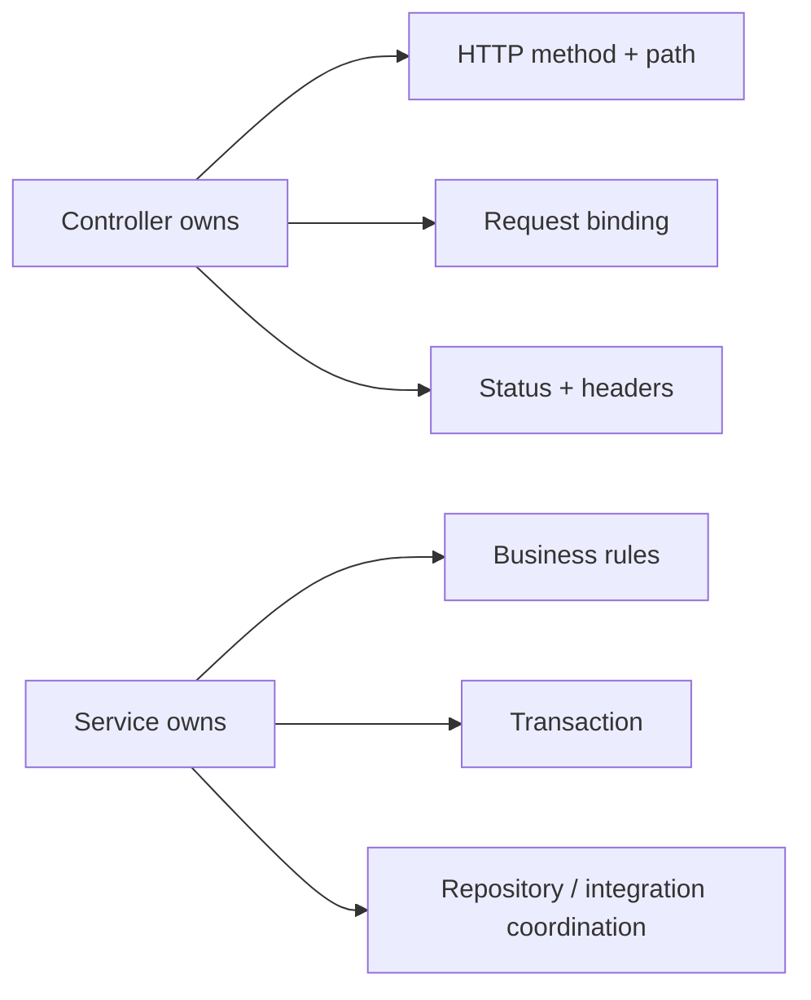
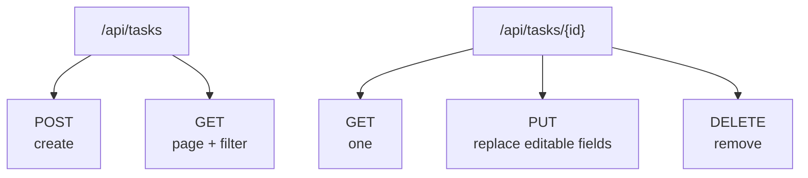

# 04 · Build a feature

[← Architecture](03-architecture-and-connections.md) · [README](../README.md) · [Next: Database →](05-database-and-jpa.md)

Use a vertical slice: finish one small behavior through every layer.



## Step 1 · Write the contract

```text
POST /api/tasks
Content-Type: application/json

{
  "title": "Learn Spring",
  "description": "Trace the request",
  "dueDate": "2030-01-01"
}

201 Created
Location: /api/tasks/1
```

Decide path, method, input, output, success status, validation, and error cases before writing persistence code.

## Step 2 · Request DTO

```java
public record CreateTaskRequest(
    @NotBlank @Size(max = 120) String title,
    @Size(max = 1000) String description,
    @FutureOrPresent LocalDate dueDate
) {}
```



## Step 3 · Entity

```java
@Entity
@Table(name = "tasks")
public class Task {
    @Id
    @GeneratedValue(strategy = GenerationType.IDENTITY)
    private Long id;

    @Column(nullable = false, length = 120)
    private String title;

    @Enumerated(EnumType.STRING)
    @Column(nullable = false, length = 20)
    private TaskStatus status;
}
```

The entity is persistence state. Do not expose it directly just because returning it is convenient.

## Step 4 · Repository

```java
public interface TaskRepository extends JpaRepository<Task, Long> {
    Page<Task> findAllByStatus(TaskStatus status, Pageable pageable);
}
```



## Step 5 · Mapper

```java
@Component
public class TaskMapper {
    public TaskResponse toResponse(Task task) {
        return new TaskResponse(
            task.getId(), task.getTitle(), task.getDescription(),
            task.getStatus(), task.getDueDate(),
            task.getCreatedAt(), task.getUpdatedAt()
        );
    }
}
```

## Step 6 · Service

```java
@Service
public class TaskService {
    private final TaskRepository repository;
    private final TaskMapper mapper;

    public TaskService(TaskRepository repository, TaskMapper mapper) {
        this.repository = repository;
        this.mapper = mapper;
    }

    @Transactional
    public TaskResponse create(CreateTaskRequest request) {
        Task task = Task.create(
            request.title(), request.description(), request.dueDate()
        );
        return mapper.toResponse(repository.save(task));
    }
}
```

## Step 7 · Controller

```java
@PostMapping
public ResponseEntity<TaskResponse> create(
        @Valid @RequestBody CreateTaskRequest request) {
    TaskResponse created = service.create(request);
    URI location = URI.create("/api/tasks/" + created.id());
    return ResponseEntity.created(location).body(created);
}
```



## Add read, update, delete



| Operation | Common success |
|---|---|
| Create | `201 Created` + body + `Location` |
| List | `200 OK` + page |
| Find | `200 OK`; missing → `404` |
| Update | `200 OK` + updated body |
| Delete | `204 No Content`; missing → `404` |

## Definition of done

- [ ] Contract is written.
- [ ] Request and response DTOs exist.
- [ ] Validation covers boundary rules.
- [ ] Service owns the use case and transaction.
- [ ] Repository query is explicit and bounded.
- [ ] Errors have stable status and shape.
- [ ] Tests cover success, invalid input, and missing data.
- [ ] Logs contain context without secrets.
- [ ] Documentation shows how to call the endpoint.
