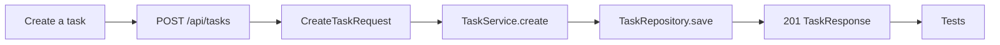
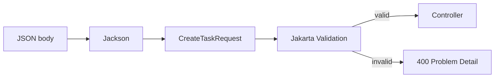
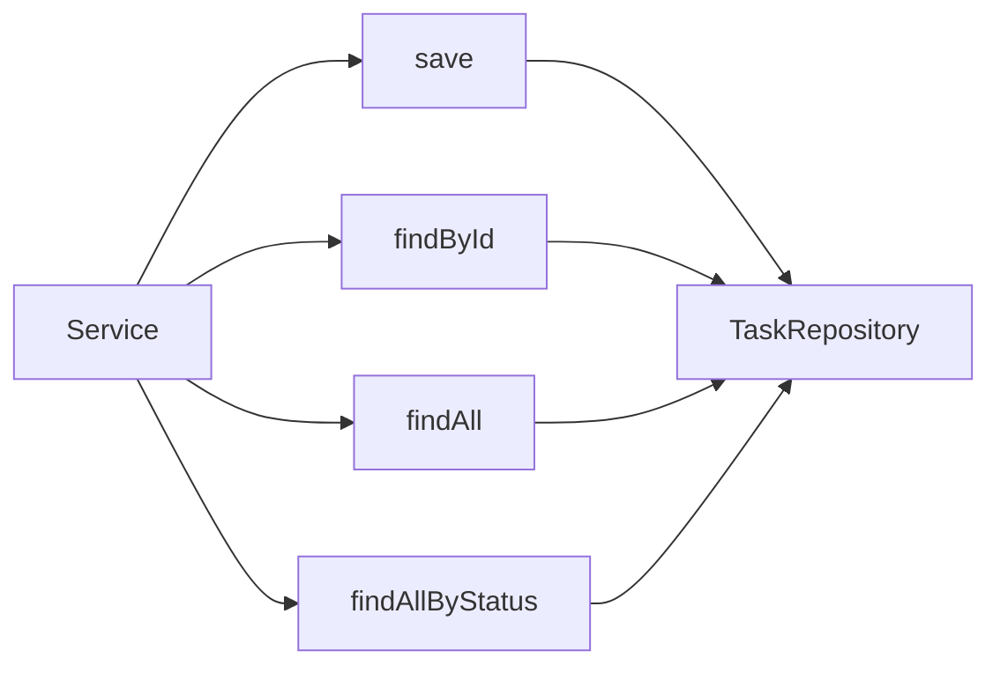
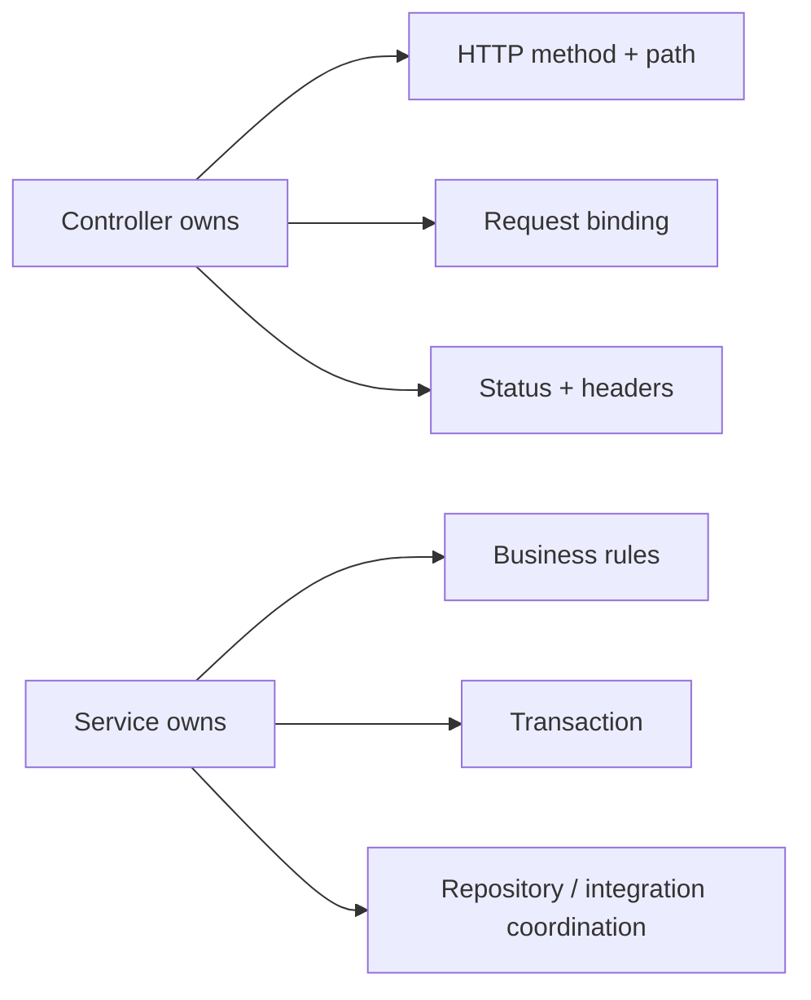
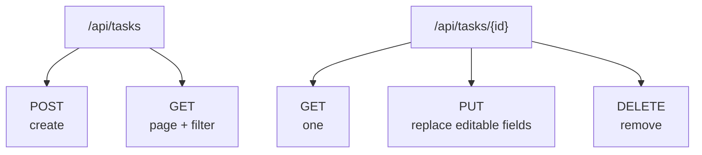

# 04 · Build a feature

[← Project workflow](00-project-workflow.md) · [Repository home](../README.md) · [Implementation gate](00-project-workflow.md#gate-5--implement-one-vertical-slice)

| Before you act | Details |
|---|---|
| What | Implement one API operation through every required layer. |
| Where | One feature package in `src/main/java`; matching tests in `src/test/java`. |
| Input | Written HTTP contract and data design from Workflow Gate 3. |
| Finish when | The request works, failures are predictable, and `mvn clean verify` passes. |

> **Terms:** An **endpoint** is one HTTP method and path, such as `POST /api/tasks`. A **vertical slice** is one complete user action implemented through API, business, and data layers. **Jackson** converts JSON and Java objects. **Jakarta Validation** checks constraints such as required text or maximum length.

Finish one small behavior through every layer.



## Step 1 · Write the contract

| Before this step | Details |
|---|---|
| What | Fix the method, path, request, response, status, and expected errors. |
| Where | API specification, issue, or project notes. |
| Produces | A contract used by DTO, controller, service, and tests. |

```text
POST /api/tasks
Content-Type: application/json

{
  "title": "Learn Spring",
  "description": "Trace the request",
  "dueDate": "2030-01-01"
}

201 Created
Location: /api/tasks/1
```

Decide path, method, input, output, success status, validation, and error cases before writing persistence code.

## Step 2 · Request DTO

| Before this step | Details |
|---|---|
| What | Define exactly what the client may send and its boundary constraints. |
| Where | `feature/dto/CreateFeatureRequest.java`. |
| Connects to | Controller `@RequestBody`; service method input. |

```java
public record CreateTaskRequest(
    @NotBlank @Size(max = 120) String title,
    @Size(max = 1000) String description,
    @FutureOrPresent LocalDate dueDate
) {}
```

`record` is a compact immutable data carrier. `@NotBlank` rejects null/empty text, `@Size` limits length, and `@FutureOrPresent` rejects past dates.



## Step 3 · Entity

| Before this step | Details |
|---|---|
| What | Map persistent business state to a database table. |
| Where | `feature/Feature.java`. |
| Connects to | Repository generic type and mapper input. |

```java
@Entity
@Table(name = "tasks")
public class Task {
    @Id
    @GeneratedValue(strategy = GenerationType.IDENTITY)
    private Long id;

    @Column(nullable = false, length = 120)
    private String title;

    @Enumerated(EnumType.STRING)
    @Column(nullable = false, length = 20)
    private TaskStatus status;
}
```

`@Entity` marks persistent JPA state. `@Table` selects the table. `@Id` marks the primary key. `@GeneratedValue` lets the database create it. `@Column` controls a column. `@Enumerated(STRING)` stores an enum by name instead of position.

The entity is persistence state. Do not expose it directly just because returning it is convenient.

## Step 4 · Repository

| Before this step | Details |
|---|---|
| What | Declare required database operations and bounded queries. |
| Where | `feature/FeatureRepository.java`. |
| Connects to | Inject into the service constructor. |

```java
public interface TaskRepository extends JpaRepository<Task, Long> {
    Page<Task> findAllByStatus(TaskStatus status, Pageable pageable);
}
```

`JpaRepository<Entity, IdType>` provides standard create/read/update/delete operations. `Page` is one bounded result segment; `Pageable` carries page number, size, and sorting. Spring Data can derive a query from a supported method name.



## Step 5 · Mapper

| Before this step | Details |
|---|---|
| What | Convert internal entity state to the public response DTO. |
| Where | `feature/FeatureMapper.java`. |
| Connects to | Inject into the service constructor. |

```java
@Component
public class TaskMapper {
    public TaskResponse toResponse(Task task) {
        return new TaskResponse(
            task.getId(), task.getTitle(), task.getDescription(),
            task.getStatus(), task.getDueDate(),
            task.getCreatedAt(), task.getUpdatedAt()
        );
    }
}
```

`@Component` makes the mapper a Spring bean so it can be constructor-injected. Keep permission checks and business decisions out of this class.

## Step 6 · Service

| Before this step | Details |
|---|---|
| What | Implement the complete business operation and transaction. |
| Where | `feature/FeatureService.java`. |
| Connects to | Repository and mapper inward; controller outward. |

```java
@Service
public class TaskService {
    private final TaskRepository repository;
    private final TaskMapper mapper;

    public TaskService(TaskRepository repository, TaskMapper mapper) {
        this.repository = repository;
        this.mapper = mapper;
    }

    @Transactional
    public TaskResponse create(CreateTaskRequest request) {
        Task task = Task.create(
            request.title(), request.description(), request.dueDate()
        );
        return mapper.toResponse(repository.save(task));
    }
}
```

`@Service` identifies a business-use-case bean. `@Transactional` starts a database transaction around the method: success commits; an unchecked failure rolls back by default.

## Step 7 · Controller

| Before this step | Details |
|---|---|
| What | Bind HTTP input, call the service once, and form the HTTP response. |
| Where | `feature/FeatureController.java`. |
| Connects to | Client route outward; service inward. |

```java
@PostMapping
public ResponseEntity<TaskResponse> create(
        @Valid @RequestBody CreateTaskRequest request) {
    TaskResponse created = service.create(request);
    URI location = URI.create("/api/tasks/" + created.id());
    return ResponseEntity.created(location).body(created);
}
```

`@PostMapping` maps an HTTP POST route. `@RequestBody` reads JSON into the DTO. `@Valid` runs DTO constraints. `ResponseEntity` carries the HTTP status, headers, and optional body. `Location` identifies the newly created resource.



## Add read, update, delete



| Operation | Common success |
|---|---|
| Create | `201 Created` + body + `Location` |
| List | `200 OK` + page |
| Find | `200 OK`; missing → `404` |
| Update | `200 OK` + updated body |
| Delete | `204 No Content`; missing → `404` |

## Definition of done

- [ ] Contract is written.
- [ ] Request and response DTOs exist.
- [ ] Validation covers boundary rules.
- [ ] Service owns the use case and transaction.
- [ ] Repository query is explicit and bounded.
- [ ] Errors have stable status and shape.
- [ ] Tests cover success, invalid input, and missing data.
- [ ] Logs contain context without secrets.
- [ ] Documentation shows how to call the endpoint.

**Next:** Continue with [Workflow Gate 6](00-project-workflow.md#gate-6--add-validation-and-error-handling) to make failure behavior predictable.
