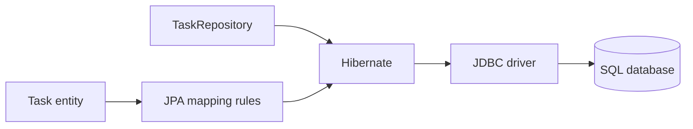
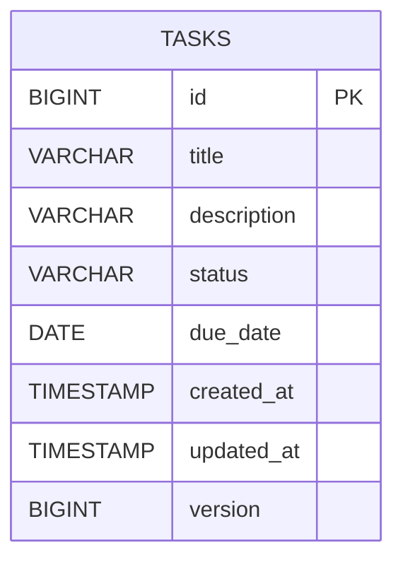
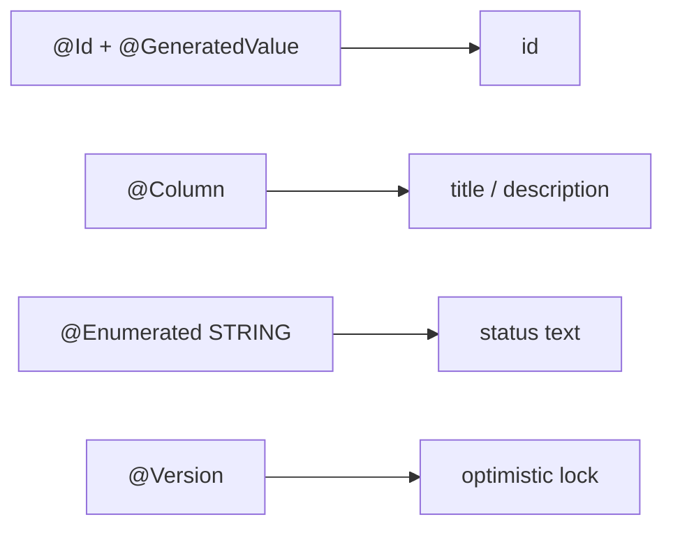
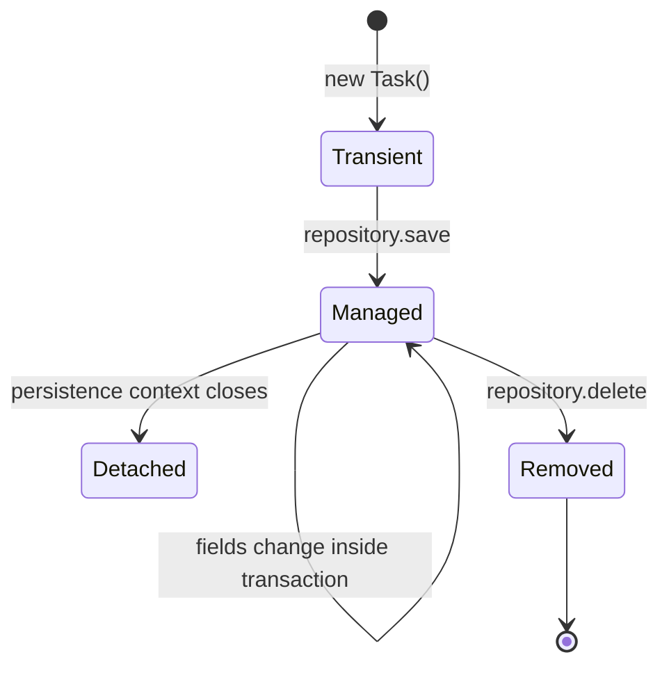
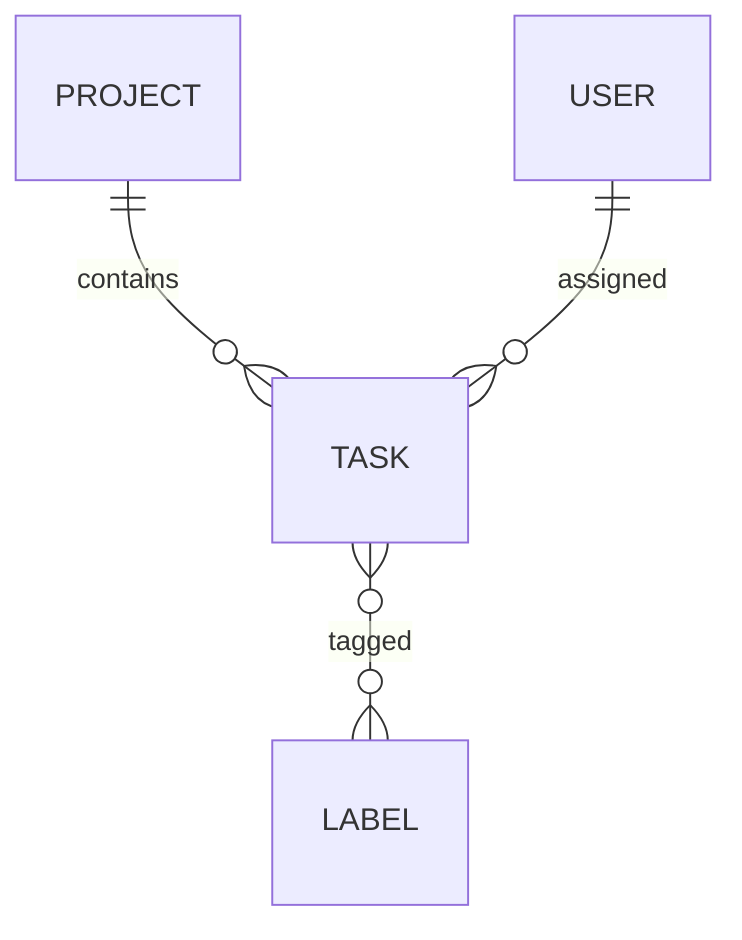
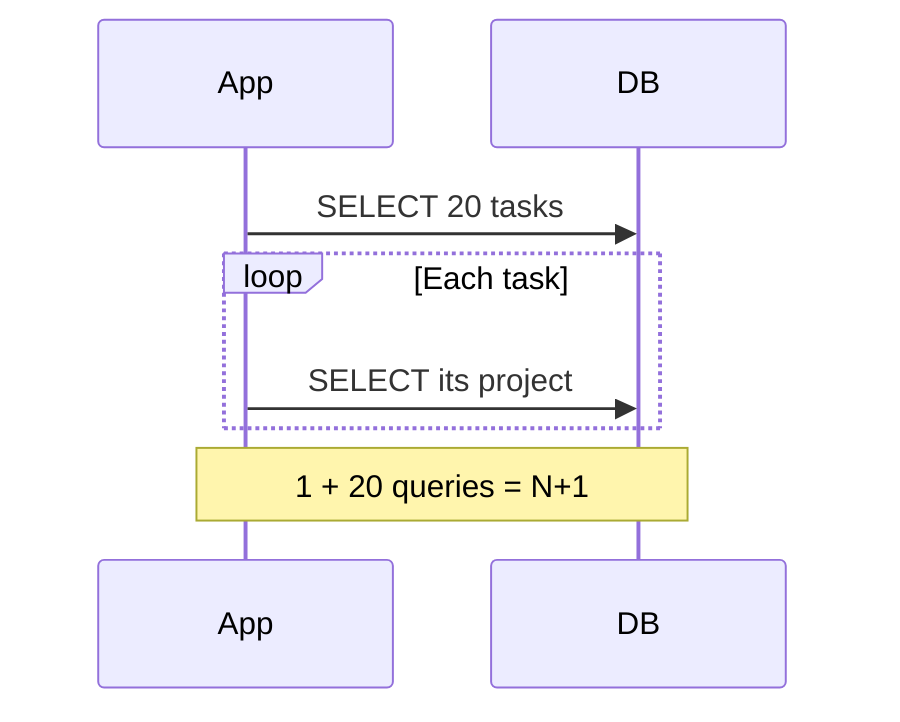
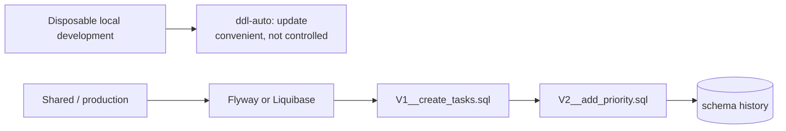
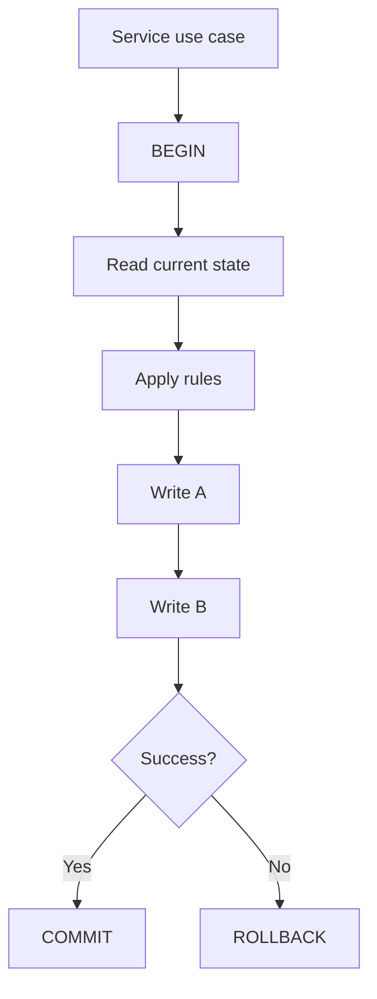
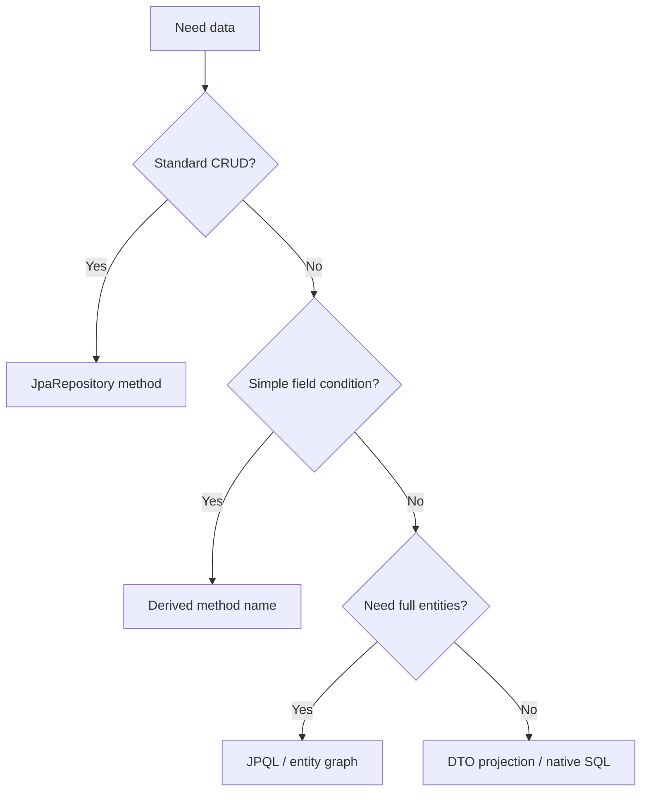
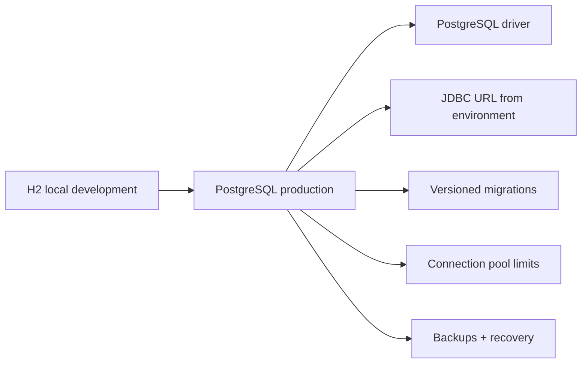

# 05 · Database and JPA

[← Project workflow](00-project-workflow.md) · [Repository home](../README.md) · [API and data gate](00-project-workflow.md#gate-3--design-the-api-and-data)

## From Java to SQL

| Part | Job |
|---|---|
| JPA | Standard annotations and persistence interfaces |
| Hibernate | Common JPA implementation that tracks and writes entities |
| Spring Data JPA | Repository abstraction and query generation |
| JDBC driver | Database-specific wire protocol |
| Database | Durable source of truth |

## Entity ↔ table

Prefer `EnumType.STRING`; ordinal numbers become dangerous when enum order changes.

## Entity lifecycle

Hibernate can detect changes to managed entities and write them at flush/commit. This is called dirty checking.

## Relationships

| Relationship | Typical annotation | Use carefully because |
|---|---|---|
| Many tasks → one project | `@ManyToOne` | Loading and nullability must be deliberate |
| One project → many tasks | `@OneToMany` | Large collections and cascade rules can surprise |
| Many tasks ↔ many labels | `@ManyToMany` or join entity | A join entity is better when the relation has fields |

Start unidirectional. Add the reverse collection only when a use case needs navigation from that side.

## Lazy loading and N+1

Use fetch joins, entity graphs, DTO projections, or purpose-built queries after confirming the access pattern. Do not make every relationship eager.

## Schema strategy

Use one schema-generation mechanism. The Spring Boot documentation recommends avoiding a mix of basic SQL initialization with Flyway or Liquibase.

## Transactions

Default Spring rollback behavior targets unchecked exceptions and errors. Be explicit when checked exceptions require rollback.

## Query choices

Always paginate unbounded collections exposed by APIs.

## Local → production database

H2 is useful for disposable local development, but database differences mean important integration tests should run against the same database engine used in production—often through Testcontainers.
