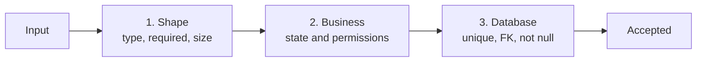
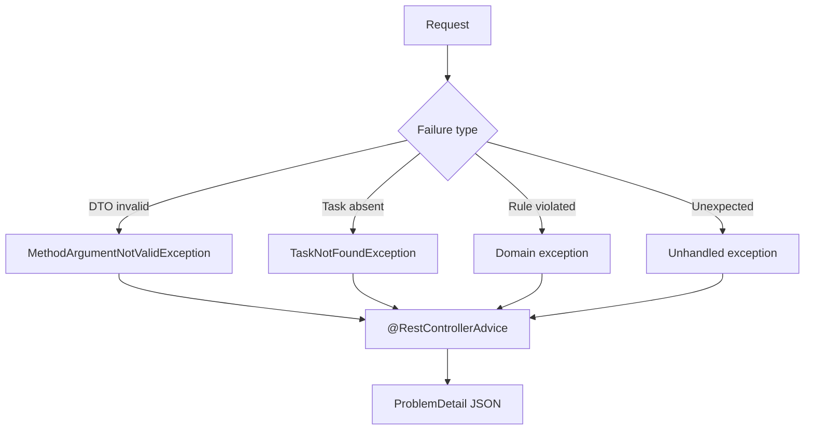
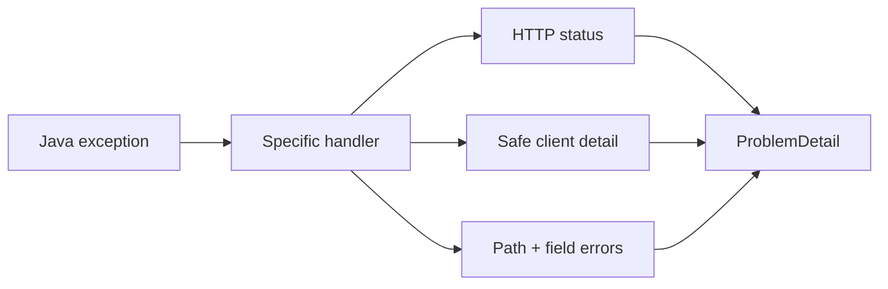
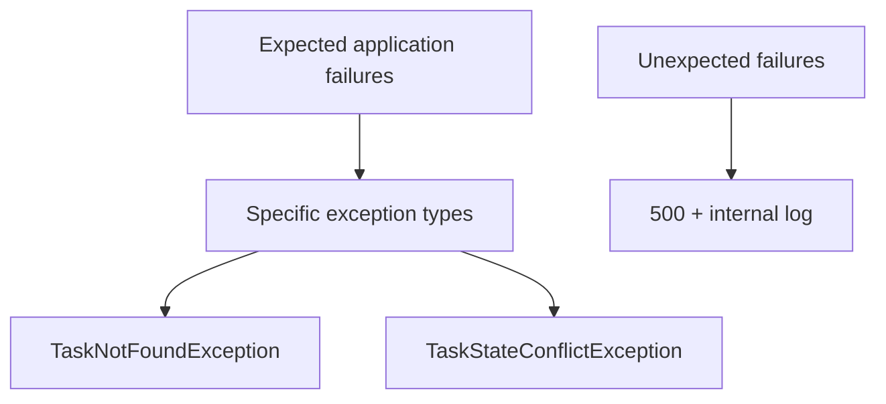

# 06 · Validation and errors

[← Project workflow](00-project-workflow.md) · [Repository home](../README.md) · [Validation gate](00-project-workflow.md#gate-6--add-validation-and-error-handling)

## Three validation levels



| Level | Example | Best home |
|---|---|---|
| Boundary | Title must not be blank | DTO annotation |
| Business | Completed task cannot return to TODO | Service/domain method |
| Database | ID is unique; project must exist | Database constraint |

Use all three. A database constraint is the final concurrency-safe guard.

## Request validation

```java
public record UpdateTaskRequest(
    @NotBlank @Size(max = 120) String title,
    @Size(max = 1000) String description,
    @NotNull TaskStatus status,
    @FutureOrPresent LocalDate dueDate
) {}
```

```java
@PutMapping("/{id}")
TaskResponse update(
    @PathVariable Long id,
    @Valid @RequestBody UpdateTaskRequest request
) {
    return service.update(id, request);
}
```

## Error flow



## Stable problem response

```json
{
  "type": "about:blank",
  "title": "Request validation failed",
  "status": 400,
  "detail": "One or more fields are invalid",
  "instance": "/api/tasks",
  "errors": {
    "title": "must not be blank",
    "dueDate": "must be a date in the present or future"
  }
}
```



Do not return stack traces, SQL strings, secret values, or internal class names to clients.

## Status map

| Situation | Status |
|---|---:|
| Valid create | `201` |
| Valid read/update | `200` |
| Valid delete with no body | `204` |
| Invalid JSON or field constraints | `400` |
| Missing/invalid authentication | `401` |
| Authenticated but forbidden | `403` |
| Resource missing | `404` |
| State/uniqueness conflict | `409` |
| Unexpected server failure | `500` |

## Exception design



Use exceptions for exceptional paths, not ordinary branching. Keep messages useful to developers but prevent sensitive leakage at the HTTP boundary.

## Validation checklist

- [ ] DTOs reject missing, oversized, malformed, and out-of-range input.
- [ ] Nested DTOs use `@Valid`.
- [ ] Service checks rules requiring current database state.
- [ ] Database enforces critical uniqueness and relationships.
- [ ] Error body has one predictable format.
- [ ] Logs contain the original exception and request correlation ID.
- [ ] Client response does not expose internals.
