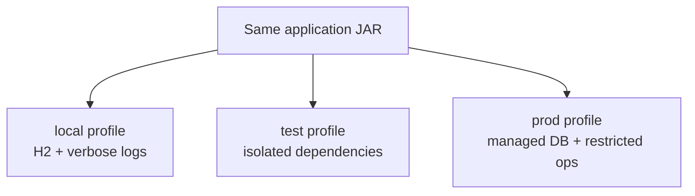
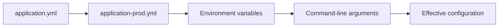
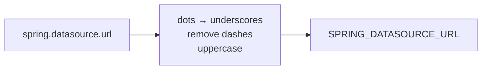
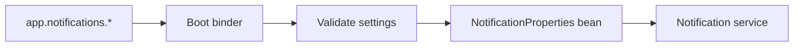
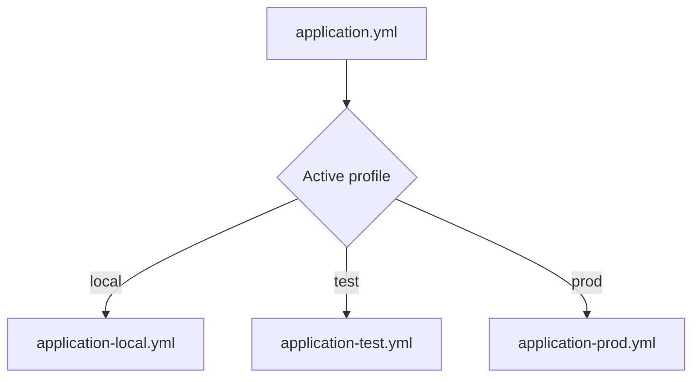
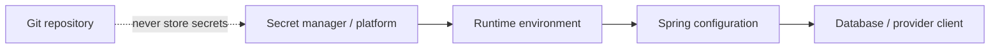

# 07 · Configuration and profiles

[← Validation](06-validation-and-errors.md) · [README](../README.md) · [Next: Testing →](08-testing.md)

## One artifact, many environments



Code should not be rebuilt just to change a database URL, port, timeout, or provider key.

## Configuration sources



Later/higher-precedence sources override earlier values. Spring Boot supports properties/YAML, environment variables, command-line arguments, and more.

## Base configuration

```yaml
spring:
  application:
    name: taskboard-api
  datasource:
    url: jdbc:h2:file:./data/taskboard
  jpa:
    hibernate:
      ddl-auto: update

management:
  endpoints:
    web:
      exposure:
        include: health,info
```

## Environment override

```bash
export SPRING_DATASOURCE_URL='jdbc:postgresql://localhost:5432/taskboard'
export SPRING_DATASOURCE_USERNAME='taskboard'
export SPRING_DATASOURCE_PASSWORD='change-me'
export SPRING_PROFILES_ACTIVE='prod'
```



## Group custom settings

Prefer typed settings over scattered `@Value` strings:

```java
@ConfigurationProperties("app.notifications")
@Validated
public record NotificationProperties(
    @NotBlank String sender,
    @NotNull Duration timeout
) {}
```



Invalid required configuration should fail at startup, not during the first customer request.

## Profiles



Use profiles for groups of environment-specific settings or beans. Avoid dozens of fine-grained profiles that create untestable combinations.

## Secret flow



Never commit passwords, API keys, private keys, production JWT secrets, or cloud credentials.

## Configuration checklist

- [ ] Defaults are safe for local development.
- [ ] Production values come from the deployment environment.
- [ ] Secrets are absent from Git and logs.
- [ ] Related custom settings use `@ConfigurationProperties`.
- [ ] Required settings are validated at startup.
- [ ] Production schema handling uses migrations rather than `ddl-auto: update`.
- [ ] Only safe Actuator endpoints are exposed publicly.
