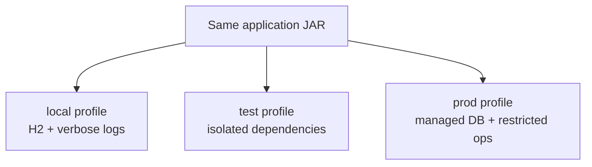
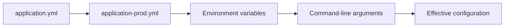
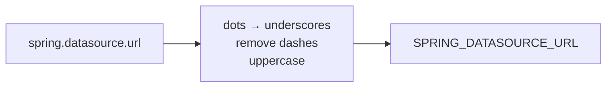
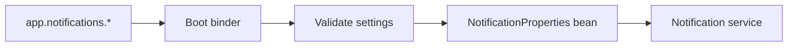
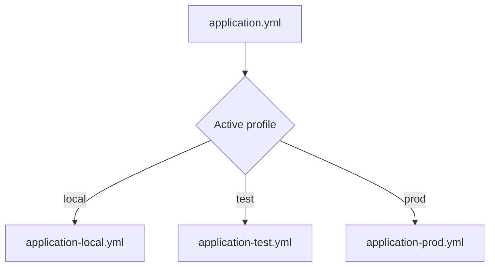
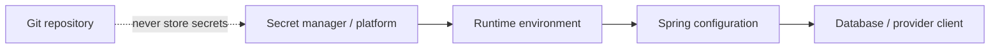

# 07 · Configuration and profiles

[← Project workflow](00-project-workflow.md) · [Repository home](../README.md) · [Environment gate](00-project-workflow.md#gate-9--prepare-shared-environments)

| Before you act | Details |
|---|---|
| What | Move environment-dependent values out of Java code and validate required settings. |
| Where | `src/main/resources/application.yml`, profile files, environment variables, and configuration records. |
| Input | Database URLs, ports, provider URLs, limits, timeouts, and credentials. |
| Finish when | The same JAR runs in each environment without source changes. |

> **Terms:** **Configuration** is a runtime value that may vary by environment. A **profile** activates a named configuration group such as `local` or `prod`. A **secret** is sensitive configuration such as a password or API key. `@ConfigurationProperties` binds related settings into a typed Java object.

## Build one artifact for every environment



Code should not be rebuilt just to change a database URL, port, timeout, or provider key.

## Choose configuration sources



Later/higher-precedence sources override earlier values. Spring Boot supports properties/YAML, environment variables, command-line arguments, and more.

## Create the base configuration

```yaml
spring:
  application:
    name: taskboard-api
  datasource:
    url: jdbc:h2:file:./data/taskboard
  jpa:
    hibernate:
      ddl-auto: update

management:
  endpoints:
    web:
      exposure:
        include: health,info
```

## Override values from the environment

```bash
export SPRING_DATASOURCE_URL='jdbc:postgresql://localhost:5432/taskboard'
export SPRING_DATASOURCE_USERNAME='taskboard'
export SPRING_DATASOURCE_PASSWORD='change-me'
export SPRING_PROFILES_ACTIVE='prod'
```



## Group application-owned settings

Prefer typed settings over scattered `@Value` strings:

```java
@ConfigurationProperties("app.notifications")
@Validated
public record NotificationProperties(
    @NotBlank String sender,
    @NotNull Duration timeout
) {}
```



Invalid required configuration should fail at startup, not during the first customer request.

## Add profiles only for grouped differences



Use profiles for groups of environment-specific settings or beans. Avoid dozens of fine-grained profiles that create untestable combinations.

## Keep secrets outside the repository



Never commit passwords, API keys, private keys, production JWT secrets, or cloud credentials.

## Verify configuration

- [ ] Defaults are safe for local development.
- [ ] Production values come from the deployment environment.
- [ ] Secrets are absent from Git and logs.
- [ ] Related custom settings use `@ConfigurationProperties`.
- [ ] Required settings are validated at startup.
- [ ] Production schema handling uses migrations rather than `ddl-auto: update`.
- [ ] Only safe Actuator endpoints are exposed publicly.

**Next:** Return to [Workflow Gate 9](00-project-workflow.md#gate-9--prepare-shared-environments) and verify the same JAR in each target environment.
