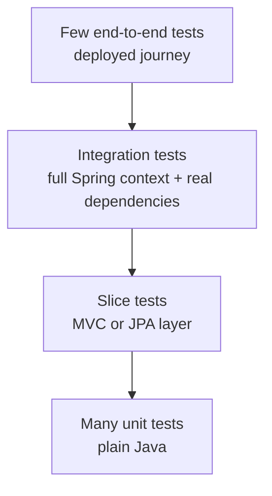
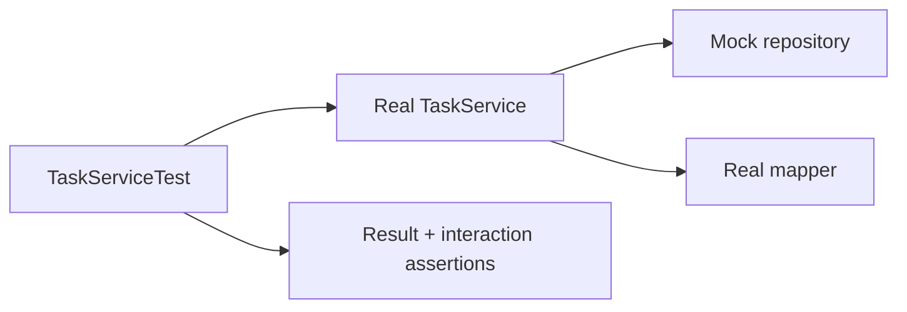
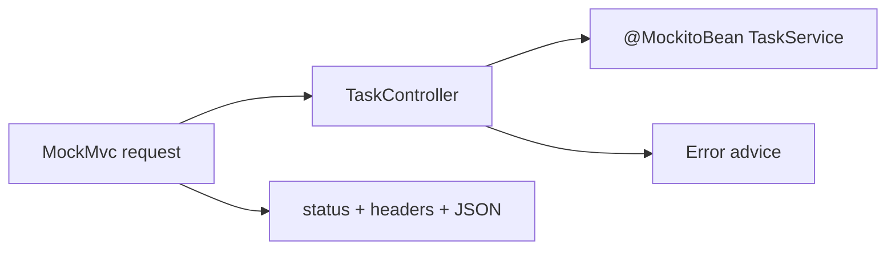
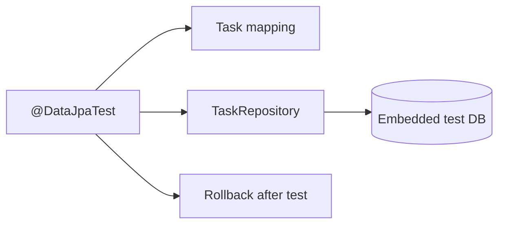
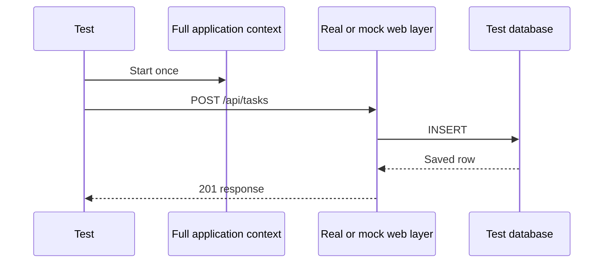
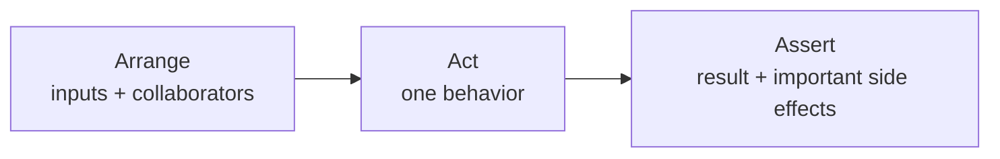

# 08 · Testing

[← Project workflow](00-project-workflow.md) · [Repository home](../README.md) · [Testing gate](00-project-workflow.md#gate-7--test-the-slice)

| Before you act | Details |
|---|---|
| What | Add the smallest test that proves each required behavior. |
| Where | Matching packages under `src/test/java`; test settings under `src/test/resources`. |
| Input | Success and failure cases from the endpoint contract. |
| Finish when | `mvn clean verify` passes from the command line. |

> **Terms:** A **unit test** runs one class with collaborators replaced. A **mock** is a controlled replacement for a collaborator. A **slice test** loads one Spring layer such as MVC or JPA. An **integration test** checks multiple real components together. **MockMvc** calls MVC controllers without opening a network port.

## Choose the smallest useful test scope



| Scope | Typical tool | Proves |
|---|---|---|
| Unit | JUnit + Mockito | Business logic in one class |
| MVC slice | `@WebMvcTest` + MockMvc | Routes, JSON, validation, status, error advice |
| JPA slice | `@DataJpaTest` | Entity mappings and repository queries |
| Integration | `@SpringBootTest` | Beans and layers work together |
| Production-like data | Testcontainers | Real database behavior |
| End to end | External client/browser | Running system and dependencies |

## Add a service unit test



```java
@ExtendWith(MockitoExtension.class)
class TaskServiceTest {
    @Mock TaskRepository repository;

    @Test
    void createsTask() {
        TaskMapper mapper = new TaskMapper();
        TaskService service = new TaskService(repository, mapper);
        // arrange → act → assert
    }
}
```

No Spring context is needed to test plain business logic.

## Add an MVC slice test



Use `@WebMvcTest` for the HTTP boundary. Mock the service because repository/database behavior is outside this slice.

## Add a JPA slice test



Spring Boot’s JPA slice configures entities and repositories, uses an embedded database when available, and rolls each test back by default.

## Add a full integration test only for critical flows



Use `@SpringBootTest` when the connection between layers is the thing being tested. Do not use it for every small branch.

## Structure every test as arrange, act, assert



## Cover the high-value cases

| Feature | Success | Boundary | Failure |
|---|---|---|---|
| Create task | Valid task saved | Max title, today due date | Blank title, past due date |
| Find task | Existing ID returned | First/last valid ID | Missing ID → 404 |
| List tasks | Page and filter | Empty page, last page | Invalid enum/page input |
| Update task | Fields changed | No-op/same values | Missing task, invalid state |
| Delete task | Row removed | Repeated call policy | Missing task |

## Verify test quality

- Assert behavior, not private implementation.
- Give each test isolated data.
- Make time and randomness controllable.
- Do not depend on test execution order.
- Use production database containers for database-specific queries.
- Keep fixtures small and readable.
- A failing test should explain what behavior broke.

**Next:** If the feature needs another capability, continue with [Workflow Gate 8](00-project-workflow.md#gate-8--add-optional-capabilities-only-when-required); otherwise move to [Gate 9](00-project-workflow.md#gate-9--prepare-shared-environments).
