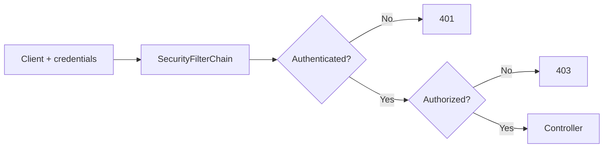
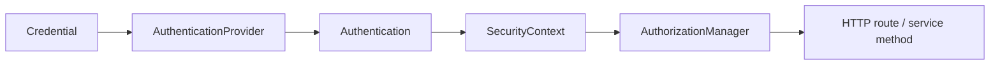
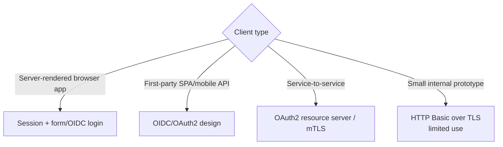
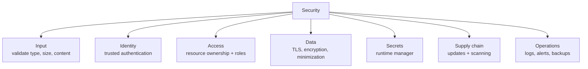
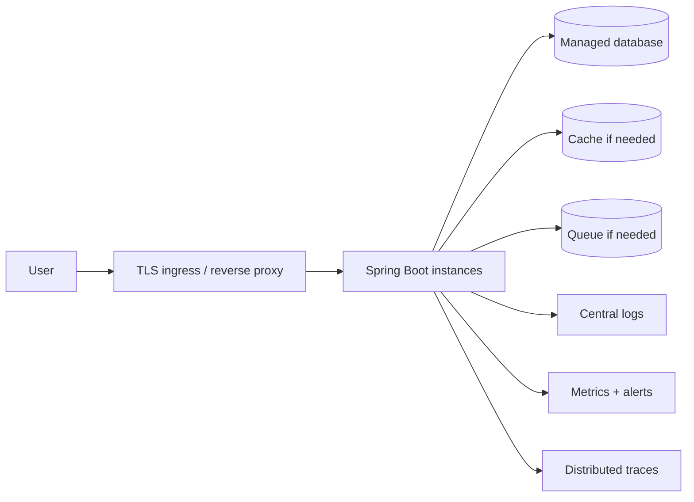
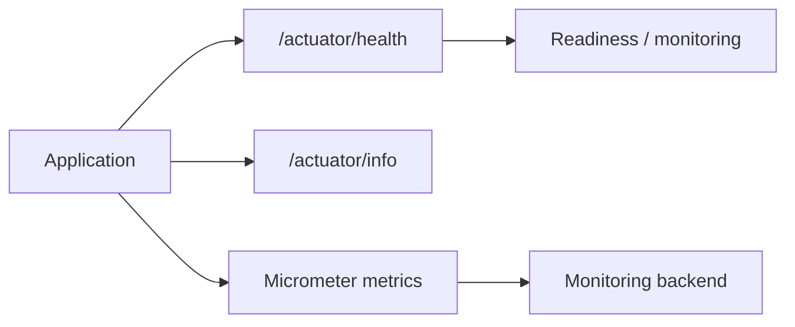

# 09 · Security and production

[← Project workflow](00-project-workflow.md) · [Repository home](../README.md) · [Environment gate](00-project-workflow.md#gate-9--prepare-shared-environments)

Adding Spring Security changes the request path before the controller.

## Authentication vs authorization

| Question | Concept | Example |
|---|---|---|
| Who are you? | Authentication | Verify session, bearer token, or password |
| May you do this? | Authorization | User may edit only their own task |

Spring Security is filter-based for servlet applications. Roles and authorities are read from the authenticated identity when authorization decisions are made.

## Pick an authentication model

Do not invent a custom password or token protocol. Store passwords through a `PasswordEncoder`, never as plaintext.

## Security checklist by boundary

## Production runtime

## Actuator

Expose only required endpoints. Health is conventionally available at `/actuator/health`; detailed health, configuration, environment, mappings, and heap data may reveal sensitive information and need protection.

## Deployment pipeline

```mermaid
flowchart LR
    Commit["Commit"] --> CI["Compile + tests + scans"]
    CI --> Jar["Versioned JAR/image"]
    Jar --> Migrate["Controlled DB migration"]
    Migrate --> Deploy["Deploy"]
    Deploy --> Ready["Readiness check"]
    Ready --> Traffic["Receive traffic"]
    Traffic --> Observe["Logs + metrics + alerts"]
    Observe --> Rollback["Rollback plan"]
```

## Before production

- [ ] Authentication mechanism matches the client and threat model.
- [ ] Every resource checks authorization/ownership.
- [ ] TLS is enforced.
- [ ] Secrets come from a secret manager or platform.
- [ ] Uploads, URLs, and serialized input have limits.
- [ ] Database migrations are reviewed and reversible where practical.
- [ ] Timeouts, connection pools, and retry limits are explicit.
- [ ] Health/readiness checks match real dependencies.
- [ ] Logs are structured and free of secrets/personal data.
- [ ] Metrics and alerts cover latency, errors, saturation, and business failures.
- [ ] Backups and restore procedures are tested.
- [ ] Dependency and container scanning runs in CI.
- [ ] Rollback or roll-forward procedure exists.
