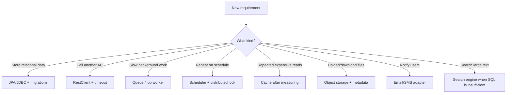
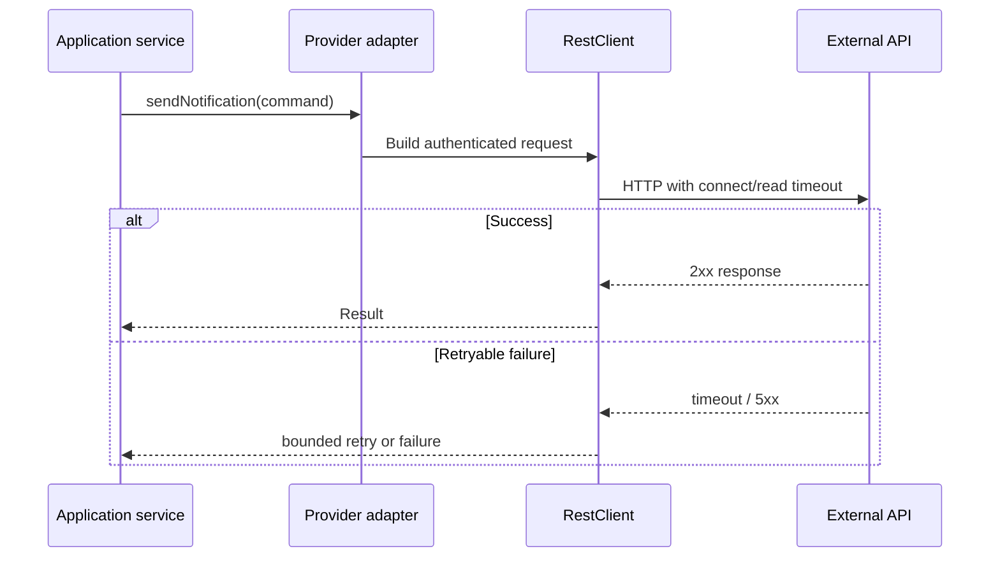
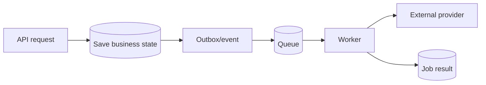
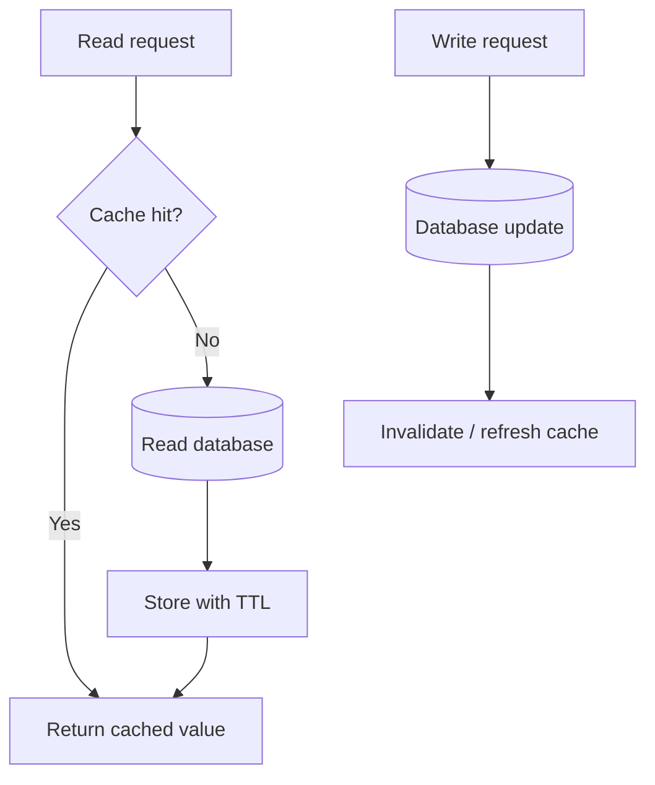
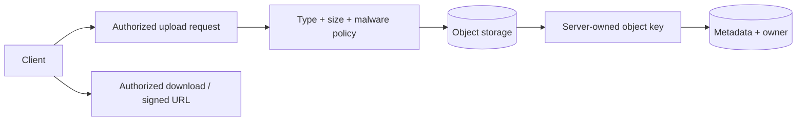
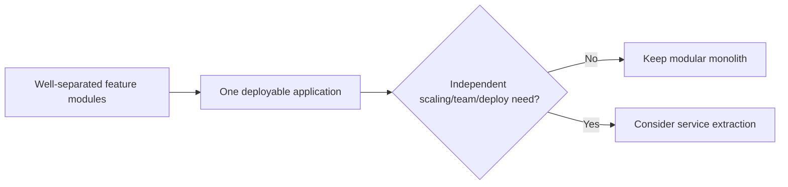
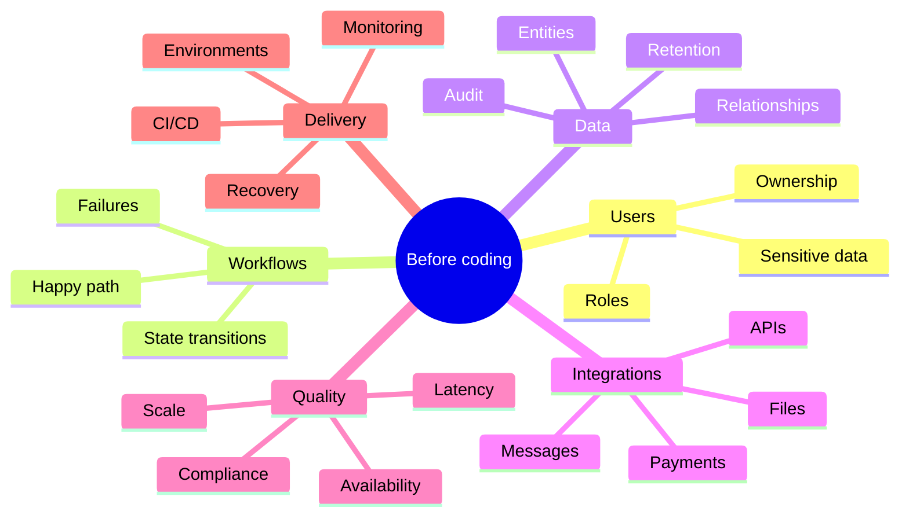

# 10 · Real-project toolbox

[← Project workflow](00-project-workflow.md) · [Repository home](../README.md) · [Capability gate](00-project-workflow.md#gate-8--add-optional-capabilities-only-when-required)

Add capabilities because a requirement demands them—not because a diagram says mature systems have them.

## Decision map

## Capability matrix

| Need | Common Spring choice | Add when | Main risk |
|---|---|---|---|
| REST API | Spring MVC | Serving HTTP/JSON | Inconsistent contracts |
| SQL persistence | Data JPA or JDBC | Durable relational data | N+1 and uncontrolled schema |
| Migrations | Flyway/Liquibase | Shared or production DB | Unsafe migration |
| Authentication | Spring Security | Any private/user data | Broken access control |
| API documentation | OpenAPI or Spring REST Docs | Other people call the API | Docs drift |
| External HTTP | `RestClient` | Calling another service | Missing timeouts/retries |
| Cache | Spring Cache + provider | Measured repeated cost | Stale data |
| Background work | Queue/broker + worker | Slow/retriable work | Duplicate delivery |
| Scheduling | `@Scheduled` | Time-based work | Multiple-instance duplication |
| Files | Object storage SDK | User-generated binaries | Unsafe files/access |
| Email/SMS | Provider adapter | Notifications | Coupling and retries |
| Observability | Actuator + Micrometer | Every deployed service | High-cardinality/sensitive labels |
| Resilience | Timeouts, retry, circuit breaker | Unreliable remote dependency | Retry storms |
| Containers | OCI image/buildpack | Reproducible deployment | Oversized/outdated image |

## External HTTP call

Set timeouts. Retry only operations safe to repeat, use backoff, cap attempts, and observe failures.

## Background job

Assume messages may be delivered more than once. Make handlers idempotent and preserve an audit trail.

## Cache flow

Caching creates a second copy of data. Define TTL, invalidation, ownership, and failure behavior before adding it.

## File storage

Do not treat the original filename as a trusted filesystem path.

## Monolith first

Microservices add networking, distributed data, deployment, observability, and failure-mode costs. Start with clear module boundaries; split only with evidence.

## Project discovery checklist

Turn each answer into an explicit API, data, security, test, or operational decision.
