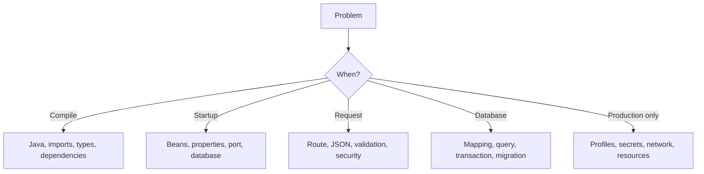
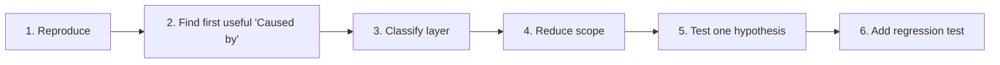
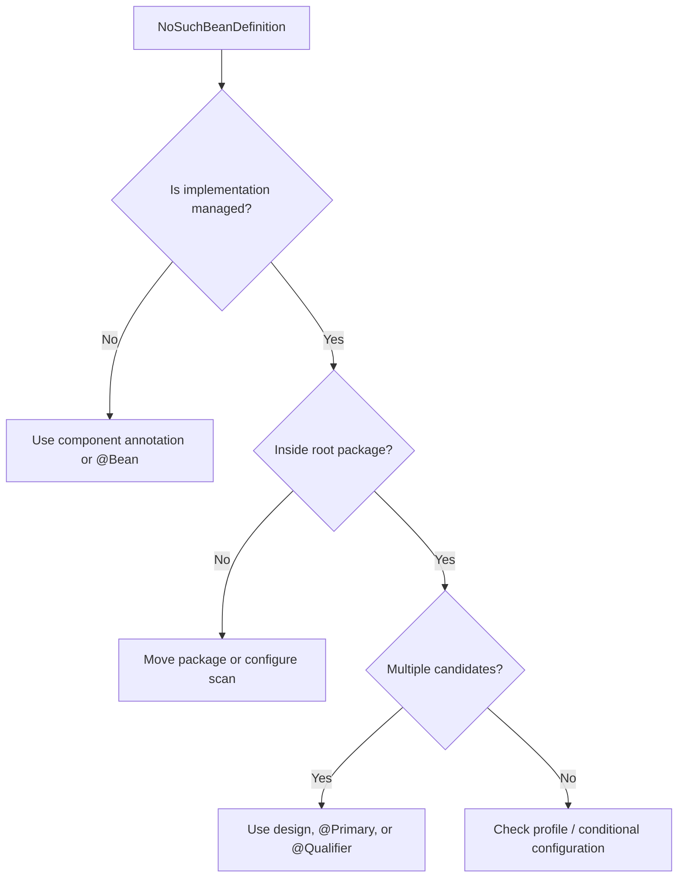
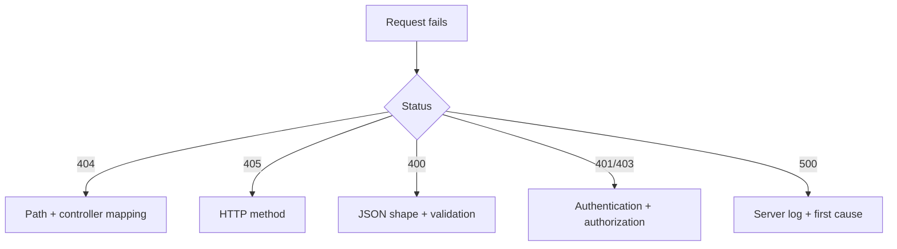
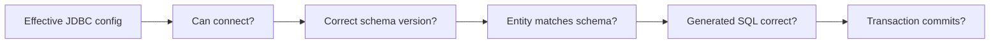

# 11 · Troubleshooting

[← Toolbox](10-real-project-toolbox.md) · [README](../README.md) · [Official references →](official-references.md)

## Diagnose by phase



## Error-reading loop



Changing several unrelated things at once destroys evidence.

## Symptom map

| Symptom | Likely cause | First check |
|---|---|---|
| `mvn` not found | Maven absent from PATH | `mvn -version` |
| Unsupported class version | JDK mismatch | `java -version`, Maven Java home |
| Package does not exist | Dependency/import/package mismatch | `pom.xml`, Maven sync, package declaration |
| Port already in use | Another process owns `8080` | Change `server.port` or stop process |
| Bean not found | Class not scanned or no bean definition | Main package, annotation, constructor type |
| Circular dependency | A → B → A design | Draw constructor graph; extract responsibility |
| Failed DataSource | URL/driver/credentials unavailable | Effective profile and datasource properties |
| Table/column missing | Schema not migrated | Migration history and active DB |
| 404 | Wrong route/path or no controller mapping | Controller base path + method mapping |
| 405 | Correct path, wrong HTTP method | GET/POST/PUT/DELETE contract |
| 400 before controller | JSON binding or validation failed | Response body and DTO fields |
| 401 | No/invalid authentication | Credential and security chain |
| 403 | Identity lacks permission/CSRF issue | Authorities, ownership, client type |
| Lazy initialization error | Lazy data accessed after context closes | Query boundary and DTO mapping location |
| Too many SQL queries | N+1 relationship access | SQL logs and fetch plan |
| Transaction did not apply | Self-invocation/private method/wrong exception assumption | Proxy boundary and rollback rules |
| Test works alone only | Shared state/order dependency | Reset fixtures and remove ordering assumption |

## Bean failure



## HTTP failure



## Database failure



## Useful commands

```bash
java -version
mvn -version
mvn clean verify
mvn spring-boot:run
mvn dependency:tree
curl -i http://localhost:8080/actuator/health
curl -i http://localhost:8080/api/tasks
```

## Ask for help with evidence

Provide:

```text
Expected behavior:
Actual behavior:
Smallest reproduction:
Exact command/request:
First meaningful exception and cause:
Java + Spring Boot versions:
Active profile:
Relevant controller/service/config:
What you already tested:
```
