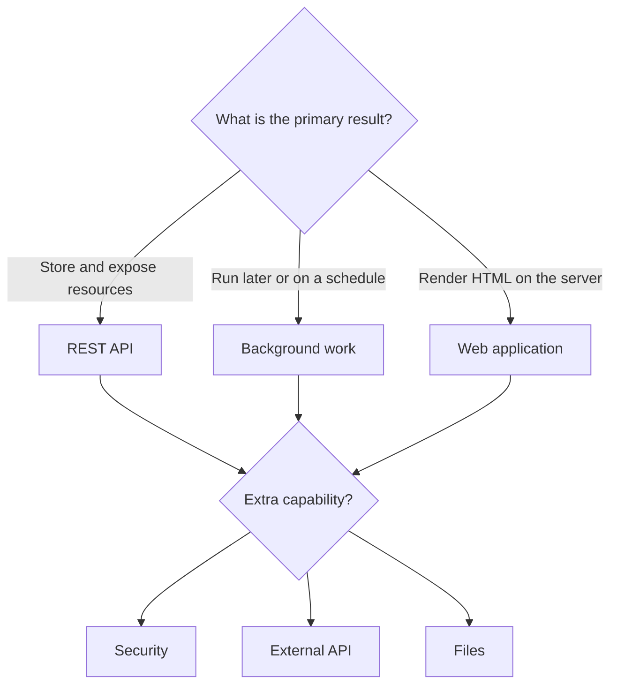
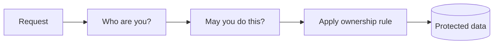
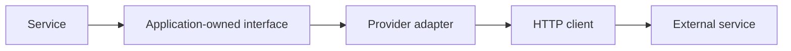

# Choose your application type

[← Core guide](core-guide.md) · [Production checklist](production-checklist.md) · [Start page](../README.md)

Start here after the generated application builds and starts. Choose one primary application shape, then add only the capabilities required by the feature.

## Choose in two decisions

First choose how the application delivers its main result:

| Primary shape | Choose |
|---|---|
| JSON over HTTP for a frontend, mobile app, or another service | [REST API](#path-a--rest-api) |
| HTML forms and pages rendered by Spring | [Server-rendered web application](#path-f--server-rendered-web-application) |
| Work triggered by a queue, event, or schedule | [Background or scheduled work](#path-d--background-or-scheduled-work) |

Then add capabilities only when required:

| Requirement | Add |
|---|---|
| Store relational data | JPA/repository parts of the [core guide](core-guide.md) |
| Login, roles, ownership, or private data | [Secure application](#path-b--secure-application) |
| Call another system | [External API integration](#path-c--external-api-integration) |
| Upload, download, or process files | [File processing](#path-e--file-processing) |



## Path A · REST API

Use for CRUD, mobile/web backends, search, and administrative services.

Follow the [core guide](core-guide.md) for a complete database-backed implementation. Skip its persistence steps when the API is only coordinating another system.

Add only what the contract requires:

1. Resource-oriented paths such as `/api/orders/{id}`.
2. Correct methods and statuses: POST/201, GET/200, PUT/200, DELETE/204.
3. Pagination and bounded page sizes for lists.
4. Explicit filters and sorting; never return an unbounded table.
5. Stable DTOs and `ProblemDetail` errors.
6. OpenAPI or REST Docs when other teams consume the API.
7. MVC tests for every public contract and integration tests for critical flows.

Completion: a client can discover the contract, call every required operation, and handle consistent success and failure responses.

## Path B · Secure application

Use when identity, roles, ownership, or private data matters. Add Spring Security.



Choose one authentication model:

| Client | Common model |
|---|---|
| Browser session application | Secure server session and CSRF protection |
| API used by SPA/mobile/other services | OAuth 2.0/OIDC resource server with validated tokens |
| Internal service | Organization-approved service identity, often OAuth 2.0 or mTLS |

Then:

1. Define roles and ownership rules before configuration.
2. Configure authentication; do not build password or token handling from scratch.
3. Restrict routes and enforce record ownership in the service.
4. Store passwords only with an approved adaptive password encoder when the application owns credentials.
5. Return `401` for missing/invalid identity and `403` for insufficient permission.
6. Test unauthenticated, forbidden, allowed, and cross-user access.
7. Keep tokens, cookies, credentials, and personal data out of logs.

Completion: every protected action has an allowed and rejected test, including ownership boundaries.

## Path C · External API integration

Use for payments, email, maps, AI, identity providers, and other HTTP services.



1. Define an application-owned interface using your own request/result types.
2. Implement the provider-specific adapter behind it.
3. Put the base URL, credentials, timeouts, and limits in external configuration.
4. Set connection and response timeouts.
5. Retry only safe operations and only for transient failures, with backoff and a limit.
6. Use idempotency keys where duplicate side effects are possible.
7. Map provider failures to application errors without leaking provider secrets.
8. Test success, timeout, invalid response, rate limit, and provider outage with a stub server.

Completion: the core service can be tested without the real provider and failure cannot block forever.

## Path D · Background or scheduled work

Use when work is slow, retryable, event-driven, or must run at a specific time.

Choose the smallest mechanism:

| Need | Mechanism |
|---|---|
| Small in-process work that may be lost on restart | `@Async` with a configured executor |
| Simple timed maintenance | `@Scheduled` with a lock when multiple instances run |
| Durable work, retries, or traffic smoothing | Message broker and worker |
| Restartable bulk processing | Spring Batch |

For durable work:

1. Save the business state and publish/record work reliably.
2. Include an operation ID so processing is idempotent.
3. Bound concurrency and queue capacity.
4. Use limited retry with backoff; move permanent failures to a dead-letter path.
5. Record job status and expose enough information to diagnose it.
6. Test duplicate delivery, retry, permanent failure, and restart behavior.

Completion: running work twice is safe, failures are visible, and restart does not silently lose required work.

## Path E · File processing

Use for documents, images, exports, and imports.

1. Validate filename, declared type, actual content, and maximum size.
2. Generate storage keys; never trust a client path.
3. Store file bytes in object storage or another durable file service, not the application container filesystem.
4. Store only metadata and ownership in the database.
5. Stream large uploads/downloads instead of loading everything into memory.
6. Authorize every upload and download.
7. Scan untrusted files when the risk requires it.
8. Use short-lived signed URLs when direct object-storage transfer is appropriate.
9. Clean up partial uploads and test oversized, invalid, missing, and unauthorized files.

Completion: storage is durable, access is authorized, and untrusted input cannot control paths or exhaust memory unchecked.

## Path F · Server-rendered web application

Use when Spring should return HTML using Thymeleaf instead of acting only as a JSON API.

1. Add Thymeleaf and return template names from `@Controller` methods.
2. Keep business logic in the same service layer used by other interfaces.
3. Use form objects with validation; redisplay field errors safely.
4. Use the Post/Redirect/Get pattern after successful form submissions.
5. Enable Spring Security, sessions, and CSRF protection for authenticated forms.
6. Escape user content and use the template engine’s safe defaults.
7. Test controller views, form validation, redirects, and permissions.

Completion: forms behave correctly on success and failure, and templates contain presentation rather than business logic.

## After every selected path

```bash
mvn clean verify
```

Run one happy-path request and the important failure paths. Then either choose another required branch or continue to the [production checklist](production-checklist.md).
