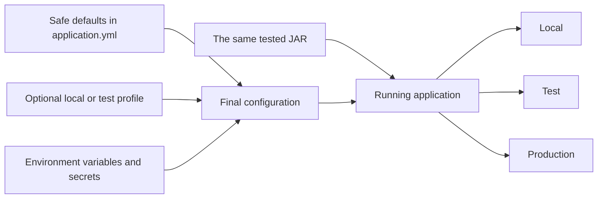

# Configuration and environments

[← Application selector](../README.md) · [Production checklist](production-checklist.md) · [Troubleshooting](troubleshooting.md)

Build the application once. Use configuration to run that same build locally, in tests, and in production. Do not edit source code for each environment.



If editing configuration/code is new, use [Action H for YAML](beginner-execution-guide.md#action-h-edit-yaml-configuration) and [Action F for the properties Java record](beginner-execution-guide.md#action-f-put-a-provided-java-code-block-into-a-file).

## 1. Put normal defaults in the base file

> 📍 Edit `src/main/resources/application.yml`.

```yaml
spring:
  application:
    name: orders-api

server:
  port: 8080

management:
  endpoints:
    web:
      exposure:
        include: health,info
```

Keep the file small. Use Spring Boot’s documented property names rather than creating duplicates.

## 2. Keep environment values outside the code

> 📍 Keep variable placeholders in `src/main/resources/application.yml`; supply their values from the terminal, IDE run configuration, CI, or deployment platform.

```yaml
spring:
  datasource:
    url: ${DATABASE_URL}
    username: ${DATABASE_USERNAME}
    password: ${DATABASE_PASSWORD}

provider:
  base-url: ${PROVIDER_BASE_URL}
  api-key: ${PROVIDER_API_KEY}
  timeout: 3s
```

`${NAME}` requires a value. `${NAME:default}` supplies a safe non-secret default.

## 3. Group application-owned settings

> 📍 Create `src/main/java/com/company/project/config/ProviderProperties.java` and edit the generated `ProjectApplication.java` under the base package.

```java
@Validated
@ConfigurationProperties(prefix = "provider")
public record ProviderProperties(
    @NotNull URI baseUrl,
    @NotBlank String apiKey,
    @NotNull Duration timeout
) {}
```

Enable configuration-property scanning in the application package. Give this record to the adapter or configuration class that needs it. Validation stops the application at startup when required settings are missing. This is easier to diagnose than a later request failure.

```java
@SpringBootApplication
@ConfigurationPropertiesScan
public class OrdersApplication {
    public static void main(String[] args) {
        SpringApplication.run(OrdersApplication.class, args);
    }
}
```

## 4. Use profiles narrowly

> 📍 Create only the required files under `src/main/resources/`: `application-local.yml` and `application-test.yml`; keep shared settings in `application.yml`.

Profiles group a small set of environment differences. They are not a place to store secrets.

```text
application.yml          shared defaults
application-local.yml    disposable local services/logging
application-test.yml     automated-test overrides
```

Activate deliberately:

```bash
SPRING_PROFILES_ACTIVE=local ./mvnw spring-boot:run
```

Do not create one profile per developer. Do not use profiles to change business rules.

## 5. Keep secrets outside Git

> 📍 Store secret values in the terminal, IDE run configuration, CI secret store, or deployment platform—not in repository files.

Use environment/deployment secret storage. Do not commit `.env`, real tokens, passwords, keys, certificates, or production URLs containing credentials. Provide variable names and examples without values in the project README.

## 6. Configure external resources explicitly

> 📍 Put application settings in `src/main/resources/application.yml`, typed settings under `src/main/java/com/company/project/config/`, and secret values outside the repository.

For every database, HTTP provider, broker, cache, or file store document:

- URL/host and credential source;
- connection and operation timeouts;
- pool/concurrency limits;
- retry behavior;
- local development replacement;
- health behavior when it is unavailable.

## 7. Verify each environment

> 📍 Run the commands in `<project-root>/`; change environment values outside the source tree between runs.

```bash
./mvnw clean verify
java -jar target/<application>.jar
```

Check startup with valid settings, startup failure for missing/invalid required settings, secret absence from logs/error responses, and health behavior when dependencies are available/unavailable.

Completion: one built JAR runs in local/test/production configuration without source changes, required settings fail fast, and all secrets remain external.
