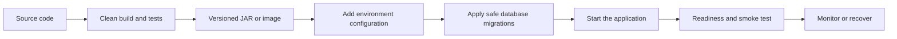

# Package and deliver the application

[← Application selector](../README.md) · [Configuration](configuration-guide.md) · [Production checklist](production-checklist.md)

Use this after the required features and tests pass. A packaged JAR or container image is called an **artifact**. Choose the format your hosting platform needs; do not create both without a reason.



Use [Action D](beginner-execution-guide.md#action-d-run-a-command-in-the-correct-terminal) for commands, [Action H](beginner-execution-guide.md#action-h-edit-yaml-configuration) for configuration, and [Action M](beginner-execution-guide.md#action-m-save-a-clean-checkpoint-with-git) before publishing.

## 1. Produce the verified artifact

> 📍 Run these commands in `<project-root>/`; Maven writes the packaged application to `<project-root>/target/`.

```bash
./mvnw clean verify
```

The runnable JAR appears under `target/`. Run that exact file:

```bash
java -jar target/orders-api-0.0.1-SNAPSHOT.jar
```

Call the health endpoint and one safe use case. Use this same tested JAR in every later environment. Do not rebuild different code for production.

## 2. Run with production-like configuration

> 📍 Open a terminal in `<project-root>/` and supply values in that terminal or through the deployment platform.

Set required variables outside source control:

```bash
export DATABASE_URL='jdbc:postgresql://localhost:5432/orders'
export DATABASE_USERNAME='orders_app'
export DATABASE_PASSWORD='local-only-value'
java -jar target/orders-api-0.0.1-SNAPSHOT.jar
```

Use a local secret value only for local verification. Confirm missing/invalid required configuration fails during startup.

## 3. Containerize only when the platform uses containers

> 📍 Create `<project-root>/Dockerfile`; run the build commands in `<project-root>/`.

Build the JAR first. Example `Dockerfile` (replace the Java version and artifact name to match the project):

```dockerfile
FROM eclipse-temurin:17-jre
WORKDIR /app
COPY target/orders-api-0.0.1-SNAPSHOT.jar app.jar
USER 10001
EXPOSE 8080
ENTRYPOINT ["java", "-jar", "/app/app.jar"]
```

```bash
docker build -t orders-api:local .
docker run --rm -p 8080:8080 \
  -e DATABASE_URL \
  -e DATABASE_USERNAME \
  -e DATABASE_PASSWORD \
  orders-api:local
```

Do not copy `.env`, source secrets, local databases, or build caches into the image. Run as a non-root user and use a small supported runtime image.

## 4. Make CI reject broken changes

> 📍 Create the workflow in the CI folder used by the repository, such as `<project-root>/.github/workflows/verify.yml` for GitHub Actions.

Use this repository’s [working GitHub Actions workflow](../.github/workflows/verify.yml) as the concrete example. It validates the handbook and runs `clean verify` independently for every starter. Copy only the job needed by the new project.

Every pushed change should run from a clean checkout with the project wrapper. The automated path is:

```text
checkout
→ select supported JDK
→ ./mvnw clean verify
→ dependency/security scan
→ publish immutable JAR or image
```

Pin the JDK major version and CI actions/plugins. Keep deployment credentials in the CI/platform secret store. Publish artifacts only after tests pass.

## 5. Plan database migration order

> 📍 Put migrations under `src/main/resources/db/migration/` and record the deployment order in `<project-root>/docs/database-runbook.md`.

For a database-backed application:

1. Back up or confirm recovery capability.
2. Apply tested forward-compatible Flyway/Liquibase migrations.
3. Deploy code compatible with both transition and final schema when rolling instances.
4. Verify migration history and application readiness.
5. Remove old columns/behavior only in a later release after old code is gone.

Never repair production by deleting its database or editing an already-applied migration file.

## 6. Deploy and check the result

> 📍 Perform these actions in the selected deployment platform; run smoke requests from a terminal that can reach the deployed application.

A smoke test is a small check that proves the deployed application is usable. Test one safe success path and, when relevant, one login or permission boundary. Check errors, response time, and resource usage. Logs should help trace a request without exposing secrets.

## 7. Roll back or roll forward

> 📍 Record the decision and executable commands in `<project-root>/docs/deployment-runbook.md`.

Before deployment decide:

- how to stop new traffic;
- which prior artifact is recoverable;
- whether schema changes permit old code;
- whether failed messages/jobs need replay;
- who decides and performs recovery.

If a database change cannot be safely undone, deploy a tested correction instead. Replacing the JAR does not undo data changes.

## 8. Write the operator handoff

> 📍 Edit `<project-root>/README.md` and link any detailed runbooks stored under `<project-root>/docs/`.

The project README must include:

```text
required Java/runtime
configuration variable names
build and test command
local run command
migration process
artifact/container run command
health/readiness endpoint
smoke-test command
known dependencies and limits
rollback/roll-forward owner
```

## Delivery completion gate

- Clean checkout produces the artifact.
- The artifact starts with external configuration and no source edits.
- CI runs the clean verification command.
- Migrations are tested and ordered safely.
- Readiness and smoke tests pass after deployment.
- Secrets are absent from Git, artifact, image, logs, and responses.
- Recovery is documented and assigned.

Finish with the [production checklist](production-checklist.md).
