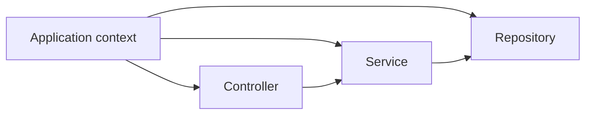

# Java and Spring Boot foundation

[← Application selector](../README.md) · [Project workbook](project-workbook.md) · [Troubleshooting](troubleshooting.md)

Complete this once if Java or Spring Boot is new to you. The goal is not to learn all of Java; it is to understand and safely modify the patterns used by every path in this repository.

Keep the [beginner execution guide](beginner-execution-guide.md) open for physical file/terminal actions and the [Java syntax primer](java-syntax-primer.md) open for unfamiliar symbols/types.

## Foundation step map

| Step | What | Where | Do | Verify | Next |
|---|---|---|---|---|---|
| 1 | Working tools | Terminal | Install/check JDK, Git, editor | Version commands succeed | 2 |
| 2 | Running practice app | Initializr + project root | Generate, build, start | Build succeeds; app starts | 3 |
| 3 | Project navigation | Generated tree | Locate build/source/resources/tests | You can name each location | 4 |
| 4 | Read Java type declarations | Java files | Read class/record/interface/enum | Identify each type’s role | 5 |
| 5 | Read object behavior | Service example | Trace fields/constructor/method | Explain input, call, return | 6 |
| 6 | Understand Spring wiring | Root/feature packages | Trace beans and constructor injection | Explain dependency arrows | 7 |
| 7 | Trace one HTTP flow | Controller/service/repository | Follow request to result | Name owner of each concern | 8 |
| 8 | Use Maven | Project root | Run compile/test/verify/run | Know which command to choose | 9 |
| 9 | Use development loop | Feature package/test | Change and verify one slice | Small checkpoint passes | 10 |
| 10 | Clean handoff | `.gitignore`/Git status | Ignore output/secrets; clean verify | Status contains only intended files | Selector |

The detailed section for each step contains the commands/code. Do not move to **Next** while **Verify** is false.

## 1. Install and verify the tools

Required:

- a JDK supported by the chosen Spring Boot release;
- Git;
- an editor or IDE with Java support;
- internet access for the first dependency download.

Generated projects include the Maven wrapper, so a separate Maven install is normally unnecessary.

```bash
java -version
git --version
```

On Linux/macOS use `./mvnw`; on Windows use `mvnw.cmd`.

## 2. Generate a disposable practice project

At [Spring Initializr](https://start.spring.io/), select Maven, Java, Jar, a supported Java version, and Spring Web. Download, extract, then run:

```bash
./mvnw clean verify
./mvnw spring-boot:run
```

Stop the application with `Ctrl+C`. Do not begin real feature work until the generated build passes.

## 3. Know the project files

```text
project/
├── pom.xml                         dependencies and build plugins
├── mvnw / mvnw.cmd                 repeatable Maven command
├── src/main/java/...Application.java  application entry point
├── src/main/resources/
│   ├── application.yml             configuration
│   ├── static/                     CSS/images for web apps
│   └── templates/                  server-rendered templates
├── src/test/java/                  tests matching main packages
└── target/                         generated build output; do not commit
```

Keep the generated `*Application.java` in the root package above controllers, services, repositories, and configuration. `@SpringBootApplication` starts the application and scans its package and children.

## 4. Read the Java types used here

| Java type | Use in these projects |
|---|---|
| `class` | Entity, service, controller, adapter |
| `record` | Immutable request/response DTO |
| `interface` | Repository or application-owned provider boundary |
| `enum` | Fixed state such as `TODO`, `DONE` |

```java
public record CreateTaskRequest(String title) {}

public enum TaskStatus {
    TODO, DONE
}
```

One public top-level type normally lives in a same-named file. `TaskService` belongs in `TaskService.java`. The `package` line must match the directory below `src/main/java`.

## 5. Understand fields, constructors, and methods

```java
public class TaskService {
    private final TaskRepository repository;

    public TaskService(TaskRepository repository) {
        this.repository = repository;
    }

    public TaskResponse findById(Long id) {
        Task task = repository.findById(id)
            .orElseThrow(() -> new TaskNotFoundException(id));
        return new TaskResponse(task.getId(), task.getTitle());
    }
}
```

- `private final` declares a required collaborator assigned once.
- The constructor receives that collaborator.
- `public TaskResponse` is the method visibility and return type.
- `Long id` is a parameter.
- `new` creates an object.
- `throw` stops the current path with an exception.
- `Optional.orElseThrow` handles a missing value explicitly.

Common types:

| Data | Java type |
|---|---|
| Text | `String` |
| Database ID | `Long` |
| Money | `BigDecimal` |
| True/false | `boolean` / `Boolean` |
| Date | `LocalDate` |
| UTC timestamp | `Instant` |
| Ordered collection | `List<T>` |
| Possibly missing value | `Optional<T>` |
| Bounded database results | `Page<T>` |

## 6. Understand Spring wiring

Spring creates and connects application objects called beans.



| Annotation | Meaning |
|---|---|
| `@RestController` | Handles HTTP and returns response bodies |
| `@Controller` | Handles HTTP and usually returns a view/template |
| `@Service` | Business use-case bean |
| `@Component` | General Spring-managed bean |
| `@Configuration` | Declares application configuration/beans |
| `@Entity` | Maps a class to persistent relational state |
| `@Transactional` | Runs a service operation in a database transaction |

Use constructor injection: a class declares what it needs, and Spring supplies it. Do not create services or repositories with `new` inside controllers.

## 7. Trace an HTTP request

```text
HTTP JSON
→ controller route and request binding
→ request validation
→ service business rules
→ repository or external adapter
→ mapper and response DTO
→ HTTP status + JSON
```

- Controller owns HTTP method, path, headers, and status.
- Service owns business decisions and transaction boundaries.
- Repository owns persistence access.
- Adapter isolates an external provider/broker/storage system.
- DTO defines input/output; entity defines stored state.

## 8. Use Maven deliberately

| Command | Purpose |
|---|---|
| `./mvnw compile` | Compile main code |
| `./mvnw test` | Compile and run tests |
| `./mvnw clean verify` | Clean, test, and package; final local check |
| `./mvnw spring-boot:run` | Run during development |
| `java -jar target/<name>.jar` | Run the packaged artifact |

Read the first meaningful compiler error before later errors; later failures are often consequences.

## 9. Use the normal work loop

```text
write one contract
→ create the smallest files
→ compile
→ run the smallest test
→ run a real request/job
→ clean verify
→ commit
```

Change one boundary at a time. Do not add several dependencies or features before the first checkpoint passes.

## 10. Keep the repository clean

Ignore at least generated build output, IDE metadata, local database files, logs, and environment-secret files. Never commit passwords, tokens, keys, or production connection values.

```gitignore
target/
.idea/
.vscode/
*.log
.env
data/
```

Before sharing:

```bash
./mvnw clean verify
git status --short
```

## Foundation completion gate

- You can locate dependencies, source, resources, tests, and generated output.
- You can explain controller → service → repository/adapter.
- You can read a class, record, interface, enum, constructor, and method.
- The generated practice project builds and starts.
- You know how to run a clean build and read the first failure.

Return to the [application selector](../README.md) and choose the path matching the required result.
