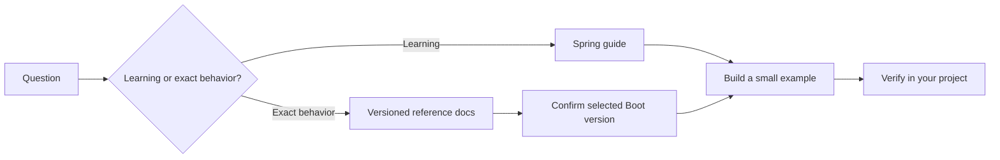

# Official references

[← Troubleshooting](11-troubleshooting.md) · [README](../README.md)

These are the primary sources used to design this handbook. Version-specific claims were checked on **2026-07-20**.

## Start and structure

- [Spring Initializr](https://start.spring.io/) — generate a project from the current dependency catalog.
- [Spring Boot system requirements](https://docs.spring.io/spring-boot/system-requirements.html) — supported Java, Maven, Gradle, servlet container, and native-image versions.
- [Structuring Spring Boot code](https://docs.spring.io/spring-boot/reference/using/structuring-your-code.html) — root package and main application class guidance.
- [Building a RESTful web service](https://spring.io/guides/gs/rest-service/) — controller, JSON conversion, running, and executable JAR basics.

## Data and transactions

- [Accessing data with JPA](https://spring.io/guides/gs/accessing-data-jpa/) — entities and Spring Data repositories.
- [Spring Data JPA reference](https://docs.spring.io/spring-data/jpa/reference/) — repositories, queries, projections, auditing, locking, and specifications.
- [Spring Boot database initialization](https://docs.spring.io/spring-boot/how-to/data-initialization.html) — Hibernate schema settings, SQL scripts, Flyway, and Liquibase.
- [Spring transaction model](https://docs.spring.io/spring-framework/reference/data-access/transaction/declarative/tx-decl-explained.html) — proxy-based declarative transactions.
- [`@Transactional` settings](https://docs.spring.io/spring-framework/reference/data-access/transaction/declarative/annotations.html) — propagation, isolation, timeout, read-only, and rollback behavior.

## Configuration and testing

- [Externalized configuration](https://docs.spring.io/spring-boot/reference/features/external-config.html) — property sources, profiles, environment variables, and `@ConfigurationProperties`.
- [Testing Spring Boot applications](https://docs.spring.io/spring-boot/reference/testing/spring-boot-applications.html) — `@SpringBootTest`, `@WebMvcTest`, MockMvc, and `@DataJpaTest`.
- [Development-time services](https://docs.spring.io/spring-boot/reference/features/dev-services.html) — Docker Compose and Testcontainers integration.

## Security and operations

- [Spring Security servlet architecture](https://docs.spring.io/spring-security/reference/servlet/architecture.html) — filter chain and request security model.
- [Spring Security authentication](https://docs.spring.io/spring-security/reference/servlet/authentication/index.html) — supported authentication mechanisms.
- [Spring Security authorization architecture](https://docs.spring.io/spring-security/reference/servlet/authorization/architecture.html) — authorities and authorization managers.
- [Password storage](https://docs.spring.io/spring-security/reference/servlet/authentication/passwords/password-encoder.html) — `PasswordEncoder` support.
- [Spring Boot Actuator](https://docs.spring.io/spring-boot/reference/actuator/) — production-ready health, metrics, auditing, and management features.
- [Actuator HTTP monitoring](https://docs.spring.io/spring-boot/reference/actuator/monitoring.html) — endpoint paths and management-server options.

## How to use references

Tutorials explain a path. Reference documentation defines behavior. Your build and tests verify the specific version you use.
