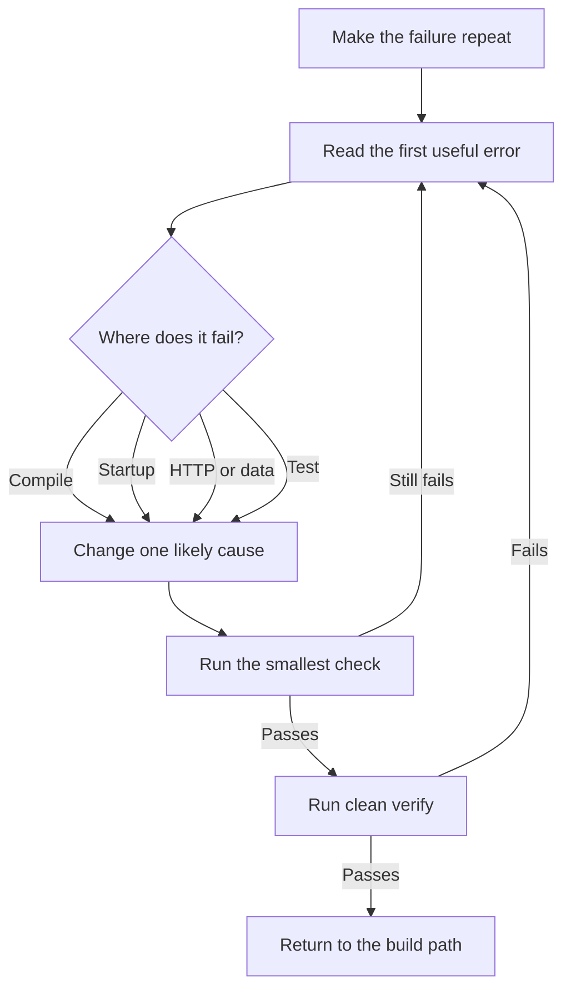

# Troubleshooting

[← Start page](../README.md) · [Core guide](core-guide.md) · [Production checklist](production-checklist.md)

For the physical error-reading and rerun procedure, use [Action L](beginner-execution-guide.md#action-l-fix-the-first-compile-or-startup-error).

## Use this loop

> 📍 Start in the terminal, test, or client where the failure appears. Open only the first application-owned file or configuration named by the error.



1. Remove unrelated actions until the failure repeats with one command or request.
2. Read the first exception and the deepest useful `Caused by` line. Later errors are often side effects.
3. Decide whether the problem is compilation, startup, HTTP, data, or a test.
4. Change one likely cause, then rerun the smallest check.
5. When that passes, run `./mvnw clean verify`.

If Step 5 fails, return to Step 1 with the new smallest failure.

## Fast checks

> 📍 Run these commands in `<project-root>/`, the folder containing `pom.xml` and `mvnw`.

```bash
java -version
./mvnw -version
./mvnw clean verify
./mvnw spring-boot:run
curl -i http://localhost:8080/actuator/health
```

| Symptom | Check first |
|---|---|
| `cannot find symbol` | spelling, import, package, dependency, first compiler error |
| `package ... does not exist` | package path and dependency in `pom.xml` |
| Application context fails | first Spring-managed object (`bean`) named in the error chain |
| No bean found | missing annotation, wrong package location, or missing dependency |
| Port already in use | stop the old process or configure another port |
| `404` | HTTP method, full controller path, application port |
| `400` | request JSON, content type, DTO types, validation response |
| `415` | send the supported `Content-Type`, normally `application/json` |
| `500` | server error and first line that points to your own code |
| Table/column missing | datasource URL, active migration, schema history |
| Lazy-loading error | read and map the needed data while the service transaction is open |
| Too many SQL queries | inspect access pattern; use a fetch join, entity graph, or projection |
| Test passes in IDE only | run Maven from project root and check JDK/test configuration |

On Windows use `mvnw.cmd`. If the project has no Maven wrapper, install Maven and replace `./mvnw` with `mvn`.

## Bean startup failures

> 📍 Read the startup output in the application terminal, then open the deepest application-owned class or configuration named after `Caused by`.

Trace the chain from the top-level bean to the deepest constructor/configuration failure. Common causes are a missing component annotation, a class outside the scanned package, a missing property, or more than one bean matching the same interface.

## HTTP failures

> 📍 Keep the application terminal visible and compare the client request with the matching controller under `src/main/java/`.

Confirm the application started, then compare the request with the controller: method, class-level path, method-level path, headers, JSON field names, and Java field types. MVC tests are the quickest way to lock a correction.

## Database failures

> 📍 Check `src/main/resources/application*.yml`, the migration under `src/main/resources/db/migration/`, and the first SQL exception in the application terminal.

Verify which datasource is active and inspect the first SQL exception. Do not delete a shared database to fix a migration. Correct the migration sequence or add a new forward migration.

## Ask for help with evidence

> 📍 Collect the command and sanitized error in `<project-root>/PROJECT.md` or an issue; never include credentials or tokens.

Provide the command, first meaningful error, relevant class/configuration, expected behavior, actual behavior, Java/Spring versions, and the smallest steps to reproduce. Remove credentials and tokens first.
