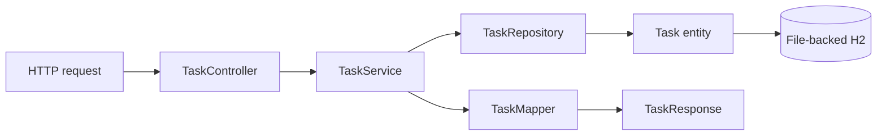
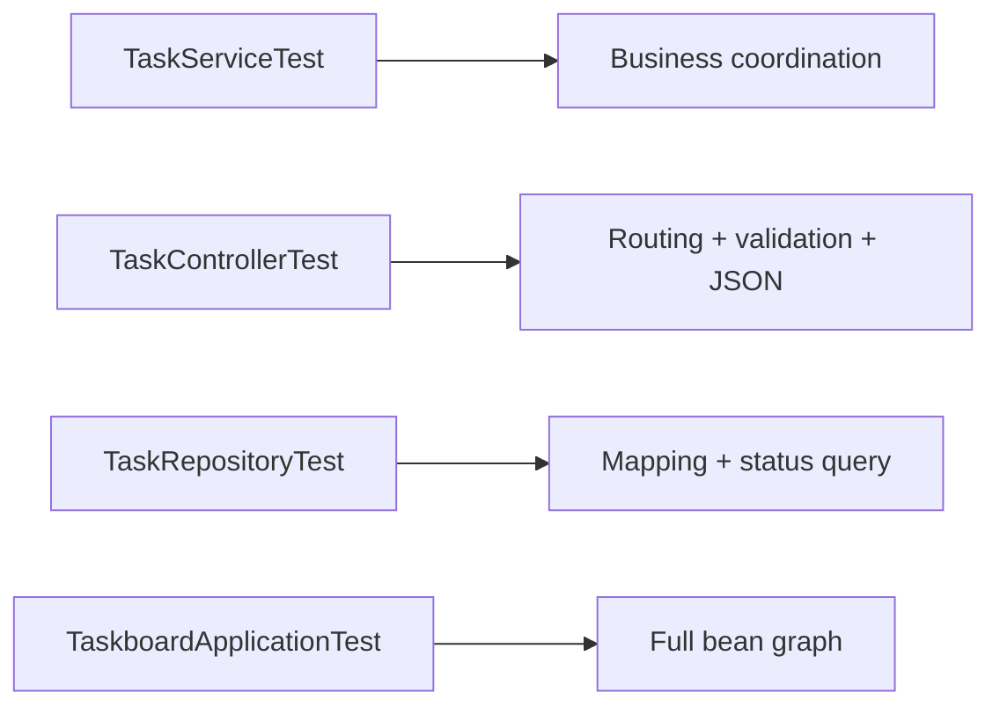

# Taskboard reference API

[← Start page](../README.md) · [REST process](../paths/rest-api.md) · [Adapt this starter](../docs/starter-adaptation-guide.md) · [Core guide](../docs/core-guide.md)

This small API is intentionally plain Java. It demonstrates structure and connections without Lombok, authentication, Docker, or a production database obscuring the core flow.



## Run

> 📍 Open a terminal in `<blueprint-root>/taskboard-api/`, the folder containing this example’s `pom.xml`.

Prerequisite: Java 17+. The included Maven wrapper downloads the required Maven version.

```bash
./mvnw spring-boot:run
```

Open `http://localhost:8080/actuator/health`.

## API

> 📍 Run the calls from a second terminal, or open `taskboard-api/requests.http` in IntelliJ IDEA or a VS Code REST Client.

| Method | Path | Purpose |
|---|---|---|
| `POST` | `/api/tasks` | Create a task |
| `GET` | `/api/tasks` | List tasks with pagination and optional status |
| `GET` | `/api/tasks/{id}` | Read one task |
| `PUT` | `/api/tasks/{id}` | Update editable task fields |
| `DELETE` | `/api/tasks/{id}` | Delete a task |

Create:

```bash
curl -i -X POST http://localhost:8080/api/tasks \
  -H 'Content-Type: application/json' \
  -d '{
    "title":"Learn Spring layers",
    "description":"Trace a request from controller to database",
    "dueDate":"2030-01-01"
  }'
```

List and filter:

```bash
curl 'http://localhost:8080/api/tasks?page=0&size=20'
curl 'http://localhost:8080/api/tasks?status=TODO&page=0&size=20'
```

Update:

```bash
curl -i -X PUT http://localhost:8080/api/tasks/1 \
  -H 'Content-Type: application/json' \
  -d '{
    "title":"Learn Spring layers",
    "description":"Completed the request trace",
    "status":"DONE",
    "dueDate":"2030-01-01"
  }'
```

Delete:

```bash
curl -i -X DELETE http://localhost:8080/api/tasks/1
```

You can also run the prepared calls in [`requests.http`](requests.http) from IntelliJ IDEA or a VS Code REST Client extension.

## Database

> 📍 Inspect local data under `taskboard-api/data/`; open the H2 console in the browser only while this local example is running.

Data is stored under `taskboard-api/data/` and survives restarts. The local-only H2 console is available at `http://localhost:8080/h2-console` with:

```text
JDBC URL: jdbc:h2:file:./data/taskboard
User: sa
Password: [blank]
```

The reference uses `ddl-auto: update` because its file-backed database is local and disposable. Use Flyway or Liquibase for shared/production databases.

## Test

> 📍 Run the test command in `<blueprint-root>/taskboard-api/`.

```bash
./mvnw clean verify
```

Build and run the concrete container example:

```bash
./mvnw clean verify
docker build -t taskboard-api:local .
docker run --rm -p 8080:8080 taskboard-api:local
```


